# FairPlay DRM / EME Flow for URL Player (C25 Reference)

## Two FairPlay Paths on tvOS

There are two separate DRM playback paths on tvOS. **This document covers Path-1 only.**

| | Path-1 (This Document) | Path-2 (Future) |
|---|---|---|
| **Bug** | [b/512045535](https://b.corp.google.com/issues/512045535) | TBD |
| **Key System** | `com.youtube.fairplay` | `com.youtube.fairplay.sbdl` |
| **Player** | AVPlayer / URLPlayer (legacy) | SbPlayer → AVSampleBufferDisplayLayer |
| **Content Delivery** | HLS (`.m3u8`) via AVPlayer natively | DASH/CMAF via MSE |
| **DRM Handling** | AVPlayer handles FairPlay natively — less DRM-ish. AVPlayer detects encrypted segments, queues key requests, and applies keys once provided. | Full EME protocol — content decrypted by Cobalt's internal FairPlay code, fed as clear samples to `AVSampleBufferDisplayLayer`. |
| **Rendering** | AVPlayer owns rendering (punch-out mode) | `AVSampleBufferDisplayLayer` — more control over rendering pipeline |
| **Entitlements** | Standard tvOS entitlements | May need special (private) entitlements — TBD |
| **Demuxer** | `UrlPlayerDemuxer` (stub) — no real demuxing | Chromium demuxer / ChunkDemuxer (MSE) — real segment parsing |
| **Starboard API** | `SbUrlPlayerCreate` + `SbUrlPlayerSetDrmSystem` | `SbPlayerCreate` + standard DRM pipeline |

### Why Path-1 First

Path-1 is simpler — AVPlayer handles HLS segment fetching, adaptive bitrate, and most of the
FairPlay handshake internally. We only need to bridge the URL across the process boundary and
provide the DRM system after AVPlayer discovers encrypted content. Path-2 requires the full
EME/DASH/MSE pipeline with `AVSampleBufferDisplayLayer` integration, which is significantly more complex.

---

## Analysis Codebase

- **C25 (old Cobalt):** `/Users/abhijeet/code/cobal-git-os/src/`
  - `cobalt/media/base/sbplayer_pipeline.cc` — single-process pipeline, URL player creation, DRM handshake
  - `cobalt/media/player/web_media_player_impl.cc` — `SetDrmSystem` / `SetDrmSystemReadyCB` race-safe pattern
  - `cobalt/dom/html_media_element.cc` — `SetMediaKeys`, `EncryptedMediaInitDataEncountered`, `'encrypted'` event
- **Current Cobalt (Chromium-based):** `/Users/abhijeet/code/cobalt-github/src/`
  - `starboard/tvos/shared/media/application_player.mm` — AVContentKeySession, key request queueing, `setDrmSystem:`
  - `starboard/tvos/shared/media/url_player_create.mm` — `SbUrlPlayerCreate`
  - `starboard/tvos/shared/media/url_player_set_drm_system.mm` — `SbUrlPlayerSetDrmSystem`
  - `media/starboard/sbplayer_bridge.cc` — `SetDrmSystem()`, `CreateUrlPlayer()`

The Starboard platform layer (`application_player.mm`, `url_player_*.mm`) is shared between both —
it's the same tvOS implementation. The difference is the layer above: C25 uses `SbPlayerPipeline`
(single-process), new architecture uses `StarboardUrlRenderer` → Mojo → `StarboardRendererClient` (multi-process).

---

This document traces the complete Encrypted Media Extensions (EME) flow for
HLS URL player (AVPlayer) playback on tvOS, based on analysis of the C25
codebase (`cobalt/media/base/sbplayer_pipeline.cc`, `cobalt/dom/html_media_element.cc`,
`starboard/tvos/shared/media/application_player.mm`).

## Simplified Overview (Read This First)

Think of it like **ordering food at a restaurant with a translator**:

```
You (JS/Web App)   = Customer who speaks English
Waiter (Cobalt)    = Translator between you and the kitchen
Kitchen (AVPlayer) = Chef who speaks French
Menu (Certificate) = You need this to know what to order
Receipt (SPC)      = Kitchen's price quote in French
Payment (CKC)      = Your payment that kitchen accepts
Food (Video)       = What you actually wanted
```

**The story:**

1. Kitchen starts cooking, notices dish is locked: "Customer needs to pay for dish #42!"
2. Waiter tells You: `'encrypted'` event — "you need a key for dish #42"
3. You go get the restaurant Menu (certificate) from the front desk (cert server)
4. You tell Waiter: "I want dish #42, here's the Menu" → Kitchen writes a Receipt (SPC)
5. You take the Receipt to the Bank (license server) → Bank gives you Payment (CKC)
6. You give Payment to Waiter → Kitchen → Kitchen unlocks the dish → Food arrives!

### Visual Flow

```
    JS (Web App)              Cobalt/Starboard           AVPlayer (tvOS)
    ============              ================           ===============
                                                         Finds encrypted
                                                         content (skd://)
                              ←── "fairplay" contentID ──
    receives 'encrypted'
    event

    fetches certificate
    from cert server ←─── (certificate server)

    packs [data+cert]
    generateRequest() ───→
                              unpacks, finds pending
                              key request
                              ────────────────────────→  Apple generates
                                                         SPC with cert
                              ←────────────────────────
    receives SPC via
    session.onmessage

    sends SPC to
    license server ──────────────────────────  (license server)
    receives CKC   ←─────────────────────────  (license server)

    session.update(CKC) ──→
                              base64-decodes CKC
                              ────────────────────────→  Receives CKC
                                                         HAS KEYS NOW!
                                                         Decrypts & plays!
```

### Three Key Takeaways

1. **JS is the orchestrator** — it fetches the certificate, contacts the license server, and passes data back. Cobalt/Starboard is just a translator between JS and AVPlayer.

2. **Two separate server calls by JS:**
   - **Certificate server** → gets the FairPlay server certificate (needed to generate SPC)
   - **License server** → exchanges SPC for CKC (the decryption key material)

3. **AVPlayer only does two things:**
   - Detects encrypted content and asks for help (`didProvideContentKeyRequest`)
   - Decrypts once it receives the keys (`processContentKeyResponse`)

### Step-by-Step with Real Names

| Step | Who | What Happens | Data |
|---|---|---|---|
| 1 | AVPlayer | Finds `#EXT-X-KEY` in `.m3u8` manifest | `skd://contentID` |
| 2 | AVPlayer → JS | `'encrypted'` event fires on `<video>` | initDataType=`"fairplay"`, initData=contentID |
| 3 | JS | Fetches FairPlay cert from certificate server | Binary DER certificate |
| 4a | JS | Packs `[initData \| contentID \| certData]` | Packed buffer |
| 4b | JS → Starboard | `session.generateRequest('fairplay', packed)` | Packed buffer |
| 4c | Apple API | `makeStreamingContentKeyRequestDataForApp:` | cert + contentID → **SPC** |
| 4d | Starboard → JS | `session.onmessage` fires | SPC blob |
| 5 | JS | `fetch(licenseServer, {body: SPC})` | SPC → **CKC** |
| 6a | JS → Starboard | `session.update(base64(CKC))` | CKC (base64) |
| 6b | Starboard → AVPlayer | `processContentKeyResponse(CKC)` | CKC → decrypt keys |
| 7 | AVPlayer | Decrypts HLS segments and plays | Video! |

---

## Init Data Type Handling in C25

**Related document:** `ResearchReport.md` Task 1 covers the Chromium-side implementation (`EmeInitDataType::FAIRPLAY` enum addition).

### C25 passes `"fairplay"` as the init data type string

The native layer hardcodes the string `"fairplay"` in `application_player.mm:744`:
```objc
_encryptedMediaFunc(starboardPlayer, _playerContext, "fairplay",
                    static_cast<const unsigned char*>(initData.bytes),
                    initData.length);
```

### C25 treats init data type as a raw string (no enum)

Unlike Chromium (which uses `EmeInitDataType` enum), C25 passes the init data type as a plain `const char*` string through the entire chain. It is **never converted to an enum** -- it flows as a raw string from native to JS:

| C25 File | Line | What Happens |
|---|---|---|
| `application_player.mm:744` | `_encryptedMediaFunc(... "fairplay" ...)` | Native sets type string |
| `sbplayer_bridge.cc:593` | `EncryptedMediaInitDataEncounteredCB(... init_data_type ...)` | Bridge forwards raw string |
| `sbplayer_pipeline.cc:241-244` | `LOG_IF(WARNING, strcmp(init_data_type, "cenc") != 0 && strcmp(init_data_type, "fairplay") != 0 && ...)` | Pipeline validates as known type (accepts `"cenc"`, `"fairplay"`, `"keyids"`, `"webm"`) |
| `web_media_player_impl.cc:951` | `GetClient()->EncryptedMediaInitDataEncountered(init_data_type, ...)` | Forwards to DOM |
| `html_media_element.cc:1867` | `media_encrypted_event_init.set_init_data_type(init_data_type)` | Sets on `MediaEncryptedEvent` |
| `media_key_session.cc:102` | `GenerateRequest(... init_data_type ...)` | JS passes it back through EME |
| `drm_system.cc:178` | `SbDrmGenerateSessionUpdateRequest(... type.c_str() ...)` | String reaches Starboard DRM |

### Important: "CENC" means two different things in EME

The acronym "CENC" (Common Encryption, ISO 23001-7) is overloaded in EME:

| Context | Meaning | Enum | Example |
|---|---|---|---|
| `initDataTypes: ['cenc']` | **PSSH box data format** -- the container format for key IDs and DRM-specific initialization data | `EmeInitDataType::CENC` | Widevine/PlayReady send PSSH boxes as init data |
| `encryptionScheme: 'cenc'` | **AES-CTR encryption mode** -- how media samples are encrypted (full sample, CTR counter) | `EncryptionScheme::kCenc` | Widevine typically uses AES-CTR |

The alternative encryption scheme is `'cbcs'` (AES-CBC with subsample patterns), which is what **FairPlay uses**.

For FairPlay (Path-1):
- **Init data type:** `"fairplay"` (Cobalt-specific) -- NOT PSSH, NOT CENC. The init data is a packed `skd://` URI.
- **Encryption scheme:** `"cbcs"` or `"cbcs-1-9"` (from `navigator.cc:125-126`)

This is why FairPlay cannot reuse `EmeInitDataType::CENC` -- the init data format is completely different (packed skd:// URI vs PSSH box).

### Chromium is different -- uses `EmeInitDataType` enum

Chromium's `media/base/eme_constants.h` defines:
```cpp
enum class EmeInitDataType { UNKNOWN, WEBM, CENC, KEYIDS };
```

There is **no `FAIRPLAY`** in the current enum. This is Gap G4 in `ResearchReport.md` -- `WebMediaPlayerImpl::OnEncryptedMediaInitData` has a `DCHECK(init_data_type != EmeInitDataType::UNKNOWN)` that would fire.

### What needs to change (see ResearchReport.md Task 1)

- Add `FAIRPLAY` to `EmeInitDataType` enum
- Map `"fairplay"` to `FAIRPLAY` in `encrypted_media_utils.cc`
- Update all `switch` statements across 11 files

### Supported init data types in C25

From `sbplayer_pipeline.cc:241-244` and `navigator.cc:120-132`:

| Init Data Type | Key System | Encryption Scheme |
|---|---|---|
| `"cenc"` | Playready, Widevine | `"cenc"` |
| `"fairplay"` | FairPlay (`com.youtube.fairplay`) | `"cbcs"`, `"cbcs-1-9"` |
| `"keyids"` | Various | Various |
| `"webm"` | Widevine | Various |

---

## Key Insight: AVPlayer Does NOT Handle DRM Fully Internally

**Initial assumption "AVPlayer handles FairPlay natively" was partially wrong.**

AVPlayer handles:
- **Detecting** encrypted segments (via `AVContentKeySession` with `AVContentKeySystemFairPlayStreaming`)
- **Generating SPC** via Apple's `makeStreamingContentKeyRequestDataForApp:` API (called by our DRM layer)
- **Applying** decryption keys once a `AVContentKeyResponse` with CKC is provided

AVPlayer does **NOT** handle:
- Contacting the license server — **JavaScript does this**
- Creating the DRM session — **Cobalt's Starboard CDM layer does this**
- Processing the CKC response — **Cobalt's DRM layer receives it from JS and feeds it to `AVContentKeyRequest`**

The full flow involves **five layers**: AVPlayer ↔ `SBDApplicationDrmSystem` ↔ Starboard DRM ↔ Cobalt CDM ↔ JavaScript EME.

### How `processKeyRequest:` Actually Works

From `application_drm_system.mm:217`:

```objc
- (BOOL)processKeyRequest:(AVContentKeyRequest*)keyRequest {
    // Check for prefetch (pre-cached key data)
    SBDKeyPrefetchData* prefetchData = _keyPrefetchData[keyRequest.identifier];
    if (prefetchData) {
        // Prefetch hit → generate SPC immediately, DON'T notify JS
        [self makeKeyRequestData:keyRequest ...];
        return NO;  // ← _encryptedMediaFunc NOT called
    }
    // No prefetch → store request, notify JS via 'encrypted' event
    _keyRequestsPendingUpdateRequest[keyRequest.identifier] = keyRequest;
    return YES;  // ← _encryptedMediaFunc IS called
}
```

**Return value matters:**
- `YES` → `_encryptedMediaFunc` fires → JS gets `'encrypted'` event → full EME roundtrip
- `NO` → prefetch handled it internally → JS not notified (SPC generated directly)

### Two Pending Queues

The DRM system maintains two separate pending queues:

| Queue | When Populated | Drained By |
|---|---|---|
| `_pendingKeyRequests` (on `ApplicationPlayer`) | `didProvideContentKeyRequest:` when `_drmSystem == nil` | `setDrmSystem:` — processes all when DRM attached |
| `_keyRequestsPendingUpdateRequest` (on `ApplicationDrmSystem`) | `processKeyRequest:` returns YES (no prefetch) | `generateSessionUpdateRequestWithCertificationData:` — called by `SbDrmGenerateSessionUpdateRequest` via JS `session.generateRequest()` |

## Certificate vs License

### Path-1 Does NOT Use `setServerCertificate()` (Deviates from EME Spec)

In the standard EME spec, the FairPlay certificate is provided via:
```js
mediaKeys.setServerCertificate(certificateData);
```

**Path-1 does NOT support this.** From `drm_is_server_certificate_updatable.mm:33-34`:
```objc
if ([drmManager isApplicationDrmSystem:drm_system]) {
    return false;  // ← Path-1 URL player: certificate NOT updatable
}
```

Instead, the **JavaScript web app packs the certificate directly into the `generateRequest()` init data**.
This is a **Cobalt-specific convention** — the JS app must:
1. Fetch the FairPlay certificate from a certificate server URL (app-specific, e.g. YouTube's cert endpoint)
2. Pack three fields into a single buffer using the format below
3. Pass the packed buffer to `session.generateRequest('fairplay', packedBuffer)`

| Path | `setServerCertificate()` | Certificate Delivery |
|---|---|---|
| **Path-1** (`com.youtube.fairplay`, URL player) | **Not supported** (`IsServerCertificateUpdatable` → `false`) | JS packs certificate into `generateRequest()` init data |
| **Path-2** (`com.youtube.fairplay.sbdl`, sample-based) | **Supported** (`DrmSystemFairplay::IsServerCertificateUpdatable` → `true`) | Standard EME: `mediaKeys.setServerCertificate(cert)` |

### Data Flow Summary

| Data | Who Fetches | Format | When |
|---|---|---|---|
| **FairPlay Server Certificate** | **JS web app** fetches from certificate server URL | Binary DER | Before `generateRequest()` — JS packs it into init data |
| **SPC (Server Playback Context)** | Generated by Apple's `makeStreamingContentKeyRequestDataForApp:` | Binary blob | During `generateRequest()` flow — sent to JS via `session.onmessage` |
| **CKC (Content Key Context)** | **JS web app** fetches from license server URL | Base64-encoded binary | JS sends SPC to license server, receives CKC, calls `session.update()` |

### Init Data Packing Format (JS → `generateRequest`)

The `generateRequest()` init data for Path-1 must be packed as three length-prefixed fields:
```
[4 bytes: initData length | initData (skd:// URL, UTF-16LE)]
[4 bytes: contentID length | contentID]
[4 bytes: certData length | certData (FairPlay server certificate)]
```

This is unpacked in `drm_generate_session_update_request.mm:78-87`:
```objc
NSData* packedData = [NSData dataWithBytes:initialization_data length:initialization_data_size];
NSArray<NSData*>* unpackedData = unpackData(packedData);
// unpackedData[0] = initData (skd:// URL)
// unpackedData[1] = contentID
// unpackedData[2] = certData (FairPlay certificate)
```

The certificate is NOT embedded in the platform layer and NOT set via `setServerCertificate()` —
the JS app is solely responsible for fetching and packing it.

## Complete Sequence Diagram (Corrected)

```mermaid
sequenceDiagram
    participant JS as JavaScript (EME)
    participant MKS as MediaKeySession<br/>(media_key_session.cc)
    participant DRM as DrmSystem<br/>(drm_system.cc)
    participant HTML as HTMLMediaElement<br/>(html_media_element.cc)
    participant WMP as WebMediaPlayerImpl<br/>(web_media_player_impl.cc)
    participant Pipeline as SbPlayerPipeline<br/>(sbplayer_pipeline.cc)
    participant Bridge as SbPlayerBridge<br/>(sbplayer_bridge.cc)
    participant AppPlayer as SBDApplicationPlayer<br/>(application_player.mm)
    participant AVP as AVPlayer /<br/>AVContentKeySession
    participant DrmSys as SBDApplicationDrmSystem<br/>(application_drm_system.mm)
    participant CertSrv as Certificate Server
    participant LicSrv as License Server

    Note over JS,LicSrv: Phase 1: Player Creation (no DRM)

    JS->>HTML: video.src = "stream.m3u8"
    HTML->>WMP: CreateMediaPlayer → LoadUrl(url)
    WMP->>Pipeline: Start(set_drm_system_ready_cb,<br/>encrypted_media_cb, source_url)
    Pipeline->>Pipeline: set_drm_system_ready_cb_ = cb
    Pipeline->>WMP: RunSetDrmSystemReadyCB(<br/>Bind(&SbPlayerPipeline::SetDrmSystem))
    Note over WMP: Stores drm_system_ready_cb_<br/>(DRM system not ready yet)
    Pipeline->>Bridge: new SbPlayerBridge(url, encrypted_cb)
    Bridge->>AppPlayer: SbUrlPlayerCreate(url, window,<br/>player_status_cb, encrypted_media_cb, error_cb)
    AppPlayer->>AVP: Create AVPlayer(url)
    AppPlayer->>AVP: Create AVContentKeySession<br/>(AVContentKeySystemFairPlayStreaming)
    AppPlayer->>AVP: [keySession setDelegate:self]
    AppPlayer->>AVP: [keySession addContentKeyRecipient:URLAsset]
    AppPlayer->>AppPlayer: attachPlayerView (punch-out)
    Bridge-->>Pipeline: player created, IsValid()

    Note over JS,LicSrv: Phase 2: AVPlayer Discovers Encrypted Content

    AVP->>AVP: Loads .m3u8 manifest<br/>finds #EXT-X-KEY with skd:// URI
    AVP->>AppPlayer: AVContentKeySessionDelegate:<br/>didProvideContentKeyRequest:(keyRequest)<br/>keyRequest.identifier = "skd://contentID"

    alt _drmSystem is nil (typical — DRM not attached yet)
        AppPlayer->>AppPlayer: Queue keyRequest in<br/>_pendingKeyRequests
    else _drmSystem already set
        AppPlayer->>DrmSys: [_drmSystem processKeyRequest:]
    end

    Note over DrmSys: processKeyRequest: no prefetch →<br/>stores in _keyRequestsPendingUpdateRequest<br/>returns YES

    AppPlayer->>AppPlayer: Pack init data:<br/>[4B len | UTF-16LE skd:// URL]
    AppPlayer->>Bridge: _encryptedMediaFunc(player,<br/>"fairplay", packed_initData)
    Bridge->>Pipeline: on_encrypted_media_init_data_encountered_cb_
    Pipeline->>WMP: OnEncryptedMediaInitDataEncountered<br/>(web_media_player_impl.cc:951)
    WMP->>HTML: EncryptedMediaInitDataEncountered<br/>(html_media_element.cc:1844)
    HTML->>JS: fires 'encrypted' event on video element

    Note over JS,LicSrv: Phase 3: JS Creates CDM (SbDrmSystem)

    JS->>JS: navigator.requestMediaKeySystemAccess(<br/>'com.youtube.fairplay', configs)
    JS->>DRM: access.createMediaKeys()<br/>(media_key_system_access.cc:48)
    DRM->>DRM: new DrmSystem("com.youtube.fairplay")<br/>→ SbDrmCreateSystem(key_system,<br/>  OnSessionUpdateRequestGeneratedFunc,<br/>  OnSessionUpdatedFunc, ...)
    Note over DrmSys: SbDrmCreateSystem routes to<br/>[drmManager drmSystemWithContext:...]<br/>→ creates SBDApplicationDrmSystem<br/>with _sessionUpdateRequestFunc<br/>and _sessionUpdatedFunc callbacks

    Note over JS,LicSrv: Phase 4: JS Attaches MediaKeys → DRM System Attached

    JS->>HTML: video.setMediaKeys(mediaKeys)<br/>(html_media_element.cc:344)
    HTML->>WMP: SetDrmSystem(media_keys->drm_system())<br/>(web_media_player_impl.cc:604)
    WMP->>WMP: drm_system_ = drm_system
    WMP->>WMP: drm_system_ready_cb_.Run(<br/>drm_system->wrapped_drm_system())
    Note over WMP,Pipeline: Race-safe handshake fires
    WMP->>Pipeline: SbPlayerPipeline::SetDrmSystem(SbDrmSystem)<br/>(sbplayer_pipeline.cc:803)
    Pipeline->>Bridge: SbPlayerBridge::SetDrmSystem(drm_system)<br/>(sbplayer_bridge.cc:595)
    Bridge->>AppPlayer: SbUrlPlayerSetDrmSystem(player, drm_system)
    AppPlayer->>AppPlayer: _drmSystem = applicationDrmSystem
    AppPlayer->>AppPlayer: _drmSystem.keySession = _keySession
    AppPlayer->>AppPlayer: Drain _pendingKeyRequests:<br/>for each → processKeyRequest

    Note over JS,LicSrv: Phase 5: JS Fetches Certificate + Calls generateRequest

    JS->>CertSrv: fetch(certificateServerUrl)
    CertSrv-->>JS: FairPlay server certificate (DER binary)

    JS->>JS: Pack init data for generateRequest:<br/>[4B len|initData][4B len|contentID][4B len|certData]
    JS->>MKS: session.generateRequest('fairplay', packedData)<br/>(media_key_session.cc:101)
    MKS->>DRM: DrmSystem::Session::GenerateUpdateRequest<br/>(drm_system.cc:55)
    DRM->>DRM: ticket = next_ticket_++<br/>Store session in ticket_to_session_update_request_map_
    DRM->>DrmSys: SbDrmGenerateSessionUpdateRequest<br/>(drm_generate_session_update_request.mm:56)
    Note over DrmSys: Unpacks: initData[0]=skd URL,<br/>initData[1]=contentID, initData[2]=certData
    DrmSys->>DrmSys: Find keyRequest in<br/>_keyRequestsPendingUpdateRequest<br/>(stored in Phase 2)
    DrmSys->>AVP: [keyRequest<br/>makeStreamingContentKeyRequestDataForApp:<br/>certData contentIdentifier:contentID]
    Note over AVP: Apple FairPlay generates SPC<br/>(Server Playback Context)
    AVP-->>DrmSys: SPC data (contentKeyRequestData)
    DrmSys->>DrmSys: Store keyRequest in _keyRequestsPendingKey[sessionId]
    DrmSys->>DRM: _sessionUpdateRequestFunc(SPC,<br/>kSbDrmSessionRequestTypeLicenseRequest)
    DRM->>DRM: OnSessionUpdateRequestGenerated<br/>(drm_system.cc:266)
    DRM->>MKS: OnSessionUpdateRequestGenerated<br/>(media_key_session.cc:241)
    MKS->>JS: fires 'message' event on session<br/>messageType = "license-request"<br/>message = SPC data
    MKS->>JS: generateRequest() promise resolves

    Note over JS,LicSrv: Phase 6: JS Sends SPC to License Server

    JS->>LicSrv: fetch(licenseServerUrl, {<br/>method: 'POST', body: SPC})
    LicSrv-->>JS: CKC response<br/>(Content Key Context)

    Note over JS,LicSrv: Phase 7: JS Updates Session with CKC

    JS->>JS: base64encode(CKC)
    JS->>MKS: session.update(base64CKC)<br/>(media_key_session.cc:158)
    MKS->>DRM: DrmSystem::Session::Update<br/>(drm_system.cc:69)
    DRM->>DRM: ticket = next_ticket_++<br/>SbDrmUpdateSession(drm, base64CKC, ticket, sessionId)
    DRM->>DrmSys: SbDrmUpdateSession<br/>(drm_update_session.mm:25)
    Note over DrmSys: Base64-decodes CKC
    DrmSys->>DrmSys: updateSessionWithKey:<br/>Find keyRequest in _keyRequestsPendingKey
    DrmSys->>AVP: [AVContentKeyResponse<br/>contentKeyResponseWithFairPlayStreamingKeyResponseData:CKC]
    DrmSys->>AVP: [keyRequest processContentKeyResponse:response]
    Note over AVP: AVPlayer now has decryption keys!
    DrmSys->>DRM: _sessionUpdatedFunc(kSbDrmStatusSuccess)
    DRM->>DRM: OnSessionUpdated (drm_system.cc:355)
    DRM->>MKS: OnSessionUpdated (media_key_session.cc:323)
    MKS->>JS: session.update() promise resolves

    Note over JS,LicSrv: Phase 8: Decryption and Playback

    AVP->>AVP: Decrypts HLS segments with FairPlay keys
    AVP->>Bridge: PlayerStatusCB(kSbPlayerStatePresenting)
    Bridge->>Pipeline: OnPlayerStatus(kSbPlayerStatePresenting)
    Pipeline->>Pipeline: duration = GetDuration()<br/>size = GetVideoResolution()
    Pipeline->>WMP: buffering_state_cb_(kPrerollCompleted)
    Pipeline->>WMP: CallSeekCB(PIPELINE_OK)
    WMP->>JS: canplay / playing events
```



## Race-Condition-Safe DRM Handshake

The DRM setup uses a two-sided callback pattern to handle the race between
pipeline startup and CDM creation:

```
WebMediaPlayerImpl has two methods:

SetDrmSystemReadyCB(callback):      ← Called by pipeline during Start
  stores drm_system_ready_cb_
  if (drm_system_ already set):
    callback.Run(drm_system_)       ← DRM arrived first → fire immediately

SetDrmSystem(drm_system):           ← Called by HTMLMediaElement::SetMediaKeys
  stores drm_system_
  if (drm_system_ready_cb_ already set):
    drm_system_ready_cb_.Run(drm_system_) ← Pipeline registered first → fire now
```

This ensures DRM attachment works regardless of whether:
- The CDM is created before playback starts (pre-attached MediaKeys)
- The CDM is created after `'encrypted'` event fires (typical EME flow)

## Key Request Lifecycle (Three States)

A single FairPlay key request goes through three states across two objects:

```
AVContentKeySession fires didProvideContentKeyRequest:
    │
    ├── _drmSystem == nil?
    │     YES → Queue in ApplicationPlayer._pendingKeyRequests
    │           (drained when setDrmSystem: called)
    │     NO  → processKeyRequest:
    │
    ▼
processKeyRequest: (on ApplicationDrmSystem)
    │
    ├── Prefetch data exists?
    │     YES → makeKeyRequestData immediately, return NO
    │           (JS NOT notified, SPC generated directly)
    │     NO  → Store in _keyRequestsPendingUpdateRequest, return YES
    │           (_encryptedMediaFunc fires → JS 'encrypted' event)
    │
    ▼
generateSessionUpdateRequestWithCertificationData:
    (called by SbDrmGenerateSessionUpdateRequest ← JS session.generateRequest)
    │
    ├── Finds keyRequest in _keyRequestsPendingUpdateRequest
    ├── makeKeyRequestData → Apple generates SPC
    ├── streamingContentKeyRequest:completedWithData:
    │     → Stores in _keyRequestsPendingKey
    │     → _sessionUpdateRequestFunc(SPC) → back to JS as session.onmessage
    │
    ▼
updateSessionWithKey:
    (called by SbDrmUpdateSession ← JS session.update(CKC))
    │
    ├── Finds keyRequest in _keyRequestsPendingKey
    ├── AVContentKeyResponse with CKC
    └── keyRequest.processContentKeyResponse → AVPlayer can decrypt!
```

### Code References

**`ApplicationPlayer.mm` — AVContentKeySessionDelegate:**

```objc
// application_player.mm:791
- (void)contentKeySession:(AVContentKeySession*)session
    didProvideContentKeyRequest:(AVContentKeyRequest*)keyRequest {
  if (_drmSystem) {
    [self processKeyRequest:keyRequest];   // DRM ready → process now
  } else {
    [_pendingKeyRequests addObject:keyRequest];  // Queue for later
  }
}
```

**`ApplicationPlayer.mm` — DRM attachment drains queue:**

```objc
// application_player.mm:752
- (void)setDrmSystem:(SBDApplicationDrmSystem*)drmSystem {
  _drmSystem = drmSystem;
  _drmSystem.keySession = _keySession;
  for (AVContentKeyRequest* keyRequest in _pendingKeyRequests) {
    [self processKeyRequest:keyRequest];   // Process all queued
  }
  [_pendingKeyRequests removeAllObjects];
}
```

**`ApplicationDrmSystem.mm` — SPC generation:**

```objc
// application_drm_system.mm:126
- (void)makeKeyRequestData:(AVContentKeyRequest*)keyRequest ... {
  [keyRequest makeStreamingContentKeyRequestDataForApp:certificationData
      contentIdentifier:contentIdentifier
      completionHandler:^(NSData* contentKeyRequestData, NSError* error) {
        // SPC generated by Apple's API
        // → sends back via _sessionUpdateRequestFunc → JS session.onmessage
      }];
}
```

**`ApplicationDrmSystem.mm` — CKC application:**

```objc
// application_drm_system.mm:104
- (void)updateSessionWithKey:(NSData*)key ticket:(NSInteger)ticket sessionId:(NSData*)sessionId {
  AVContentKeyResponse* keyResponse =
      [AVContentKeyResponse contentKeyResponseWithFairPlayStreamingKeyResponseData:key];
  [keyRequest processContentKeyResponse:keyResponse];  // AVPlayer can decrypt!
}
```

## What This Means for Chromium-Based Cobalt (New Architecture)

In the new multi-process architecture, the C25 single-process flow must be
adapted for the Renderer ↔ GPU process boundary:

| C25 (Single Process) | New Architecture (Multi-Process) |
|---|---|
| `SbPlayerPipeline` directly holds `SbPlayerBridge` | `StarboardUrlRenderer` (GPU) holds `SbPlayerBridge`, communicates via Mojo |
| `on_encrypted_media_init_data_encountered_cb_` fires directly to `WebMediaPlayerImpl` | GPU → Mojo `OnEncryptedMediaInitDataEncountered` → Renderer → `WebMediaPlayerImpl` |
| `SetDrmSystem` calls `player_bridge_->SetDrmSystem()` directly | Renderer → Mojo `SetCdm` → GPU → `StarboardUrlRenderer` → `player_bridge_->SetDrmSystem()` |
| `drm_system_ready_cb_` handshake in `WebMediaPlayerImpl` | In Chromium, `WebMediaPlayerImpl` uses `RendererClient::OnWaiting(kNoCdm)` and `SetCdm` Mojo call |
| JS contacts license server directly | Same — JS `fetch()` to license server is unchanged |
| `SbDrmGenerateSessionUpdateRequest` → SPC generation | Must work across Mojo — CDM in renderer calls Starboard DRM in GPU |
| `SbDrmUpdateSession` → CKC application | Must work across Mojo — JS `session.update(CKC)` reaches `SbPlayerBridge` in GPU |

### New Mojo Methods Needed

| Method | Interface | Direction | Purpose |
|---|---|---|---|
| `OnEncryptedMediaInitDataEncountered(type, data)` | `StarboardRendererClientExtension` | GPU → Renderer | Forward FairPlay init data from AVPlayer to trigger JS `'encrypted'` event |
| `SetCdm(cdm_id)` | `mojom::Renderer` (existing) | Renderer → GPU | Attach CDM/DRM system to `SbPlayerBridge` via `SbUrlPlayerSetDrmSystem` |

### Key Files (C25 → New Architecture)

| Layer | C25 File | New File | Role |
|---|---|---|---|
| JS DOM EME | `cobalt/dom/eme/media_key_session.cc:101,158` | Chromium EME | `generateRequest()`, `update()`, `message` event |
| JS DOM EME | `cobalt/dom/eme/media_key_system_access.cc:48` | Chromium EME | `createMediaKeys()` → `SbDrmCreateSystem` |
| HTMLMediaElement | `cobalt/dom/html_media_element.cc:344,1844` | Blink | `setMediaKeys()`, fires `encrypted` event |
| WebMediaPlayer | `cobalt/media/player/web_media_player_impl.cc:604-621` | Blink WMPI | DRM handshake (`SetDrmSystem`/`SetDrmSystemReadyCB`) |
| DRM System C++ | `cobalt/media/base/drm_system.cc:178,223` | `media/starboard/starboard_cdm.cc` | Ticket mgmt, `SbDrmGenerateSessionUpdateRequest`, `SbDrmUpdateSession` |
| Pipeline | `cobalt/media/base/sbplayer_pipeline.cc:334,803` | N/A (Mojo) | `RunSetDrmSystemReadyCB`, `SetDrmSystem` |
| Player Bridge | `cobalt/media/base/sbplayer_bridge.cc:595,687` | `media/starboard/sbplayer_bridge.cc` | `SetDrmSystem`, `EncryptedMediaInitDataEncounteredCB` |
| SB DRM Create | `internal/.../drm_create_system.mm:72` | `starboard/tvos/...` | Routes `com.youtube.fairplay` → `SBDApplicationDrmSystem` |
| SB DRM Generate | `internal/.../drm_generate_session_update_request.mm:72` | `starboard/tvos/...` | Unpacks [initData\|contentID\|certData], calls `makeKeyRequestData` |
| SB DRM Update | `internal/.../drm_update_session.mm:36` | `starboard/tvos/...` | Base64-decodes CKC, calls `updateSessionWithKey` |
| Platform DRM | `internal/.../application_drm_system.mm:130,201,221` | `starboard/tvos/...` | SPC generation, CKC application, key request lifecycle |
| Platform Player | `internal/.../application_player.mm:716,739,778` | `starboard/tvos/...` | AVContentKeySession delegate, key queueing, DRM attachment |
| URL Player Create | `internal/.../url_player_create.mm` | `starboard/tvos/...` | `SbUrlPlayerCreate` with encrypted media callback |
| URL Player DRM | `internal/.../url_player_set_drm_system.mm` | `starboard/tvos/...` | `SbUrlPlayerSetDrmSystem` — connects DRM to player |
| Mojo (new) | N/A | `media/mojo/mojom/renderer_extensions.mojom` | `OnEncryptedMediaInitDataEncountered`, `OnDurationChange` |
| URL Renderer (new) | N/A | `media/starboard/starboard_url_renderer.cc` | GPU-side: forwards `SetCdm` → `SbPlayerBridge::SetDrmSystem` |

## Complete Callback Chain (Text Reference)

```
AVFoundation detects encrypted HLS segment
  → [AVContentKeySession didProvideContentKeyRequest:]       (application_player.mm:778)
    → [SBDApplicationPlayer processKeyRequest:]              (application_player.mm:716)
      → [SBDApplicationDrmSystem processKeyRequest:]         (application_drm_system.mm:221)
        → Stores keyRequest in _keyRequestsPendingUpdateRequest
        → Returns YES
      → Fires _encryptedMediaFunc("fairplay", packed contentID)
        → SbPlayerBridge::EncryptedMediaInitDataEncounteredCB (sbplayer_bridge.cc:687)
          → SbPlayerPipeline::on_encrypted_media_init_data_encountered_cb_
            → WebMediaPlayerImpl::OnEncryptedMediaInitDataEncountered
              → HTMLMediaElement::EncryptedMediaInitDataEncountered
                → Enqueues "encrypted" event on <video>

JS handles "encrypted" → fetches certificate from cert server → packs [initData|contentID|certData]
  → session.generateRequest('fairplay', packedData)
    → MediaKeySession::GenerateRequest                       (media_key_session.cc:101)
      → DrmSystem::GenerateSessionUpdateRequest              (drm_system.cc:178)
        → SbDrmGenerateSessionUpdateRequest                  (drm_generate_session_update_request.mm:56)
          → Unpacks 3 fields: initData, contentID, certData
          → [SBDApplicationDrmSystem generateSessionUpdateRequestWithCertificationData:]
            → Finds keyRequest in _keyRequestsPendingUpdateRequest
            → [keyRequest makeStreamingContentKeyRequestDataForApp:certData contentIdentifier:contentID]
               ** Apple FairPlay generates SPC (Server Playback Context) **
            → [self streamingContentKeyRequest:completedWithData:SPC]
              → Stores keyRequest in _keyRequestsPendingKey[sessionId]
              → _sessionUpdateRequestFunc(SPC, LicenseRequest)
                → DrmSystem::OnSessionUpdateRequestGenerated
                  → MediaKeySession fires "message" event with SPC

JS sends SPC to license server → receives CKC → base64-encodes it
  → session.update(base64CKC)
    → MediaKeySession::Update                                (media_key_session.cc:158)
      → DrmSystem::UpdateSession                             (drm_system.cc:223)
        → SbDrmUpdateSession                                 (drm_update_session.mm:25)
          → Base64-decodes CKC
          → [SBDApplicationDrmSystem updateSessionWithKey:CKC]
            → Retrieves keyRequest from _keyRequestsPendingKey
            → [AVContentKeyResponse contentKeyResponseWithFairPlayStreamingKeyResponseData:CKC]
            → [keyRequest processContentKeyResponse:response]
               ** AVPlayer can now decrypt! **
            → _sessionUpdatedFunc(kSbDrmStatusSuccess)
              → DrmSystem::OnSessionUpdated
                → MediaKeySession resolves update() promise
```
