# FairPlay EME Config Selector Rejection Analysis

**Date:** 2026-05-15
**Branch:** AVPlayer-URL-Loading-New-based-on-AVPlater-Encrypted
**Test URL:** `https://people.igalia.com/akandalkar/fairplay/fairplay-urlplayer-test.html`

## 1. Problem Statement

`requestMediaKeySystemAccess("com.youtube.fairplay", [...])` rejects the configuration despite
`FairplayKeySystemInfo` accepting the key system. The `KeySystemConfigSelector` rejects it during
capability evaluation.

## 2. Test Page Configuration

The test page sends this EME config:

```js
navigator.requestMediaKeySystemAccess(keySystem, [{
    initDataTypes: ['skd', 'sinf', 'cenc'],
    videoCapabilities: [{ contentType: 'video/mp4; codecs="avc1.42E01E"' }],
    audioCapabilities: [{ contentType: 'audio/mp4; codecs="mp4a.40.2"' }]
}]);
```

Key systems tried in order: `com.youtube.fairplay`, `com.apple.fps`, `com.apple.fps.1_0`, `com.apple.fps.2_0`

## 3. Log Evidence (from `/tmp/cobalt_eme_test.log`)

```
[DRM] FairplayKeySystemInfo registered: com.youtube.fairplay codecs=0x7e0ff schemes=1
[DRM] IsSupportedKeySystem('com.youtube.fairplay') = YES
[DRM] IsSupportedInitDataType(0) = YES       <-- 'skd'/'sinf' maps to UNKNOWN(0)
[DRM] IsSupportedInitDataType(2) = YES       <-- 'cenc' maps to enum 2

[DRM-ConfigSelector] SelectConfig: key_system=com.youtube.fairplay configs=1
[DRM-ConfigSelector] === GetSupportedConfiguration === initDataTypes=3 videoCapabilities=1 audioCapabilities=1

[DRM-ConfigSelector] Evaluating capability[0]: mimeType=video/mp4 codecs=avc1.42E01E encryptionScheme=0

[DRM-ConfigSelector] IsSupportedContentType: key_system=com.youtube.fairplay mime=video/mp4 codecs=avc1.42E01E
IsSupportedContentType(video/mp4; codecs="avc1.42E01E" and com.youtube.fairplay) are unsupported.

[DRM-SB] SbMediaCanPlayMimeAndKeySystem: mime='video/mp4; codecs="avc1.42E01E"' key_system='com.youtube.fairplay'
[DRM-SB] Non-HLS path, delegating to CanPlayMimeAndKeySystem
[DRM-SB] MediaIsKeySystemSupported: key_system='com.youtube.fairplay' video_codec=1 audio_codec=0
[DRM-SB] DrmSystemPlatform::GetKeySystemName()=''
[DRM-SB] DrmSystemPlatform::IsKeySystemSupported('com.youtube.fairplay')=NO
[DRM-SB] MediaIsKeySystemSupported result=NO

[DRM-ConfigSelector] capability[0] REJECTED: contentType not supported
[DRM-ConfigSelector] REJECTED: no videoCapabilities supported (tried 1)

Key system "com.youtube.fairplay" not supported: Unsupported keySystem or supportedConfigurations.
```

For `com.apple.fps`:
```
Rejecting requested configuration because key system com.apple.fps is not supported.
```

## 4. Complete Decision Flow

```mermaid
flowchart TD
    subgraph JS["JavaScript Layer"]
        A["navigator.requestMediaKeySystemAccess(keySystem, configs)<br/><i>Test page sends: keySystem='com.youtube.fairplay'<br/>contentType='video/mp4; codecs=avc1.42E01E'<br/>No encryptionScheme specified</i>"]
    end

    subgraph Blink["Blink Layer"]
        B["KeySystemConfigSelector::SelectConfig()<br/><code>key_system_config_selector.cc:1013</code>"]
    end

    subgraph Step1["STEP 1: Key System Validation<br/><code>key_system_config_selector.cc:1022-1067</code>"]
        C{"key_system ASCII only?<br/><code>:1023</code>"}
        C -- No --> C_FAIL["REJECT: kUnsupportedKeySystem<br/><code>:1026</code>"]
        C -- Yes --> D{"KeySystemsImpl::IsSupportedKeySystem()<br/><code>:1031</code><br/><i>Iterates all registered KeySystemInfo objects</i>"}
        D -- No --> D_FAIL["REJECT: kUnsupportedKeySystem<br/><code>:1034</code><br/><b>com.apple.fps, com.apple.fps.1_0,<br/>com.apple.fps.2_0 all fail here!</b>"]
        D -- Yes --> E{"IsEncryptedMediaEnabled?<br/><code>:1055</code>"}
        E -- No --> E_FAIL["REJECT: kUnsupportedKeySystem<br/><code>:1056</code>"]
        E -- Yes --> F["SelectConfigInternal()<br/><code>:1070</code><br/>Iterate candidate configs"]
    end

    subgraph Step2["STEP 2: GetSupportedConfiguration (per config)<br/><code>key_system_config_selector.cc:615-1010</code>"]

        F --> G{"initDataTypes non-empty?<br/><code>:632</code>"}
        G -- Yes --> H["For each type: KeySystemInfo::IsSupportedInitDataType()<br/><code>:645</code><br/><i>'skd'/'sinf' -> UNKNOWN(0) -> YES<br/>'cenc' -> enum 2 -> YES</i>"]
        H --> H_CHECK{"Any supported?<br/><code>:651</code>"}
        H_CHECK -- No --> H_FAIL["REJECT: CONFIGURATION_NOT_SUPPORTED<br/><code>:654</code>"]
        H_CHECK -- Yes --> I["Set accumulated initDataTypes<br/><code>:659</code>"]
        G -- No --> I

        I --> J["Evaluate distinctiveIdentifier<br/><code>:664-715</code>"]
        J --> J1{"Cross-origin frame?<br/>(non-Android only)<br/><code>:698</code>"}
        J1 -- Yes --> J2{"DI support == ALWAYS_ENABLED?<br/><code>:699</code><br/><i>FairplayKeySystemInfo returns ALWAYS_ENABLED</i>"}
        J2 -- Yes --> J_FAIL["REJECT: CONFIGURATION_NOT_SUPPORTED<br/><code>:700</code><br/><b>Cross-origin + ALWAYS_ENABLED DI</b>"]
        J2 -- No --> J3["Set DI = NOT_SUPPORTED<br/><code>:701</code>"]
        J1 -- No --> J4["Keep DI support as-is"]
        J3 --> J5{"GetDistinctiveIdentifierConfigRule<br/>compatible?<br/><code>:706</code>"}
        J4 --> J5
        J5 -- No --> J5_FAIL["REJECT: CONFIGURATION_NOT_SUPPORTED<br/><code>:709</code>"]
        J5 -- Yes --> K["Evaluate persistentState<br/><code>:719-761</code>"]

        K --> K1{"Storage access allowed?<br/><code>:747</code>"}
        K1 -- No --> K2{"PS support == ALWAYS_ENABLED?<br/><code>:749</code><br/><i>FairplayKeySystemInfo returns ALWAYS_ENABLED</i>"}
        K2 -- Yes --> K_FAIL["REJECT: CONFIGURATION_NOT_SUPPORTED<br/><code>:750</code><br/><b>Storage denied + ALWAYS_ENABLED PS</b>"]
        K2 -- No --> K3["Set PS = NOT_SUPPORTED"]
        K1 -- Yes --> K4["Keep PS support as-is"]
        K3 --> K5{"GetPersistentStateConfigRule<br/>compatible?<br/><code>:755</code>"}
        K4 --> K5
        K5 -- No --> K5_FAIL["REJECT: CONFIGURATION_NOT_SUPPORTED<br/><code>:758</code>"]
        K5 -- Yes --> L["Evaluate sessionTypes<br/><code>:772-829</code>"]

        L --> L1{"Any unknown session type?<br/><code>:779</code>"}
        L1 -- Yes --> L1_FAIL["REJECT: CONFIGURATION_NOT_SUPPORTED<br/><code>:782</code>"]
        L1 -- No --> L2{"Persistent session + PS not-allowed?<br/><code>:788</code>"}
        L2 -- Yes --> L2_FAIL["REJECT: CONFIGURATION_NOT_SUPPORTED<br/><code>:793</code>"]
        L2 -- No --> M["Check video+audio capabilities not both empty<br/><code>:837</code>"]
    end

    subgraph Step3["STEP 3: GetSupportedCapabilities<br/><code>key_system_config_selector.cc:493-611</code>"]
        M --> M1{"Both video and audio empty?<br/><code>:837</code>"}
        M1 -- Yes --> M1_FAIL["REJECT: CONFIGURATION_NOT_SUPPORTED<br/><code>:841</code>"]
        M1 -- No --> N["For each videoCapability:<br/><code>:512</code>"]

        N --> N1{"contentType empty?<br/><code>:518</code>"}
        N1 -- Yes --> N1_FAIL["REJECT: return false<br/><code>:521</code>"]
        N1 -- No --> O["IsSupportedContentType()<br/><code>:398</code>"]
    end

    subgraph Step3a["STEP 3a: IsSupportedContentType<br/><code>key_system_config_selector.cc:398-457</code>"]
        O --> O1{"codecs empty?<br/><code>:414</code>"}
        O1 -- Yes --> O1_FAIL["REJECT: return false<br/><code>:417</code>"]
        O1 -- No --> P{"USE_STARBOARD_MEDIA?<br/><code>:424</code>"}

        P -- Yes --> Q["SbMediaCanPlayMimeAndKeySystem(mime, key_system)<br/><code>:426</code><br/><i>Calls into Starboard platform layer</i>"]
        P -- No --> R["Chrome IsSupportedMediaFormat<br/><code>:436</code>"]
    end

    subgraph SB_CanPlay["STEP 3a-i: SbMediaCanPlayMimeAndKeySystem<br/><code>media_can_play_mime_and_key_system.mm:76-117</code>"]
        Q --> S1{"mime == NULL?<br/><code>:78</code>"}
        S1 -- Yes --> S1_FAIL["REJECT: NotSupported<br/><code>:80</code>"]
        S1 -- No --> S2{"key_system contains ';'?<br/><code>:88</code>"}
        S2 -- Yes --> S2_FAIL["REJECT: NotSupported<br/><code>:90</code>"]
        S2 -- No --> S3{"mime starts with<br/>'application/x-mpegURL'?<br/><code>:95</code>"}

        S3 -- Yes --> HLS["HLS / URL Player Path"]
        S3 -- No --> NONHLS["Non-HLS Path<br/><code>:116</code><br/><b>video/mp4 goes here!</b>"]
    end

    subgraph SB_HLS["HLS Path (application/x-mpegURL)<br/><code>media_can_play_mime_and_key_system.mm:95-114</code>"]
        HLS --> HLS1["Parse mime, extract codecs<br/><code>:96-100</code>"]
        HLS1 --> HLS2{"All codecs supported by URL player?<br/><code>:101-105</code><br/><i>IsAudioCodecSupportedByUrlPlayer(:34)<br/>Audio: AAC, AC3, EAC3 only<br/>IsVideoCodecSupportedByUrlPlayer(:52)<br/>Video: H264, VP9(if HW) only</i>"}
        HLS2 -- No --> HLS2_FAIL["REJECT: NotSupported<br/><code>:104</code>"]
        HLS2 -- Yes --> HLS3{"key_system non-empty?<br/><code>:108</code>"}
        HLS3 -- No --> HLS_OK["ACCEPT: kSbMediaSupportTypeProbably<br/><code>:113</code>"]
        HLS3 -- Yes --> HLS4{"key_system ==<br/>DrmSystemPlatform::GetKeySystemName()?<br/><code>:109</code>"}
        HLS4 -- Yes --> HLS_OK
        HLS4 -- No --> HLS4_FAIL["REJECT: NotSupported<br/><code>:110</code><br/><b>GetKeySystemName() returns ''<br/>so 'com.youtube.fairplay' != ''</b>"]
    end

    subgraph SB_NonHLS["Non-HLS Path: CanPlayMimeAndKeySystem<br/><code>media_can_play_mime_and_key_system.mm:116</code><br/>-> calls MediaIsKeySystemSupported<br/><code>media_is_key_system_supported.mm:24-53</code>"]
        NONHLS --> KS1{"key_system contains ';'?<br/><code>media_is_key_system_supported.mm:27</code>"}
        KS1 -- Yes --> KS1_FAIL["REJECT: false<br/><code>:29</code>"]
        KS1 -- No --> KS2{"Widevine key system?<br/><code>:38</code><br/><i>com.youtube.widevine.l3<br/>com.youtube.widevine.forcehdcp<br/>com.widevine.alpha</i>"}
        KS2 -- Yes --> KS_OK["ACCEPT: true<br/><code>:39</code>"]
        KS2 -- No --> KS3{"key_system ==<br/>DrmSystemPlatform::GetKeySystemName()?<br/><code>:42</code>"}
        KS3 -- Yes --> KS4{"video_codec != VP9?<br/><code>:44</code><br/><i>Comment: 'We don't use AVPlayer<br/>for encrypted vp9.'</i>"}
        KS4 -- Yes --> KS_OK2["ACCEPT: true"]
        KS4 -- No --> KS_FAIL2["REJECT: false"]
        KS3 -- No --> KS5{"DrmSystemPlatform::IsKeySystemSupported()?<br/><code>:48</code>"}
        KS5 -- No --> KS_FAIL3["REJECT: false<br/><code>drm_system_platform.mm:20-21</code><br/><b>STUB: always returns false!</b><br/><b>com.youtube.fairplay dies here!</b>"]
        KS5 -- Yes --> KS6{"Codec check<br/><code>:49-52</code><br/><i>Comment: 'Only encrypted VP9<br/>and AAC are supported.'<br/>video: None or VP9<br/>audio: None or AAC</i>"}
        KS6 -- Yes --> KS_OK3["ACCEPT: true"]
        KS6 -- No --> KS_FAIL4["REJECT: false"]
    end

    subgraph Step3b["STEP 3b: After ContentType Passes<br/><code>key_system_config_selector.cc:542-600</code>"]
        CT_OK["ContentType OK"] --> ROB["GetRobustnessConfigRule<br/><code>:559</code><br/><i>FairplayKeySystemInfo(:108-125):<br/>Accept empty, reject non-empty</i>"]
        ROB --> ROB1{"Rule compatible?<br/><code>:567</code>"}
        ROB1 -- No --> ROB_FAIL["REJECT: continue to next capability<br/><code>:569</code>"]
        ROB1 -- Yes --> ENC["GetEncryptionSchemeConfigRule<br/><code>:576</code> -> <code>:460</code>"]

        ENC --> ENC1{"encryptionScheme value?<br/><code>:463</code>"}
        ENC1 -- "kNotSpecified (0)<br/>(default when JS omits it)" --> ENC_DEFAULT["Treated as kCenc!<br/><code>:473</code><br/><i>Comment: 'for backward compatibility<br/>and simplicity, we treat kNotSpecified<br/>the same as kCenc'</i>"]
        ENC1 -- "kCenc (1)" --> ENC_CENC["Query: GetEncryptionSchemeConfigRule(kCenc)<br/><code>:475</code>"]
        ENC1 -- "kCbcs (2) / kCbcs_1_9 (3)" --> ENC_CBCS["Query: GetEncryptionSchemeConfigRule(kCbcs)<br/><code>:479</code>"]
        ENC1 -- "kUnrecognized" --> ENC_UNREC["REJECT: UnsupportedRule<br/><code>:487</code>"]

        ENC_DEFAULT --> ENC_CENC
        ENC_CENC --> ENC_CHECK1{"FairPlay supports kCenc?<br/><code>fairplay_key_system_info.cc:83-93</code>"}
        ENC_CHECK1 -- No --> ENC_FAIL["REJECT: UnsupportedRule<br/><b>FairPlay only has kCbcs<br/>in encryption_schemes_ set!</b>"]
        ENC_CHECK1 -- Yes --> ENC_PASS["Rule compatible check<br/><code>:577</code>"]

        ENC_CBCS --> ENC_CHECK2{"FairPlay supports kCbcs?<br/><code>fairplay_key_system_info.cc:85</code>"}
        ENC_CHECK2 -- Yes --> ENC_PASS
        ENC_CHECK2 -- No --> ENC_FAIL2["REJECT: UnsupportedRule"]

        ENC_PASS --> CAP_OK["Capability ACCEPTED<br/><code>:583</code>"]
    end

    subgraph Step4["STEP 4: Final Resolution<br/><code>key_system_config_selector.cc:896-1010</code>"]
        CAP_OK --> FIN1["All video/audio capabilities evaluated"]
        FIN1 --> FIN2{"Any capability accepted?<br/><code>:604</code>"}
        FIN2 -- No --> FIN_FAIL["REJECT: CONFIGURATION_NOT_SUPPORTED<br/><code>:607 (video) / :884 (audio)</code>"]
        FIN2 -- Yes --> FIN3["Resolve optional DI/PS<br/><code>:905-972</code>"]
        FIN3 --> FIN4{"DI required + no permission?<br/><code>:1001-1006</code>"}
        FIN4 -- Yes --> FIN5["CONFIGURATION_REQUIRES_PERMISSION<br/><code>:1006</code><br/>Request permission, retry"]
        FIN4 -- No --> FIN6["CONFIGURATION_SUPPORTED<br/><code>:1010</code>"]
        FIN6 --> FIN7["Build CdmConfig<br/><code>:1112-1125</code><br/>ShouldUseBaseKeySystemName() -> 'com.youtube.fairplay'"]
        FIN7 --> SUCCESS["Promise resolves: MediaKeySystemAccess"]
    end

    A --> B --> C

    style D_FAIL fill:#b00,color:#fff
    style KS_FAIL3 fill:#b00,color:#fff,stroke:#ff0,stroke-width:4px
    style HLS4_FAIL fill:#b00,color:#fff,stroke:#ff0,stroke-width:4px
    style ENC_FAIL fill:#b00,color:#fff,stroke:#ff0,stroke-width:4px
    style J_FAIL fill:#800,color:#fff
    style K_FAIL fill:#800,color:#fff
    style SUCCESS fill:#060,color:#fff
    style CAP_OK fill:#060,color:#fff
    style KS_OK fill:#060,color:#fff
    style KS_OK2 fill:#060,color:#fff
    style KS_OK3 fill:#060,color:#fff
    style HLS_OK fill:#060,color:#fff
    style ENC_PASS fill:#060,color:#fff
```



## 5. DrmSystemPlatform Stubs (Root Cause)

All four methods in `drm_system_platform.mm` are stubs that block FairPlay:

| Method | Line | Returns | Impact |
|--------|------|---------|--------|
| `IsKeySystemSupported(key_system)` | `:20-21` | `false` | `MediaIsKeySystemSupported` rejects all non-Widevine key systems |
| `IsSupported(drm_system)` | `:25-26` | `false` | No DRM system recognized as platform DRM |
| `GetName()` | `:30-31` | `""` | DRM name matching in `drm_create_system.mm:66` always succeeds (empty string) |
| `GetKeySystemName()` | `:35-36` | `""` | HLS DRM check in `media_can_play_mime_and_key_system.mm:109` always fails |

These stubs exist because `DrmSystemPlatform` is an internal-build abstraction. In the open-source
build, FairPlay support at the Starboard layer is not wired.

## 6. All Design-Constraint Comments

### `media_is_key_system_supported.mm`

| Line | Comment | Meaning |
|------|---------|---------|
| `:28` | `// TODO: Remove this check and enable key system with attributes support.` | Key systems with `;` separator (attributes) are temporarily rejected |
| `:43` | `// We don't use AVPlayer for encrypted vp9.` | AVPlayer (URL player) path excludes VP9. Encrypted VP9 uses AVSampleBuffer path |
| `:47` | `// Only encrypted VP9 and AAC are supported.` | The `DrmSystemPlatform` fallback path restricts to VP9 video + AAC audio only (this is the SBDL/AVSampleBuffer path) |

### `media_can_play_mime_and_key_system.mm`

| Line | Comment | Meaning |
|------|---------|---------|
| `:93-94` | `// "application/x-mpegURL" is for hls content and will use UrlPlayer. The supported types are different from SbPlayer.` | HLS content = AVPlayer/URL player. Non-HLS = SbPlayer (AVSampleBuffer) |
| `:107` | `// UrlPlayer only supports what DrmSystemPlatform supports.` | HLS encrypted playback is gated on `DrmSystemPlatform::GetKeySystemName()` |

### `media_can_play_mime_and_key_system.mm` (codec constraints)

| Function | Line | Supported Codecs |
|----------|------|-----------------|
| `IsVideoCodecSupportedByUrlPlayer()` | `:52-72` | H264 (always), VP9 (only if HW decoder present) |
| `IsAudioCodecSupportedByUrlPlayer()` | `:34-50` | AAC, AC3, EAC3 (channel count limited by device) |

### `url_player.h`

| Line | Comment | Meaning |
|------|---------|---------|
| `:46-49` | `// Callback to queue an encrypted event for initialization data matching one of the EME initialization data types: "cenc", "fairplay", "keyids", or "webm"` | URL player explicitly lists `"fairplay"` as a valid init data type |
| `:68-69` | `// DRM system is not available at the time of SbUrlPlayerCreate` | DRM system is attached after player creation via `SbUrlPlayerSetDrmSystem` |

### `application_player.mm`

| Line | Comment/Code | Meaning |
|------|-------------|---------|
| `:246` | `Creating AVContentKeySession for FairPlay.` | AVPlayer path creates `AVContentKeySystemFairPlayStreaming` session |
| `:744` | `_encryptedMediaFunc(... "fairplay", ...)` | Init data type hardcoded as `"fairplay"` when encrypted media encountered |
| `:87` | `// player will fallback to use AVPlayer.` | AVSampleBuffer audio renderer can fall back to AVPlayer |
| `:477` | `// AVPlayer can recover itself after the connection is restored` | Network errors are non-fatal for AVPlayer |

### `drm_create_system.mm`

| Line | Code/Comment | Meaning |
|------|-------------|---------|
| `:42-44` | `MediaIsKeySystemSupported(kSbMediaVideoCodecNone, kSbMediaAudioCodecNone, key_system)` | DRM system creation also gates on `MediaIsKeySystemSupported`. FairPlay fails here too |
| `:59` | `DrmSystemPlatform::IsKeySystemSupported(key_system)` | Second gate: platform DRM check (stub returns `false`) |
| `:66` | `strstr(key_system, DrmSystemPlatform::GetName().c_str())` | Third gate: name substring match. `GetName()` returns `""`, so `strstr` always succeeds with empty string. This is the only gate that FairPlay currently passes |
| `:71-78` | `SBDDrmManager` / `SBDApplicationDrmSystem` | Creates an ObjC-level DRM system through `DrmManager`. This is the existing AVPlayer FairPlay path |

### `key_system_config_selector.cc`

| Line | Comment | Meaning |
|------|---------|---------|
| `:472` | `// for backward compatibility and simplicity, we treat kNotSpecified the same as kCenc.` | When JS omits `encryptionScheme`, it defaults to kCenc. FairPlay only supports kCbcs, so this silently breaks FairPlay |
| `:693-696` | `// This is an additional action... we are not allowing a distinctive identifier for cross-origin frames.` | Cross-origin iframe + `ALWAYS_ENABLED` DI = immediate rejection |

### `fairplay_key_system_info.cc`

| Line | Code | Meaning |
|------|------|---------|
| `:29-30` | `kAppleFairplayKeySystem = "com.apple.fps"` / `kFairplayKeySystem = "com.youtube.fairplay"` | Two key system names. JS-facing is `com.apple.fps`, internal is `com.youtube.fairplay` |
| `:62-64` | `ShouldUseBaseKeySystemName() -> true` | Tells config selector to substitute `com.youtube.fairplay` before reaching `SbDrmCreateSystem` |
| `:133-134` | `GetPersistentStateSupport() -> ALWAYS_ENABLED` | Can cause rejection if storage access is denied |
| `:137-138` | `GetDistinctiveIdentifierSupport() -> ALWAYS_ENABLED` | Can cause rejection in cross-origin frames |

### `configuration_public.h`

| Line | Comment | Meaning |
|------|---------|---------|
| `:37` | `// Enable URL-based player support (AVPlayer for HLS playback).` | URL player = AVPlayer, specifically for HLS |
| `:45-46` | `// Path to the URL player header` | Build wires URL player via `SB_URL_PLAYER_INCLUDE_PATH` |

## 7. Blockers (Ordered by Hit Sequence)

### Blocker 1: `DrmSystemPlatform::IsKeySystemSupported()` returns `false` (ACTUAL FAILURE)
- **File:** `drm_system_platform.mm:20-21`
- **Called from:** `media_is_key_system_supported.mm:48`
- **Triggered by:** Test page sends `video/mp4` -> takes non-HLS path -> `CanPlayMimeAndKeySystem` -> `MediaIsKeySystemSupported` -> falls through Widevine check -> falls through `GetKeySystemName()` (returns `""`) -> hits `IsKeySystemSupported("com.youtube.fairplay")` -> returns `false`
- **Fix:** Implement `IsKeySystemSupported` or add `"com.youtube.fairplay"` to `MediaIsKeySystemSupported`

### Blocker 2: `DrmSystemPlatform::GetKeySystemName()` returns `""` (would hit if using HLS mime)
- **File:** `drm_system_platform.mm:35-36`
- **Called from:** `media_can_play_mime_and_key_system.mm:109`
- **Triggered by:** If test page used `application/x-mpegURL` -> HLS path -> DRM check -> `GetKeySystemName()` returns `""` -> `"com.youtube.fairplay" != ""` -> rejected
- **Fix:** Return `"com.youtube.fairplay"` from `GetKeySystemName()`

### Blocker 3: Encryption scheme defaults to kCenc (would hit after fixing #1 and #2)
- **File:** `key_system_config_selector.cc:473`
- **Triggered by:** Test page omits `encryptionScheme` -> defaults to `kNotSpecified` -> treated as `kCenc` -> `FairplayKeySystemInfo::GetEncryptionSchemeConfigRule(kCenc)` returns `UnsupportedRule` because FairPlay only has `kCbcs` in its scheme set
- **Fix:** Either add `encryptionScheme: "cbcs"` to JS config, or add `kCenc` to FairPlay's encryption scheme set (not recommended, since FairPlay truly doesn't support CENC), or handle `kNotSpecified` differently for non-Widevine key systems

### Blocker 4: Cross-origin + ALWAYS_ENABLED distinctive identifier (conditional)
- **File:** `key_system_config_selector.cc:698-700`
- **Triggered by:** If test page is loaded in a cross-origin iframe and `GetDistinctiveIdentifierSupport()` returns `ALWAYS_ENABLED`
- **Fix:** Change `GetDistinctiveIdentifierSupport()` to `REQUESTABLE` in `FairplayKeySystemInfo`

### Blocker 5: Storage denied + ALWAYS_ENABLED persistent state (conditional)
- **File:** `key_system_config_selector.cc:747-750`
- **Triggered by:** If browser denies storage access and `GetPersistentStateSupport()` returns `ALWAYS_ENABLED`
- **Fix:** Change `GetPersistentStateSupport()` to `REQUESTABLE` in `FairplayKeySystemInfo`

### Blocker 6: `com.apple.fps` not found by KeySystemsImpl (ACTUAL FAILURE)
- **File:** `key_system_config_selector.cc:1031`
- **Triggered by:** `KeySystemsImpl::IsSupportedKeySystem("com.apple.fps")` returns false. The internal registry indexes by base key system name (`com.youtube.fairplay`), and the `com.apple.fps` -> `com.youtube.fairplay` mapping via `ShouldUseBaseKeySystemName()` is not consulted during `IsSupportedKeySystem()` lookup
- **Fix:** Register `com.apple.fps` as a sub-key-system that maps to `com.youtube.fairplay`, or add it to the key system registry

## 8. Internal Build vs Open-Source Build

The `DrmSystemPlatform` class in `drm_system_platform.mm` is a **stub** in the open-source build.
In the **internal build**, these methods are implemented by real FairPlay classes that return proper
values:

| Method | Open-Source (stub) | Internal Build (expected) |
|--------|-------------------|--------------------------|
| `GetKeySystemName()` | `""` | `"com.youtube.fairplay"` |
| `IsKeySystemSupported(ks)` | `false` | `true` for FairPlay key systems |
| `IsSupported(drm)` | `false` | `true` for FairPlay DRM instances |
| `GetName()` | `""` | Platform DRM name |

This means **Blockers #1 and #2 are non-issues in the internal/production build**. The
`DrmSystemPlatform` stubs only affect the open-source build where FairPlay platform classes
are not available.

### Remaining Blockers in Internal Build

Even with a working `DrmSystemPlatform`, the following blockers still apply:

| # | Blocker | Severity | Affects Internal Build? |
|---|---------|----------|------------------------|
| #1 | `DrmSystemPlatform::IsKeySystemSupported()` stub | HIGH | No - resolved by internal FairPlay classes |
| #2 | `DrmSystemPlatform::GetKeySystemName()` stub | HIGH | No - resolved by internal FairPlay classes |
| **#3** | **Encryption scheme defaults to kCenc** | **HIGH** | **YES - config selector is shared code** |
| **#4** | **Cross-origin + ALWAYS_ENABLED DI** | **MEDIUM** | **YES - FairplayKeySystemInfo is shared code** |
| **#5** | **Storage denied + ALWAYS_ENABLED PS** | **MEDIUM** | **YES - FairplayKeySystemInfo is shared code** |
| **#6** | **`com.apple.fps` not found by KeySystemsImpl** | **HIGH** | **YES - KeySystemsImpl registration is shared code** |

### Internal Build Action Items

1. **Blocker #3 (Encryption scheme):** The test page must pass `encryptionScheme: "cbcs"` in
   capabilities, or the config selector needs a FairPlay-aware path for `kNotSpecified`. This is
   in Blink shared code (`key_system_config_selector.cc:473`), not platform-specific.

2. **Blocker #6 (`com.apple.fps` lookup):** `KeySystemsImpl::IsSupportedKeySystem("com.apple.fps")`
   fails because the registry indexes by base name only. The `ShouldUseBaseKeySystemName()` /
   `IsSupportedKeySystem()` mapping from `com.apple.fps` to `com.youtube.fairplay` is not wired in
   `KeySystemsImpl`. This needs to be fixed in `media/base/key_systems_impl.cc`.

3. **Blockers #4/#5 (DI/PS):** Consider changing `FairplayKeySystemInfo` to return `REQUESTABLE`
   instead of `ALWAYS_ENABLED` for `GetDistinctiveIdentifierSupport()` and
   `GetPersistentStateSupport()` to avoid rejection in cross-origin or storage-denied scenarios.

## 9. Why `video/mp4` Works (Not `application/x-mpegURL`)

A key finding from the internal build logs: the test page uses `video/mp4` as the contentType
in `requestMediaKeySystemAccess`, not `application/x-mpegURL`. This works because:

1. `SbMediaCanPlayMimeAndKeySystem("video/mp4", "com.youtube.fairplay")` takes the **non-HLS path**
2. Delegates to `MediaIsKeySystemSupported` at `media_is_key_system_supported.mm:42`
3. In internal build, `DrmSystemPlatform::GetKeySystemName()` returns `"com.youtube.fairplay"`
4. Key system matches, and `video_codec=H264` (not VP9), so it returns **YES**

<h3><b>The container format (<code>video/mp4</code> vs <code>application/x-mpegURL</code>) only matters for routing to URL player vs SbPlayer at actual playback time, not during the EME capability query.</b></h3>

The `requestMediaKeySystemAccess` call is purely a capability probe asking "can you handle
FairPlay + H264?" The actual HLS/AVPlayer routing happens later when `video.src` is set to the
`.m3u8` URL. This means:

- The test page does **not** need to use `application/x-mpegURL` in the EME config
- `video/mp4; codecs="avc1.42E01E"` is a valid and correct capability query for FairPlay + H264
- The only fix needed on the test page was adding `encryptionScheme: "cbcs"`

## 10. Fix Status

| # | Fix | Status | Notes |
|---|-----|--------|-------|
| 1 | Add `encryptionScheme: "cbcs"` to test page capabilities | DONE | Fixed in `fairplay-urlplayer-test.html` |
| 2 | Add debug logs to `key_system_config_selector.cc` | DONE | `[ABHIJEET][DRM]` prefix at every decision point |
| 3 | Add debug logs to `media_is_key_system_supported.mm` | DONE | `[ABHIJEET][DRM]` prefix |
| 4 | Add debug logs to `media_can_play_mime_and_key_system.mm` | DONE | `[ABHIJEET][DRM]` prefix |

### Remaining (if needed)

- **`com.apple.fps` registration** - Not blocking since `com.youtube.fairplay` is tried first and succeeds. Only needed if YouTube JS ever uses `com.apple.fps` as the key system name.
- **DI/PS `ALWAYS_ENABLED`** - Not blocking in current test setup. Only relevant if content runs in cross-origin iframe or storage access is denied.
- *(Open-source only)* `DrmSystemPlatform` stubs - resolved by internal build classes.

## 11. Optimization Opportunities

The current config selection logic is complex with multiple layers (Blink -> KeySystemsImpl ->
KeySystemInfo -> Starboard). While the `KeySystemConfigSelector` follows the W3C EME spec
step-by-step (diverging would create upstream rebase burden), there are Cobalt-specific
optimizations that don't require changing upstream logic.

### Observed Inefficiencies

| Issue | Evidence from Logs | Impact |
|-------|-------------------|--------|
| `IsSupportedKeySystem` called **7 times** for one `requestMediaKeySystemAccess` | Each call iterates all registered `KeySystemInfo` objects | Redundant CPU work |
| `GetBaseKeySystemName` called **9 times** for one query | Result never changes during config evaluation | Redundant CPU work |
| `SbMediaCanPlayMimeAndKeySystem` called per-capability | Cross-thread call to Starboard for each video/audio capability | IPC overhead |
| `kNotSpecified` encryption scheme hardcoded to kCenc | Silently breaks any CBCS-only key system (FairPlay) | Requires every JS caller to explicitly pass `encryptionScheme: "cbcs"` |
| 4-layer call chain for "can you play this?" | Blink -> KeySystemsImpl -> KeySystemInfo -> SbMediaCanPlayMimeAndKeySystem | Latency and complexity |

### Realistic Optimizations for Cobalt

**1. Cache `DrmSystemPlatform::GetKeySystemName()` result**
- Called repeatedly but never changes at runtime
- Store in a `static` variable on first call
- File: `media_is_key_system_supported.mm`, `media_can_play_mime_and_key_system.mm`

**2. Cache `SbMediaCanPlayMimeAndKeySystem` results**
- Same mime+key_system query always returns the same answer
- Use a simple `base::flat_map<std::string, SbMediaSupportType>` cache keyed on `mime|key_system`
- File: `key_system_config_selector.cc:426` (the Starboard call site)

**3. Fix `kNotSpecified` encryption scheme properly**
- Instead of hardcoding to kCenc, try kCenc first, fall back to kCbcs if unsupported
- Aligns with W3C spec: "any encryption scheme is acceptable"
- Removes the need for every JS caller to know about the encryption scheme
- File: `key_system_config_selector.cc:473`

### Not Recommended to Optimize

- **`KeySystemConfigSelector` structure** - follows W3C EME spec step-by-step. Changing it
  diverges from upstream Chromium and creates rebase burden.
- **`ConfigState` accumulation pattern** - required by spec. Over-engineered for typical
  configs (1-2 capabilities) but not worth simplifying given upstream alignment.
