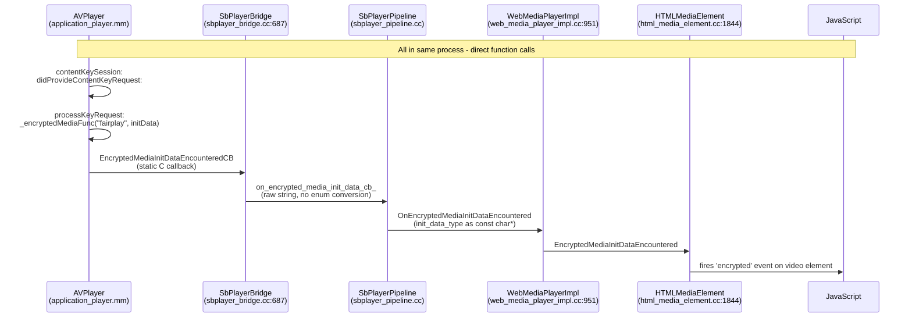
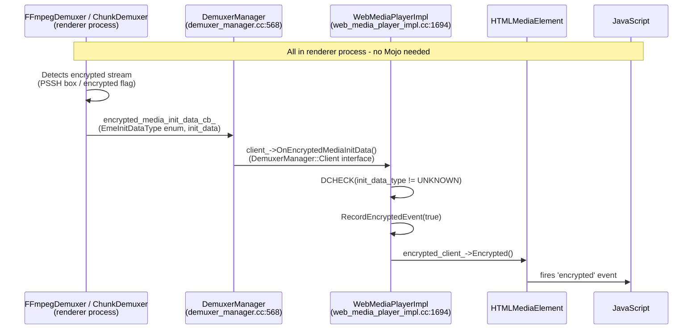
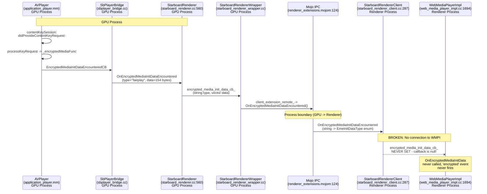
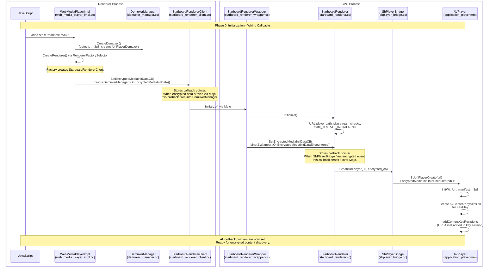
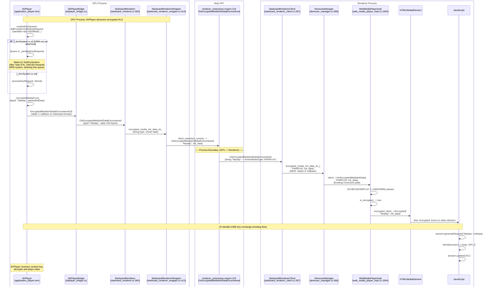

# Encrypted Event Forwarding: Architecture Comparison

**Date:** 2026-05-17
**Context:** FairPlay DRM integration for Cobalt on tvOS (AVPlayer/HLS path)
**Problem:** `encrypted` event from AVPlayer never reaches JS

## 1. The Core Problem

In Chromium, encrypted media events originate from the **Demuxer** (renderer process).
In our port, they originate from **AVPlayer** (GPU process). This process boundary
mismatch is the root cause of all architectural challenges.

| Aspect | Chromium | C25 (old Cobalt) | Cobalt/Chromium Port |
|--------|----------|------------------|----------------------|
| Process model | Multi-process | Single-process | Multi-process |
| Encrypted event origin | Demuxer (renderer) | AVPlayer (same process) | AVPlayer (GPU process) |
| Crosses process boundary? | No | N/A | Yes (GPU -> Renderer) |
| Interface used | `DemuxerManager::Client` | Direct callback chain | Mojo + ??? |
| Current status | Works | Works | **Broken** (last mile missing) |

## 2. C25 Architecture (Single-Process)

C25 is single-process. The encrypted event flows through a direct callback chain
with no process boundary to cross.



### C25 Race-Safe DRM Handshake

C25 uses a two-sided callback pattern in `WebMediaPlayerImpl` to handle the race
between pipeline startup and CDM creation:

```
WebMediaPlayerImpl:
  SetDrmSystemReadyCB(callback)   <-- Called by pipeline during Start()
    stores drm_system_ready_cb_
    if (drm_system_ already set): callback.Run(drm_system_)

  SetDrmSystem(drm_system)        <-- Called by video.setMediaKeys()
    stores drm_system_
    if (drm_system_ready_cb_ set): drm_system_ready_cb_.Run(drm_system_)
```

This ensures DRM attachment works regardless of whether CDM or pipeline starts first.
The callback unconditionally forwards to `SbPlayerBridge::SetDrmSystem` which calls
`SbUrlPlayerSetDrmSystem`.

### C25 Key Points
- No process boundary, no Mojo, no enum conversion
- Init data type flows as raw `const char*` string end-to-end ("fairplay")
- `SetDrmSystem` always reaches the player bridge (no state machine gating)
- Encrypted events fire through a direct callback chain

## 3. Chromium Architecture (Multi-Process, Demuxer-Driven)

In standard Chromium, encrypted events come from the **Demuxer** which lives in the
**renderer process** (same process as WebMediaPlayerImpl). No cross-process call needed.



### Chromium Key Interfaces

**`DemuxerManager::Client`** (`media/filters/demuxer_manager.h:49`):
```cpp
class Client {
  virtual void OnEncryptedMediaInitData(
      EmeInitDataType init_data_type,
      const std::vector<uint8_t>& init_data) = 0;
};
```
WebMediaPlayerImpl implements this. The DemuxerManager calls it when any demuxer
detects encrypted content.

**`RendererClient`** (`media/base/renderer_client.h`):
```
OnError, OnEnded, OnStatisticsUpdate, OnBufferingStateChange,
OnWaiting, OnAudioConfigChange, OnVideoConfigChange,
OnVideoNaturalSizeChange, OnVideoOpacityChange, OnVideoFrameRateChange
```
**Does NOT have `OnEncryptedMediaInitData`.** By design: encrypted events come from
the demuxer, not the renderer. The renderer handles playback control/metrics.

### Why RendererClient Has No Encrypted Callback

This is intentional in Chromium's architecture:
- **Demuxer** parses the media container and discovers encryption metadata (PSSH boxes)
- **Renderer** receives already-parsed streams and handles decode/display
- Encrypted events are a **stream discovery** concern, not a **rendering** concern
- Therefore, encrypted events belong in the Demuxer -> DemuxerManager -> WMPI path

## 4. Our Port Architecture (Multi-Process, AVPlayer-Driven)

Our port has a fundamental architectural mismatch: encrypted events come from
**AVPlayer in the GPU process**, but `WebMediaPlayerImpl::OnEncryptedMediaInitData`
is in the **renderer process**.



### What Works (Verified by Logs)

| Stage | File:Line | Status |
|-------|-----------|--------|
| AVPlayer detects encrypted content | `application_player.mm:791` | WORKS |
| Key request queued (pending DRM) | `application_player.mm` `_pendingKeyRequests` | WORKS |
| Task 8: SetCdm forwards DRM to player | `starboard_renderer.cc:315-324` | WORKS (fixed) |
| Pending key requests drained | `application_player.mm` `setDrmSystem:` | WORKS |
| `_encryptedMediaFunc` fires | `application_player.mm:744` | WORKS |
| SbPlayerBridge callback | `sbplayer_bridge.cc:687` | WORKS |
| StarboardRenderer receives data | `starboard_renderer.cc:560` | WORKS |
| Wrapper forwards via Mojo | `starboard_renderer_wrapper.cc:413` | WORKS |
| StarboardRendererClient receives | `starboard_renderer_client.cc:287` | WORKS |
| **Forward to WMPI** | **NOT WIRED** | **BROKEN** |

### What's Missing: The Last Mile

`StarboardRendererClient` has `SetEncryptedMediaInitDataCB()` but nobody calls it.
The callback that would connect to `WebMediaPlayerImpl::OnEncryptedMediaInitData`
is never registered.

## 4a. WebKit Reference: How Safari Handles FairPlay Encrypted Events

WebKit is the reference implementation for FairPlay on Apple platforms. Both WebKit
and our Cobalt code use AVPlayer for HLS playback, but they use **different Apple
APIs** for FairPlay key delivery.

### Two Apple APIs for FairPlay Key Delivery

| Aspect | WebKit (Safari) | Cobalt (Our Code) |
|--------|----------------|-------------------|
| **API** | `AVAssetResourceLoadingDelegate` (older) | `AVContentKeySession` (newer, recommended) |
| **Callback** | `shouldWaitForLoadingOfResource:` (`MediaPlayerPrivateAVFoundationObjC.mm:2167`) | `contentKeySession:didProvideContentKeyRequest:` (`application_player.mm:791`) |
| **Receives** | `AVAssetResourceLoadingRequest` with `skd://` URL | `AVContentKeyRequest` with identifier string |
| **Gets URI via** | `[avRequest.request.URL absoluteString]` | `keyRequest.identifier` |
| **Both get** | Same `skd://` URI from AVPlayer | Same `skd://` URI from AVPlayer |

Both APIs ultimately extract the same `skd://` URI from the HLS manifest's `EXT-X-KEY`
tag. The difference is just the delegate pattern Apple uses to deliver it.

### What WebKit Sends to JavaScript

**Source:** `WebKit/Source/WebCore/platform/graphics/avfoundation/objc/MediaPlayerPrivateAVFoundationObjC.mm:2206-2208`

```objc
RetainPtr keyURIData = [keyURI.createNSString()
    dataUsingEncoding:NSUTF8StringEncoding allowLossyConversion:YES];
m_keyID = SharedBuffer::create(keyURIData.get());
player->initializationDataEncountered("skd"_s,
    protect(m_keyID)->tryCreateArrayBuffer());
```

| Field | Value |
|-------|-------|
| **initDataType** | `"skd"` |
| **initData** | Raw `skd://` URI encoded as **UTF-8** |
| **Example** | `skd://302f80dd-411e-4886-bca5-bb1f8018a024:77FD1889AAF4143B...` |

### What Our Code Now Sends (After Fix)

**Source:** `starboard/tvos/shared/media/application_player.mm` (updated)

The init data type is **not hardcoded**. It is extracted from the URI scheme
reported by `keyRequest.identifier`, matching how WebKit extracts it.

```objc
// Extract init data type from URI scheme (not hardcoded).
// Matches WebKit: MediaPlayerPrivateAVFoundationObjC.mm:2173
//   WebKit:  String scheme = [[[avRequest request] URL] scheme];
//   Cobalt:  NSString* scheme = [[NSURL URLWithString:identifier] scheme];
NSURL* keyURL = [NSURL URLWithString:urlString];
NSString* scheme = [keyURL scheme];  // "skd" from "skd://302f80dd-..."
const char* initDataType = scheme ? [scheme UTF8String] : "unknown";

// Send raw URI as UTF-8.
// Matches WebKit: MediaPlayerPrivateAVFoundationObjC.mm:2206-2208
//   WebKit:  keyURIData = [keyURI dataUsingEncoding:NSUTF8StringEncoding];
//            initializationDataEncountered("skd"_s, keyURIData);
//   Cobalt:  uriData = [urlString dataUsingEncoding:NSUTF8StringEncoding];
//            _encryptedMediaFunc(player, context, initDataType, uriData, len);
NSData* uriData = [urlString dataUsingEncoding:NSUTF8StringEncoding];
_encryptedMediaFunc(starboardPlayer, _playerContext, initDataType,
                    static_cast<const unsigned char*>(uriData.bytes),
                    uriData.length);
```

### What Our Code Previously Sent (YouTube-Specific)

```objc
// Type was hardcoded as "fairplay", data packed as UTF-16LE with length prefix
NSData* urlStringData = [urlString dataUsingEncoding:NSUTF16LittleEndianStringEncoding];
uint32_t urlStringDataLength = urlStringData.length;
NSMutableData* initData = [NSMutableData dataWithBytes:&urlStringDataLength
                                                length:sizeof(urlStringDataLength)];
[initData appendData:urlStringData];
_encryptedMediaFunc(starboardPlayer, _playerContext, "fairplay", ...);
```

### Side-by-Side Comparison

| Field | Old (YouTube) | New (Cobalt) | WebKit (Safari) |
|-------|--------------|--------------|-----------------|
| **initDataType** | `"fairplay"` (hardcoded) | Extracted from URI scheme | Extracted from URL scheme |
| **How type is derived** | Hardcoded string literal | `[[NSURL URLWithString:id] scheme]` | `[[avRequest.request URL] scheme]` |
| **Init data content** | Packed: `[4B len][UTF-16LE skd URL]` | Raw `skd://` URI | Raw `skd://` URI |
| **Init data encoding** | UTF-16LE with length prefix | UTF-8 | UTF-8 |
| **byteLength** | ~154 bytes | ~75 bytes | ~75 bytes |
| **Compatible with** | YouTube's `SBDApplicationDrmSystem` | Standard FairPlay servers | Standard FairPlay servers |

### How WebKit CDM Handles generateRequest("skd", initData)

**Source:** `WebKit/Source/WebCore/platform/graphics/avfoundation/objc/CDMInstanceFairPlayStreamingAVFObjC.mm:832-834`

```objc
if (initDataType == CDMPrivateFairPlayStreaming::skdName()) {
    identifier = adoptNS([[NSString alloc]
        initWithData:initData->makeContiguous()->createNSData().get()
            encoding:NSUTF8StringEncoding]);
}
```

WebKit simply decodes the UTF-8 data back to an NSString and uses it as the
`AVContentKeyRequest` identifier. Then it calls `makeStreamingContentKeyRequestData`
with the server certificate to generate the SPC (Server Playback Context).

### WebKit's Supported Init Data Types

**Source:** `WebKit/Source/WebCore/platform/graphics/avfoundation/CDMFairPlayStreaming.cpp:259-271`

| Type | Status | Handler |
|------|--------|---------|
| `"sinf"` | Always supported | `sanitizeSinf` / `extractKeyIDsSinf` - sinf box format |
| `"skd"` | Always supported | `sanitizeSkd` / `extractKeyIDsSkd` - skd:// URI format |
| `"cenc"` | Conditional (`HAVE(FAIRPLAYSTREAMING_CENC_INITDATA)`) | PSSH box format |
| `"mpts"` | Conditional (`HAVE(FAIRPLAYSTREAMING_MTPS_INITDATA)`) | MPEG-TS format |

## 5. Why Each "Simple Fix" Doesn't Work

### Option A: Add OnEncryptedMediaInitData to RendererClient

**Conceptually wrong.** RendererClient is for renderer -> pipeline callbacks
(playback control, metrics). Encrypted events are stream discovery, not rendering.
Adding it here contradicts Chromium's design and would need changes to:
- `media/base/renderer_client.h` (upstream interface)
- `media/renderers/renderer_impl.cc` (PipelineImpl::RendererWrapper)
- `media/base/pipeline_impl.cc`
- Every RendererClient implementation

**Verdict:** High impact, wrong abstraction layer.

### Option B: Use UrlPlayerDemuxer as Bridge

**Can't work.** UrlPlayerDemuxer is in the renderer process but encrypted events
come from AVPlayer in the GPU process. The demuxer never receives these events.
DemuxerManager creates UrlPlayerDemuxer without an encrypted callback
(`demuxer_manager.cc:361`) because it's a stub.

Even if we gave UrlPlayerDemuxer a callback, there's no mechanism for the GPU-side
encrypted events to reach the renderer-side demuxer.

**Verdict:** Wrong direction of data flow.

### Option C: Wire Through Factory Chain

**Would work but touches many files.** The callback needs to go:
1. `WebMediaPlayerImpl` creates callback bound to `OnEncryptedMediaInitData`
2. Passes through `RendererFactorySelector` -> `StarboardRendererClientFactory`
3. Factory passes to `StarboardRendererClient` constructor
4. Client stores and uses it in `OnEncryptedMediaInitDataEncountered`

This touches: `web_media_player_impl.cc`, `renderer_factory.h`,
`starboard_renderer_client_factory.h/.cc`, `starboard_renderer_client.h/.cc`,
possibly `media_factory.cc`.

**Verdict:** Correct design but high file count.

### Option D: Post-Construction Callback Registration

**Simplest viable approach.** After the renderer is created by the factory,
`WebMediaPlayerImpl` checks if it's a `StarboardRendererClient` and calls
`SetEncryptedMediaInitDataCB()` with a bound callback to
`OnEncryptedMediaInitData`.

This only touches:
1. `web_media_player_impl.cc` - after renderer creation, set the callback
2. No factory changes needed

**Verdict:** Minimal changes, works within existing patterns.

### Option E: DemuxerManager::OnEncryptedMediaInitData as Public Method

**Clean bridge approach.** `DemuxerManager` already has `OnEncryptedMediaInitData`
(`demuxer_manager.cc:568`) which forwards to `client_->OnEncryptedMediaInitData()`
(WMPI). If `StarboardRendererClient` can call `DemuxerManager::OnEncryptedMediaInitData`
directly, the existing path handles everything.

`WebMediaPlayerImpl` owns both `DemuxerManager` and the `Renderer`. It could pass
a callback bound to `DemuxerManager::OnEncryptedMediaInitData` to the renderer
client.

This reuses the existing Chromium forwarding path exactly.

**Verdict:** Clean, reuses existing infrastructure, minimal changes.

## 6. Recommended Approach: Option E

Wire `StarboardRendererClient` to call `DemuxerManager::OnEncryptedMediaInitData`
via a callback set by `WebMediaPlayerImpl`. This reuses the exact same path that
FFmpegDemuxer and ChunkDemuxer use for encrypted events.

### Complete Flow: Initialization (Callback Wiring)

Before any encrypted content is discovered, the callback pointers must be
established. This happens during page load when `video.src` is set.



### Complete Flow: Encrypted Content Discovery and Event Forwarding

Now when AVPlayer encounters encrypted content, the event flows through the
entire chain to reach JavaScript.



### What Option E Changes (New Code)

**Only 2 files need changes:**

**File 1: `media/filters/demuxer_manager.h`**
Make `OnEncryptedMediaInitData` public (currently private):
```cpp
// Currently private - move to public:
void OnEncryptedMediaInitData(EmeInitDataType init_data_type,
                              const std::vector<uint8_t>& init_data);
```

**File 2: `third_party/blink/.../web_media_player_impl.cc`**
After renderer creation, wire the callback:
```cpp
// In CreateRenderer() or after renderer is assigned:
#if SB_HAS(PLAYER_WITH_URL)
if (auto* src = dynamic_cast<StarboardRendererClient*>(renderer_.get())) {
    src->SetEncryptedMediaInitDataCB(
        base::BindRepeating(&DemuxerManager::OnEncryptedMediaInitData,
                            base::Unretained(demuxer_manager_.get())));
}
#endif
```

### Why This Works

- Reuses the exact same `DemuxerManager -> WMPI` path as Widevine/DASH
- The DCHECK at `web_media_player_impl.cc:1697` passes because we added
  `EmeInitDataType::FAIRPLAY` in Phase 1
- No changes to `RendererClient`, `PipelineImpl`, or factory chain
- Guarded by `SB_HAS(PLAYER_WITH_URL)` so Widevine/DASH path is untouched
- Callback wiring happens at initialization, before encrypted content is discovered

### Why Each Existing Piece Matters

| Component | Set When | Called When | Purpose |
|-----------|----------|-------------|---------|
| `SR::encrypted_media_init_data_cb_` | Wrapper::Initialize | AVPlayer fires encrypted event | Forward from GPU renderer to wrapper |
| `Wrapper::client_extension_remote_` | Construction (Mojo pipe) | Wrapper receives from SR | Send over Mojo to renderer process |
| `SRC::encrypted_media_init_data_cb_` | **WMPI sets via Option E** | Mojo delivers from GPU | Forward to DemuxerManager (existing path) |
| `DM::client_` | DemuxerManager construction | SRC calls OnEncryptedMediaInitData | Forward to WMPI (existing Chromium code) |

## 7. Comparison: How Encrypted Events Reach JS in Each System

```mermaid
flowchart TD
    subgraph C25["C25 (Single Process)"]
        C25_AVP["AVPlayer"] --> C25_Bridge["SbPlayerBridge"]
        C25_Bridge --> C25_Pipeline["SbPlayerPipeline"]
        C25_Pipeline --> C25_WMP["WebMediaPlayerImpl"]
        C25_WMP --> C25_JS["JS 'encrypted' event"]
        style C25 fill:#e8f5e9
    end

    subgraph Chromium["Chromium (Multi-Process, Renderer Only)"]
        CR_Demuxer["FFmpegDemuxer<br/>(Renderer Process)"] --> CR_DM["DemuxerManager"]
        CR_DM --> CR_WMPI["WebMediaPlayerImpl"]
        CR_WMPI --> CR_JS["JS 'encrypted' event"]
        style Chromium fill:#e3f2fd
    end

    subgraph Port["Our Port (Multi-Process, GPU -> Renderer)"]
        subgraph GPU["GPU Process"]
            P_AVP["AVPlayer"] --> P_Bridge["SbPlayerBridge"]
            P_Bridge --> P_SR["StarboardRenderer"]
            P_SR --> P_Wrapper["Wrapper (Mojo send)"]
        end
        P_Wrapper -->|"Mojo IPC"| P_SRC
        subgraph Renderer["Renderer Process"]
            P_SRC["StarboardRendererClient<br/>(Mojo receive)"]
            P_SRC -->|"Option E<br/>callback"| P_DM["DemuxerManager"]
            P_DM --> P_WMPI["WebMediaPlayerImpl"]
            P_WMPI --> P_JS["JS 'encrypted' event"]
        end
        style GPU fill:#fff3e0
        style Renderer fill:#e3f2fd
    end
```



## 8. Files Changed Summary (Verified Against Commits)

| Phase | What | Commit | Files |
|-------|------|--------|-------|
| Key system | FairplayKeySystemInfo registration | `ff203b8` | `fairplay_key_system_info.cc/h`, `cobalt_content_renderer_client.cc`, `BUILD.gn` (4 files) |
| Init data types | EmeInitDataType enum (SINF, SKD, FAIRPLAY) | `6a9c464` | `eme_constants.h`, `encrypted_media_utils.cc`, `starboard_cdm.cc`, `external_clear_key_key_system_info.cc`, `web_content_decryption_module_session_impl.cc` (5 files) |
| Task 8 | SetCdm forwards DRM to URL player | `711d7b9` | `starboard_renderer.cc` (1 file) |
| Encrypted event forwarding + Option E | GPU -> Mojo -> Renderer -> DemuxerManager -> WMPI (with PostTask thread safety) | `a79221d` | `starboard_renderer.cc/h`, `starboard_renderer_wrapper.cc/h`, `starboard_renderer_client.cc/h`, `demuxer_manager.cc/h`, `web_media_player_impl.cc` (9 files) |
| Init data type | Send `"skd"` from AVPlayer (URI scheme extraction) | `125bea0` | `application_player.mm` (1 file) |
| Gap #1 | Enable setServerCertificate for FairPlay | `be90623` | `drm_is_server_certificate_updatable.mm`, `drm_update_server_certificate.mm`, `application_drm_system.h/mm`, `drm_manager.h/mm`, `drm_create_system.mm` (7 files) |
| Gap #2+3 | `"skd"` path in generateRequest (UTF-8 + stored cert) | `8278552` | `drm_generate_session_update_request.mm`, `application_drm_system.h/mm` (3 files) |
| Bonus | Raw binary CKC in session.update | `71dbe3d` | `drm_update_session.mm` (1 file) |

**Total: 8 commits, ~31 files changed.**

## 9. Resolution Status (2026-05-18)

**All items resolved. FairPlay DRM key exchange working end-to-end.**

Verified on device with Axinom FairPlay test server (`protected_1080p_h264_cbcs`).

```
requestMediaKeySystemAccess("com.youtube.fairplay")  --> accepted
createMediaKeys()                                     --> SbDrmCreateSystem OK
setServerCertificate(1242 bytes)                      --> stored, returns true
setMediaKeys() (SetCdm -> SetDrmSystem)               --> DRM forwarded to AVPlayer
encrypted event (type=skd, 75 bytes)                  --> reaches JS via Mojo + Option E
generateRequest("skd", skdUri)                        --> SPC generated (6592 bytes)
LICENSE SERVER (SPC sent, CKC received 892 bytes)     --> Axinom responded OK
session.update(CKC)                                   --> raw binary applied to AVPlayer
EVENT: canplay                                        --> AVPlayer has decryption key
```
