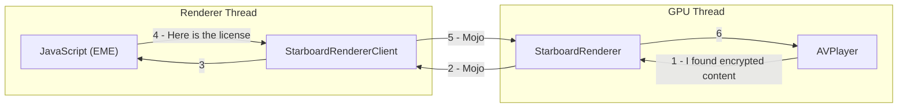
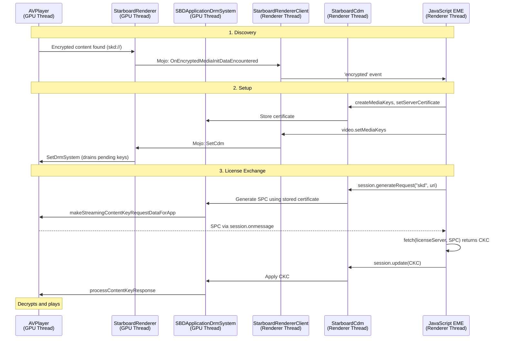

# **Design Doc: FairPlay DRM & EME Integration on Chrobalt (Phase 2)**

*Authors: [abhijeet@igalia.com](mailto:abhijeet@igalia.com)*  
*May 2026*

# **One-page overview**

### **Summary**
This document proposes adding FairPlay DRM support to Chrobalt's URL Player (Phase 1) so that protected HLS content can play on tvOS. The core challenge is that `AVPlayer` discovers encrypted content on the GPU thread, but the JavaScript EME logic that handles license exchange lives on the Renderer thread. We need to bridge this gap.

### **Platforms**
tvOS

### **Team**
Cobalt Media Team

### **Bug**
[b/512045535](https://partnerissuetracker.corp.google.com/u/1/issues/512045535)

### **Code affected**
`media/base`, `media/starboard`, `media/filters`, `media/mojo`, `starboard/tvos/shared/media`, `third_party/blink/renderer/platform/media`, `components/cdm/renderer`

---

# **Design**

## **The Big Picture**

In Phase 1, communication was one-way: the Renderer sends a URL to the GPU, and `AVPlayer` plays it. For encrypted content, we need two-way communication:



Steps 1-3: AVPlayer tells JavaScript about encryption (GPU to Renderer).
Steps 4-6: JavaScript provides the license back (Renderer to GPU).

The [W3C EME specification](https://www.w3.org/TR/encrypted-media-2/) defines the standard API for this conversation. The diagram below shows the standard EME stack. In our case, the **Media Stack** (bottom-left) is split across two threads, which is the root of every challenge in this document.


## **Why C25's Approach Does Not Work Here**

C25 was single-process. `AVPlayer` and JavaScript lived on the same thread, so the DRM handshake was a chain of direct function calls. C25 also made YouTube-specific choices:

*   Used a custom init data type `"fairplay"` instead of the standard `"skd"` or `"sinf"` types.
*   Did not support `setServerCertificate()`. Instead, the certificate was packed into `generateRequest()` init data.
*   Decoded identifiers as UTF-16LE and expected license responses in Base64.

These choices worked for YouTube's JS app but are incompatible with standard FairPlay web content. Since we do not have YouTube's app-side JS code for testing, we need to support the standard path (used by Safari and third-party providers like Axinom) while keeping backward compatibility with the C25 path for production.

## **Proposed Solution**

We propose four changes, each addressing a specific gap. For each, we describe what currently breaks and how we would fix it.

### **1. Route encrypted events from GPU to Renderer**

**What breaks:** AVPlayer discovers encryption and fires a callback, but the signal stops at `StarboardRenderer` (GPU thread). There is no path to reach JavaScript.

**What we propose:** Add a new Mojo method `OnEncryptedMediaInitDataEncountered` on `StarboardRendererClientExtension`. On the Renderer side, we wire this into the existing `DemuxerManager::OnEncryptedMediaInitData` entry point using a callback set during renderer creation. This reuses the same code path that Chromium's built-in demuxers already use, so the event reaches JavaScript through the standard `'encrypted'` event on the `<video>` element.

```
AVPlayer (GPU) -> SbPlayerBridge -> StarboardRenderer
    -> StarboardRendererWrapper -> Mojo
    -> StarboardRendererClient -> DemuxerManager
    -> WebMediaPlayerImpl -> JS 'encrypted' event
```

### **2. Add FairPlay init data types to Chromium's enum**

**What breaks:** Chromium's `EmeInitDataType` enum only has `CENC`, `WEBM`, and `KEYIDS`. FairPlay types (`"skd"`, `"sinf"`, `"fairplay"`) all map to `UNKNOWN`, which triggers a `DCHECK` crash in `WebMediaPlayerImpl`.

**What we propose:** Add `SKD`, `SINF`, and `FAIRPLAY` to the enum in `media/base/eme_constants.h` and update the string-to-enum mapping in `encrypted_media_utils.cc`. `SKD` is the standard FairPlay type (raw `skd://` URI). `SINF` is the standard MP4 sinf atom format. `FAIRPLAY` is C25's custom YouTube type. All `switch` statements on the enum across the codebase would need updates.

### **3. Support both standard and C25 data formats**

**What breaks:** Three format mismatches cause silent failures:

| Issue | C25 expects | Standard provides | Result |
| :--- | :--- | :--- | :--- |
| Init data format | Packed 3-field blob | Raw `skd://` URI | `unpackData()` returns nil, callback never fires |
| Identifier encoding | UTF-16LE | UTF-8 | Garbled string, no match to pending key request |
| License response | Base64 string | Raw binary | Decode fails, key not applied |

**What we propose:** Branch on the init data type string in the Starboard DRM layer. If the type is `"skd"`, treat data as raw UTF-8 and use a stored certificate. If the type is `"fairplay"`, use the existing C25 unpacking logic. For license responses, try raw binary first, fall back to Base64.

### **4. Support certificate storage and late DRM attachment**

**What breaks:** Two issues related to timing:

*   `setServerCertificate()` is rejected because C25 returned `false` from `SbDrmIsServerCertificateUpdatable`. C25's YouTube app packed the certificate into `generateRequest()` instead. Chromium/Widevine and Safari/FairPlay both support `setServerCertificate()`. The [W3C EME spec](https://www.w3.org/TR/encrypted-media-2/#dom-mediakeys-setservercertificate) allows either approach, but standard FairPlay web apps (the only ones we can test with) require it.

*   AVPlayer discovers encryption before JS has finished setting up the CDM. Key requests are queued in `_pendingKeyRequests` but never drained because `SetCdm` does not call `player_bridge_->SetDrmSystem()`.

**What we propose:** Return `true` from `SbDrmIsServerCertificateUpdatable` and store the certificate in `SBDApplicationDrmSystem`. In `StarboardRenderer::SetCdm`, always forward the DRM system to the player bridge so pending key requests are drained regardless of when the CDM arrives.

## **End-to-End Flow**



## **Platform Guard Strategy**

Same as Phase 1:

| Where | Guard |
| :--- | :--- |
| Non-Starboard code | `BUILDFLAG(IS_IOS_TVOS) && BUILDFLAG(USE_STARBOARD_MEDIA)` |
| Starboard code (`media/starboard/`) | `#if SB_HAS(PLAYER_WITH_URL)` |
| Enum declarations (`eme_constants.h`) | Unconditional (consistent with existing types) |
| Mojo definitions | Always present (cannot `EnableIf` for tvOS) |

---

# **Testing plan**

We propose validating with a [FairPlay test page](https://people.igalia.com/akandalkar/fairplay/fairplay-urlplayer-test.html) using an Axinom encrypted HLS stream.

**Success criteria:**
1. `encrypted` event fires in JS with init data type `"skd"`.
2. `setServerCertificate()` resolves successfully.
3. `generateRequest()` produces an SPC and fires `session.onmessage`.
4. After `session.update(CKC)`, video plays.

**Regression:** Non-encrypted HLS (Phase 1) must remain unaffected.

---

# **References**

| Topic | Link |
| :--- | :--- |
| W3C EME Specification | [encrypted-media-2](https://www.w3.org/TR/encrypted-media-2/) |
| W3C `setServerCertificate` | [Section 4.3.1](https://www.w3.org/TR/encrypted-media-2/#dom-mediakeys-setservercertificate) |
| W3C Init Data Format Registry | [eme-initdata-registry](https://www.w3.org/TR/eme-initdata-registry/) |
| C25 `SbDrmIsServerCertificateUpdatable` | [github](https://github.com/youtube/cobalt/blob/main/starboard/tvos/shared/media/drm_is_server_certificate_updatable.mm) |
| C25 `application_player.mm` | [github](https://github.com/youtube/cobalt/blob/main/starboard/tvos/shared/media/application_player.mm) |
| WebKit FairPlay CDM | `CDMInstanceFairPlayStreamingAVFObjC.mm` (local: `/Users/abhijeet/code/WebKit/Source/WebCore/platform/graphics/avfoundation/objc/`) |
| Phase 1 Design Doc | `Phase-1.md` |
| Detailed Research | `ResearchReport.md`, `EME-C25-Flow.md`, `FairPlay-GenerateRequest-Gap-Analysis.md` |
