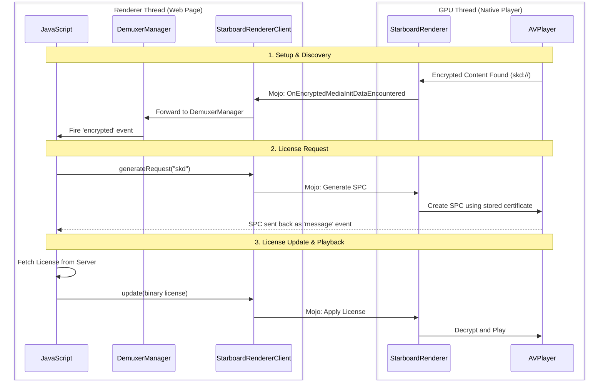

# **Design Doc: FairPlay DRM & EME Integration on Chrobalt (Phase 2)**

*Authors: [abhijeet@igalia.com](mailto:abhijeet@igalia.com)*  
*May 2026*

# **One-page overview**

### **Summary**
This document proposes a strategy to integrate Apple's FairPlay Streaming (FPS) DRM into Chrobalt's multi-process architecture. Building on the Phase 1 "URL Player," this work enables playback of protected HLS content by bridging the DRM conversation between the native platform and Chromium’s media stack.

While Phase 1 solved the process boundary problem for *routing* the HLS URL, Phase 2 addresses the more complex challenge of synchronizing the DRM handshake. We must ensure that encrypted media events discovered by the native `AVPlayer` (running on the GPU thread) can successfully trigger the standard web-based DRM logic (running on the Renderer thread) and that the resulting license can be safely delivered back to the hardware.

### **Platforms**
tvOS

### **Team**
Cobalt Media Team

### **Bug**
[b/512045535](https://partnerissuetracker.corp.google.com/u/1/issues/512045535) (Reference)

### **Code affected**
`media/base`, `media/starboard`, `media/filters`, `media/mojo`, `starboard/tvos/shared/media`, `third_party/blink/renderer/platform/media`

---

# **Design**

## **Problem Statement**
On tvOS, `AVPlayer` lives in the GPU thread, while the web page and its EME logic (JavaScript) live in the Renderer thread. For encrypted HLS, these two sides must perform a bidirectional conversation across a process boundary.

In the old Cobalt (C25) architecture, this was simple because everything happened on a single thread using direct function calls. In Chrobalt, we must bridge this gap using Mojo IPC. Every message must land on the correct thread and use a data format that both Chromium's EME stack and Apple's native frameworks understand.

### **Process Boundary Diagram**

```
      Renderer Thread (Web Page)                 GPU Thread (Native Player)
      =========================                  ==========================

  +-----------------------+             +------------------------+
  | WebMediaPlayerImpl    |             | StarboardRenderer      |
  |   (Fires 'encrypted') |  <--Mojo--  |   (Receives Events)    |
  +-----------------------+             |                        |
  | StarboardRendererClient|            | SbPlayerBridge         |
  |   (Bridges Events)    | --Mojo-->  |   (Native Wrappers)    |
  +-----------------------+             +------------------------+
  | StarboardCdm          |             | SBDApplicationPlayer   |
  |   (Bridges License)   | --Mojo-->  |   (AVContentKeySession)|
  +-----------------------+             +------------------------+
  | JavaScript (EME)      |             | AVPlayer               |
  |   session.update()    |             |   (Hardware Decrypt)   |
  +-----------------------+             +------------------------+
```

## **FairPlay Integration Strategy**

### **Background: The C25 Legacy**
C25's FairPlay implementation was highly specialized for YouTube. It made several assumptions that are incompatible with Chrobalt:
*   **Synchronous Flow:** It relied on direct function calls. In Chrobalt, native player events fire from background system queues and must be asynchronously posted across threads.
*   **Custom Formats:** It used a proprietary "packed" format for initialization data. Standard web content uses raw URI strings (`skd://`).
*   **Implicit Certificates:** It bypassed `setServerCertificate()`, assuming the certificate would always be bundled inside the license request itself.

### **Why Chrobalt needs a different approach**
To support standard FairPlay (e.g., Axinom, Safari-compatible web apps), we must align with W3C EME standards while maintaining backward compatibility for legacy YouTube content. This requires the system to handle raw URIs, explicit certificates, and binary license formats that the legacy code was not designed for.

### **Capability Interception (IsTypeSupported)**
Before playback begins, a web app calls `navigator.requestMediaKeySystemAccess()` to check if the browser supports FairPlay. Our investigation identified a critical roadblock in this initial check:

*   **Encryption Scheme Default:** Chromium's configuration selector defaults to `kCenc` (Common Encryption) if the application doesn't specify a scheme. However, FairPlay **only** supports `kCbcs` (Sample-AES). This causes the browser to silently reject FairPlay because it thinks the platform cannot handle the requested (default) encryption scheme.
*   **Starboard Routing:** During this check, the browser probes the platform via `SbMediaCanPlayMimeAndKeySystem`. On tvOS, this logic must correctly identify when a query is for HLS content (e.g., using `application/x-mpegURL`) and ensure it returns a positive result for FairPlay-supported codecs like H.264 and AAC.

We propose updating these capability checks to be "FairPlay-aware," ensuring that the browser correctly identifies the platform's native DRM capabilities.

## **Investigation Findings**
Our research identified four critical technical gaps that would prevent a standard DRM handshake:

1.  **Orphaned Encrypted Events:** Chromium expects encryption to be discovered by a "Demuxer" in the Renderer. Since our native player replaces the Demuxer but lives in the GPU, encrypted events are trapped in the GPU thread with no path back to the web page.
2.  **Enum Incompatibility:** Chromium's `EmeInitDataType` does not recognize `SKD` or `SINF`. These events are dropped as "unknown," causing a crash in the media pipeline.
3.  **Encoding & Format Mismatches:**
    *   **Identifier Encoding:** Standard FairPlay uses UTF-8 for URIs. Legacy code expects UTF-16LE. This mismatch causes "key not found" errors in the hardware.
    *   **Unpacking Failure:** The platform layer unconditionally tries to "unpack" data. A raw standard URI is too short for this logic, causing the license request to fail silently and time out after 20 seconds.
4.  **Startup Races:** In a multi-threaded browser, the video might start loading before the DRM system is ready. If the system doesn't handle this "race" by queuing requests, the player will time out and fail to play.

## **Proposed Architecture**

### **1. Universal Type Support [proposed modification]**
We propose extending Chromium's core media enums to include `SINF` and `SKD`. This ensures that FairPlay-specific events are recognized throughout the entire IPC pipeline.

### **2. The Event Routing Bridge [proposed, new]**
To bridge the thread gap without hacking Chromium's core interfaces, we propose using the existing `DemuxerManager` as an entry point. When our custom Renderer is created, we will wire its event output directly into the `DemuxerManager`. This "injects" the platform-specific event into the standard Chromium flow, reaching JavaScript safely.

### **3. Adaptive DRM Payloads [proposed modification]**
The platform's DRM layer must become "format-aware":
*   **Modern Path:** If it detects standard HLS, it will treat identifiers as raw UTF-8 and use a stored certificate.
*   **Legacy Path:** It will retain the ability to read YouTube's custom blobs for backward compatibility.
*   **Resilient Licenses:** The system will attempt raw binary updates (standard) before falling back to decoding.

### **4. State-Resilient Handshaking [proposed modification]**
We propose a "late-binding" strategy where the DRM system can be attached to the player at any time. If the player finds encrypted content before the DRM is ready, it will safely queue the request and process it automatically once the connection is made.

## **Sequence Diagram: The Handshake**



---

# **Testing plan**

We will validate this design using a standard FairPlay test page.

**Success Criteria:**
- The `encrypted` event fires in JavaScript with a valid `skd://` URI.
- The browser successfully generates a license request (SPC) using a certificate set earlier in the process.
- The player accepts a raw binary license and begins playback.
- Existing YouTube HLS content continues to play correctly using the legacy path.
