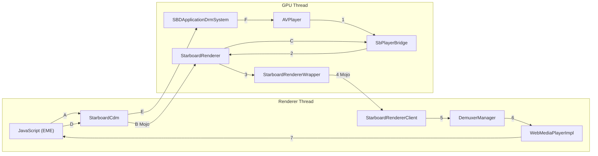
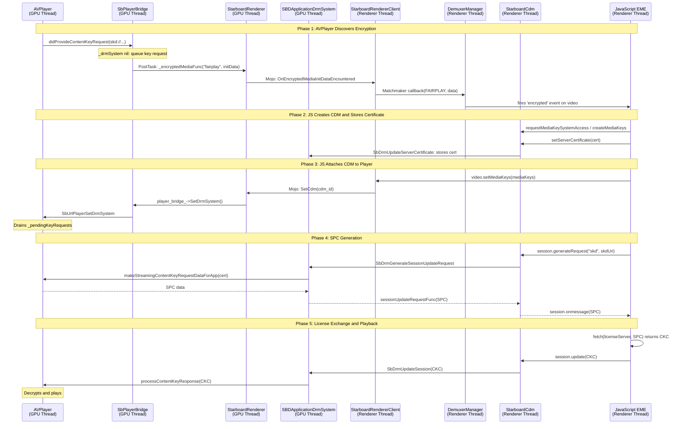

# **Design Doc: FairPlay DRM & EME Integration on Chrobalt (Phase 2)**

*Authors: [abhijeet@igalia.com](mailto:abhijeet@igalia.com)*  
*May 2026*

# **One-page overview**

### **Summary**
This document proposes a strategy to integrate Apple's FairPlay Streaming (FPS) DRM into Chrobalt's multi-process architecture. Building on the Phase 1 "URL Player," this work enables playback of protected HLS content by bridging the DRM conversation between the native platform and Chromium’s media stack.

While Phase 1 solved the process boundary problem for *routing* the HLS URL, Phase 2 addresses the more complex challenge of synchronizing the DRM handshake. We must ensure that encrypted media events discovered by the native `AVPlayer` (running on the GPU thread) can successfully trigger the standard web-based DRM logic (running on the Renderer thread) and that the resulting license can be safely delivered back to the hardware.

### **Platforms**
tvOS

### **Team**
Cobalt Media Team

### **Bug**
[b/512045535](https://partnerissuetracker.corp.google.com/u/1/issues/512045535) (Reference)

### **Code affected**
`media/base`, `media/starboard`, `media/filters`, `media/mojo`, `starboard/tvos/shared/media`, `third_party/blink/renderer/platform/media`, `components/cdm/renderer`

---

# **Design**

## **Problem Statement**
On tvOS, `AVPlayer` lives in the GPU thread, while the web page and its EME logic (JavaScript) live in the Renderer thread. For encrypted HLS, these two sides must perform a bidirectional conversation across a process boundary.

In the old Cobalt (C25) architecture, this was simple because everything happened on a single thread using direct function calls. In Chrobalt, we must bridge this gap using Mojo IPC. Every message must land on the correct thread and use a data format that both Chromium's EME stack and Apple's native frameworks understand.

### **Standard EME Architecture (W3C Reference)**

The W3C EME specification defines the following stack:


In standard Chromium, the **Media Stack** (bottom-left) contains the Demuxer, which discovers encrypted content and fires the `encrypted` event upward to JavaScript. The **Content Decryption Module** (bottom-right) handles license operations. Both live in the same process as the web page.

In our URL player architecture, the **Media Stack is split**: the Demuxer is a stub in the Renderer thread (`UrlPlayerDemuxer`), but the actual media handling (`AVPlayer`) lives in the GPU thread. This means the encrypted content discovery happens on the wrong side of a thread boundary and must be bridged back to the standard EME flow.

### **Process Boundary Diagram (Chrobalt URL Player)**



**Encrypted event flow (GPU to Renderer): Steps 1-7**

| Step | From | To | What Happens | File |
| :--- | :--- | :--- | :--- | :--- |
| 1 | AVPlayer | SbPlayerBridge | `didProvideContentKeyRequest` fires on `keySessionQueue` thread. `_encryptedMediaFunc` callback invoked with `"fairplay"` type and packed `skd://` URI. | `application_player.mm:802` |
| 2 | SbPlayerBridge | StarboardRenderer | `EncryptedMediaInitDataEncounteredCB` posts callback to GPU thread via `task_runner_->PostTask`. | `sbplayer_bridge.cc:593` |
| 3 | StarboardRenderer | StarboardRendererWrapper | `encrypted_media_init_data_cb_` fires (set during `Initialize`). | `starboard_renderer.cc:548` |
| 4 | StarboardRendererWrapper | StarboardRendererClient | **Mojo IPC** via `client_extension_remote_->OnEncryptedMediaInitDataEncountered(type, data)`. Crosses thread boundary. | `starboard_renderer_wrapper.cc:419` |
| 5 | StarboardRendererClient | DemuxerManager | Maps `"fairplay"` string to `EmeInitDataType::FAIRPLAY` enum. Calls the Matchmaker callback (set by `WebMediaPlayerImpl` during renderer creation). | `starboard_renderer_client.cc:297` |
| 6 | DemuxerManager | WebMediaPlayerImpl | `OnEncryptedMediaInitData` forwarded via `DemuxerManager::Client` interface. | `demuxer_manager.cc:576` |
| 7 | WebMediaPlayerImpl | JavaScript | Fires `'encrypted'` event on the `<video>` element. | `web_media_player_impl.cc:1697` |

**CDM attachment flow (Renderer to GPU): Steps A-C**

| Step | From | To | What Happens | File |
| :--- | :--- | :--- | :--- | :--- |
| A | JavaScript | StarboardCdm | JS calls `video.setMediaKeys(mediaKeys)`. | EME API |
| B | StarboardCdm | StarboardRenderer | **Mojo IPC** via `mojom::Renderer::SetCdm(cdm_id)`. | `renderer.mojom:44` |
| C | StarboardRenderer | SbPlayerBridge | `player_bridge_->SetDrmSystem(drm_system_)` calls `SbUrlPlayerSetDrmSystem`. Connects `AVContentKeySession` to DRM backend. Drains `_pendingKeyRequests`. | `starboard_renderer.cc:323` |

**License exchange flow (Renderer to GPU): Steps D-F**

| Step | From | To | What Happens | File |
| :--- | :--- | :--- | :--- | :--- |
| D | JavaScript | StarboardCdm | JS calls `session.generateRequest("skd", uri)` or `session.update(CKC)`. | EME API |
| E | StarboardCdm | SBDApplicationDrmSystem | `SbDrmGenerateSessionUpdateRequest` or `SbDrmUpdateSession`. These use the existing Starboard DRM API (no new Mojo method needed). | `starboard_cdm.cc` |
| F | SBDApplicationDrmSystem | AVPlayer | SPC: `makeStreamingContentKeyRequestDataForApp`. CKC: `processContentKeyResponse`. | `application_drm_system.mm:130, 104` |

## **Background: The C25 Legacy**
C25's FairPlay implementation was highly specialized for YouTube. It made several assumptions that are incompatible with Chrobalt:

*   **Synchronous Flow:** It relied on direct function calls. In Chrobalt, native player events fire from background system queues (e.g., `keySessionQueue`) and must be asynchronously posted to the GPU thread before they can safely enter the Chromium pipeline.
*   **Custom Init Data Type:** C25 uses a custom init data type string `"fairplay"` ([hardcoded in `application_player.mm:744`](https://github.com/youtube/cobalt/blob/main/starboard/tvos/shared/media/application_player.mm)). Standard FairPlay uses `"skd"` or `"sinf"` as init data types (see WebKit's [`CDMInstanceFairPlayStreamingAVFObjC.mm`](https://github.com/nicoboss/nicobalt/nicobalt)). Since `"fairplay"` is a YouTube-specific convention, only YouTube's JS app can exercise it. For testing with standard FairPlay streams, we need to extend support for `"skd"`. Both types would need corresponding entries in Chromium's `EmeInitDataType` enum, which currently only has `CENC`, `WEBM`, and `KEYIDS`.
*   **Certificate Handling:** C25's certificate flow is quite different from Safari and Chromium. C25 does not support `setServerCertificate()` ([returns `false`](https://github.com/youtube/cobalt/blob/main/starboard/tvos/shared/media/drm_is_server_certificate_updatable.mm)). Instead, YouTube's JS app passes the certificate as part of the `generateRequest()` init data. Chromium/Widevine (`media/cdm/cdm_adapter.cc:352`) and Safari/FairPlay (`CDMInstanceFairPlayStreamingAVFObjC.mm:394-409`) both store the certificate via `setServerCertificate()` and use it later when `generateRequest()` is called. The [W3C EME spec](https://www.w3.org/TR/encrypted-media-2/#dom-mediakeys-setservercertificate) does not force either approach, so both are compliant. For production with YouTube's JS app, the C25 path would work. But for testing with standard FairPlay test streams (Axinom, etc.), we need the Chromium/Safari behavior since we do not have YouTube's app-side JS code.

## **Investigation Findings**
Our research has identified four critical technical gaps that would prevent a standard DRM handshake:

1.  **Orphaned Encrypted Events:** Chromium treats encryption as a "stream-discovery" concern managed by the Demuxer. Since our native player replaces the Demuxer but lives in the GPU, encrypted events have no path back to the web page. Neither `RendererClient` nor `Pipeline::Client` currently supports forwarding these events.
2.  **Enum Incompatibility:** Chromium's `EmeInitDataType` (`media/base/eme_constants.h`) only recognizes `CENC`, `WEBM`, and `KEYIDS`. FairPlay needs three additional types: `SKD` (standard raw URI), `SINF` (standard MP4 atoms), and `FAIRPLAY` (C25/YouTube custom packed format). Without these, all three map to `UNKNOWN`, triggering a `DCHECK` crash in `WebMediaPlayerImpl::OnEncryptedMediaInitData` (`web_media_player_impl.cc:1697`).
3.  **Encoding & Format Mismatches:**
    *   **Identifier Encoding:** Standard FairPlay uses UTF-8 for `skd://` URIs. Legacy code expects UTF-16LE. If we send standard data, it becomes "garbage" that doesn't match the hardware's expected identifier.
    *   **Unpacking Failure:** The platform layer unconditionally tries to "unpack" data into three fields. A raw URI is too short, causing the unpacking to fail silently and the Mojo message to time out after 20 seconds.
4.  **Timing Between Player and DRM:** AVPlayer starts loading the HLS manifest immediately after `SbUrlPlayerCreate`. If the manifest contains FairPlay encryption, AVPlayer fires `didProvideContentKeyRequest` and queues the key request in `_pendingKeyRequests` (`application_player.mm:810`). Meanwhile, on the Renderer thread, JS is still going through `requestMediaKeySystemAccess` -> `createMediaKeys` -> `setMediaKeys`. The `SetCdm` call that connects the DRM system to the player arrives later. If `StarboardRenderer::SetCdm` does not forward the DRM system to the player bridge (`player_bridge_->SetDrmSystem()`), the queued key requests are never processed and AVPlayer times out waiting for decryption keys.

## **Proposed Architecture**

### **1. Universal Type Support [proposed modification]**
We propose extending `EmeInitDataType` in `media/base/eme_constants.h` to include `SINF`, `SKD`, and `FAIRPLAY`. This ensures that Apple's native events are recognized throughout the pipeline.

### **2. The "Matchmaker" Bridge Pattern [proposed, new]**
In normal Chromium, encrypted events flow from the Demuxer to `DemuxerManager::Client` (which is `WebMediaPlayerImpl`) -- all on the Renderer thread, no Mojo involved. For URL player, the event originates in the GPU thread and arrives at `StarboardRendererClient` via Mojo.

Rather than adding `OnEncryptedMediaInitData` to Chromium's core `RendererClient` and `Pipeline::Client` interfaces (which would require changes across all Renderer implementations), we propose a "Matchmaker" pattern: `WebMediaPlayerImpl` wires the `StarboardRendererClient`'s event output directly into `DemuxerManager`, reusing the existing `DemuxerManager::OnEncryptedMediaInitData` entry point that normal Chromium demuxers already use.

Concretely, during renderer creation in `WebMediaPlayerImpl::CreateRenderer()`, we would set a callback on `StarboardRendererClient` that posts to the main thread and calls `DemuxerManager::OnEncryptedMediaInitData`:

```
StarboardRendererClient (media thread)
  -> PostTask to main thread
  -> DemuxerManager::OnEncryptedMediaInitData(type, data)
  -> DemuxerManager::Client::OnEncryptedMediaInitData  [existing WMPI method]
  -> WebMediaPlayerImpl fires 'encrypted' event to JS
```

This avoids touching Chromium's `RendererClient`/`Pipeline::Client` interfaces entirely. The GPU event enters the Renderer through the same door that a normal demuxer would use.

> **Reference:** `DemuxerManager::OnEncryptedMediaInitData` already exists (`media/filters/demuxer_manager.cc`) and is used by `FFmpegDemuxer` and `ManifestDemuxer` for the same purpose. We would be adding a third caller (the StarboardRendererClient matchmaker callback), not inventing a new path.

### **3. Adaptive DRM Payloads [proposed modification]**
The Starboard DRM layer (`SBDApplicationDrmSystem`) must become "format-aware":
*   **Modern Path:** If the type is `"skd"`, it would treat the data as raw UTF-8 and use a stored certificate.
*   **Legacy Path:** It would retain the ability to unpack YouTube's custom blobs for backward compatibility.
*   **Resilient Licenses:** `SbDrmUpdateSession` would prioritize raw binary data (standard) before falling back to Base64 (legacy).

### **4. State-Resilient Handshaking [proposed modification]**
We propose three changes to handle multi-threaded races and missing signals:

*   **Certificate Persistence:** `SbDrmIsServerCertificateUpdatable` (`drm_is_server_certificate_updatable.mm:34`) currently returns `false` for application DRM systems, causing `setServerCertificate()` to reject. We propose returning `true` and threading the certificate through `SBDDrmManager` to `SBDApplicationDrmSystem`, where it would be stored as `_serverCertificate` for use during `generateRequest`.

*   **Unconditional CDM Attachment:** `StarboardRenderer::SetCdm` (`starboard_renderer.cc:298-325`) currently stores `drm_system_` but, for URL players, must also call `player_bridge_->SetDrmSystem(drm_system_)`. This triggers `SbUrlPlayerSetDrmSystem`, which sets `applicationPlayer.drmSystem`, connects the `AVContentKeySession` to the DRM backend, and drains all pending key requests queued in `_pendingKeyRequests` (`application_player.mm:757-764`).

    ```
    JS: video.setMediaKeys(mediaKeys)
      -> StarboardRendererClient -> Mojo -> StarboardRenderer::SetCdm
      -> player_bridge_->SetDrmSystem(drm_system_)
      -> SbUrlPlayerSetDrmSystem(player, drm_system)
      -> applicationPlayer.drmSystem = applicationDrmSystem
      -> _drmSystem.keySession = _keySession
      -> for each keyRequest in _pendingKeyRequests:
           [self processKeyRequest:keyRequest]   // drains queue
    ```

*   **Native Signal Discovery Fix:** `application_player.mm:802-814` currently only fires `_encryptedMediaFunc` when `_drmSystem` is already set. For URL players, `_drmSystem` is nil at startup (DRM is attached lazily via `SetCdm`). We propose also firing `_encryptedMediaFunc` in the `else` branch (when `_drmSystem` is nil), so the web app receives the `'encrypted'` event immediately and can begin the EME handshake. The key request would still be queued in `_pendingKeyRequests` for later processing when the DRM system is attached.

### **5. Thread Safety for Encrypted Media Callback [proposed modification]**
`SbPlayerBridge::EncryptedMediaInitDataEncounteredCB` (`sbplayer_bridge.cc:593-604`) is a static callback invoked from the `AVContentKeySession` delegate dispatch queue (`keySessionQueue`). Unlike `PlayerStatusCB` (which uses `PostTask`), this callback currently calls the Cobalt callback directly on the wrong thread. We propose wrapping it with `task_runner_->PostTask()` to ensure the callback runs on the GPU thread, matching the pattern used by other `SbPlayerBridge` callbacks.

## **Sequence Diagram: The Handshake**



## **Proposed Mojo IPC Extensions**

### **New Messages**
| Message | Direction | Interface | Purpose |
| :--- | :--- | :--- | :--- |
| `OnEncryptedMediaInitDataEncountered(type, data)` | GPU -> Renderer | `StarboardRendererClientExtension` | Would forward the init data type and payload from AVPlayer to the Renderer, where the Matchmaker bridge injects it into `DemuxerManager` to fire the JS `'encrypted'` event. |

### **Existing Messages Used (no changes needed)**
| Message | Direction | Interface | Purpose |
| :--- | :--- | :--- | :--- |
| `SetCdm(cdm_id)` | Renderer -> GPU | `mojom::Renderer` | Attaches the CDM to `StarboardRenderer`, which calls `player_bridge_->SetDrmSystem()` to connect `AVContentKeySession` and drain pending key requests. |

> **Note:** `setServerCertificate()` and `generateRequest()` / `session.update()` flow through `StarboardCdm` to the Starboard DRM APIs (`SbDrmUpdateServerCertificate`, `SbDrmGenerateSessionUpdateRequest`, `SbDrmUpdateSession`). These do not use new Mojo messages -- they use the existing CDM Mojo channel that Chromium already provides.

## **Platform Guard Strategy**

This work follows the same guard strategy established in Phase 1:

| Where | Guard | Why |
| :--- | :--- | :--- |
| **Non-Starboard code** (`//third_party/blink`, `//media/filters`, `//components/cdm`) | `BUILDFLAG(IS_IOS_TVOS) && BUILDFLAG(USE_STARBOARD_MEDIA)` | Limits FairPlay-specific code to tvOS only. |
| **Starboard code** (`media/starboard/`, etc.) | `#if SB_HAS(PLAYER_WITH_URL)` | Platform capability check -- only tvOS defines this. |
| **Enum declarations** (`media/base/eme_constants.h`) | Unconditional | Consistent with how Chromium defines `CENC`, `WEBM`, `KEYIDS`. FairPlay-specific behavior is guarded at the registration site (`FairplayKeySystemInfo`). |
| **Mojo IPC definitions** (`media/mojo/`) | Always present | Cannot use `EnableIf` for tvOS. Harmless if never called. |

---

# **Testing plan**

We propose validating this design using a [test page](https://people.igalia.com/akandalkar/fairplay/fairplay-urlplayer-test.html) loading an Axinom test stream (`protected_1080p_h264_cbcs`).

**Success Criteria:**
- **JS Events:** `encrypted` fires with `initDataType: "skd"` and a 75-byte URI.
- **Log Verification:** 
    * `IsServerCertificateUpdatable` returns `true`.
    * `pending key request lookup: FOUND` appears in logs.
    * `kSbPlayerStatePresenting` is reached after the license update.
- **Playback:** Video renders and plays without freezing or timing out.
