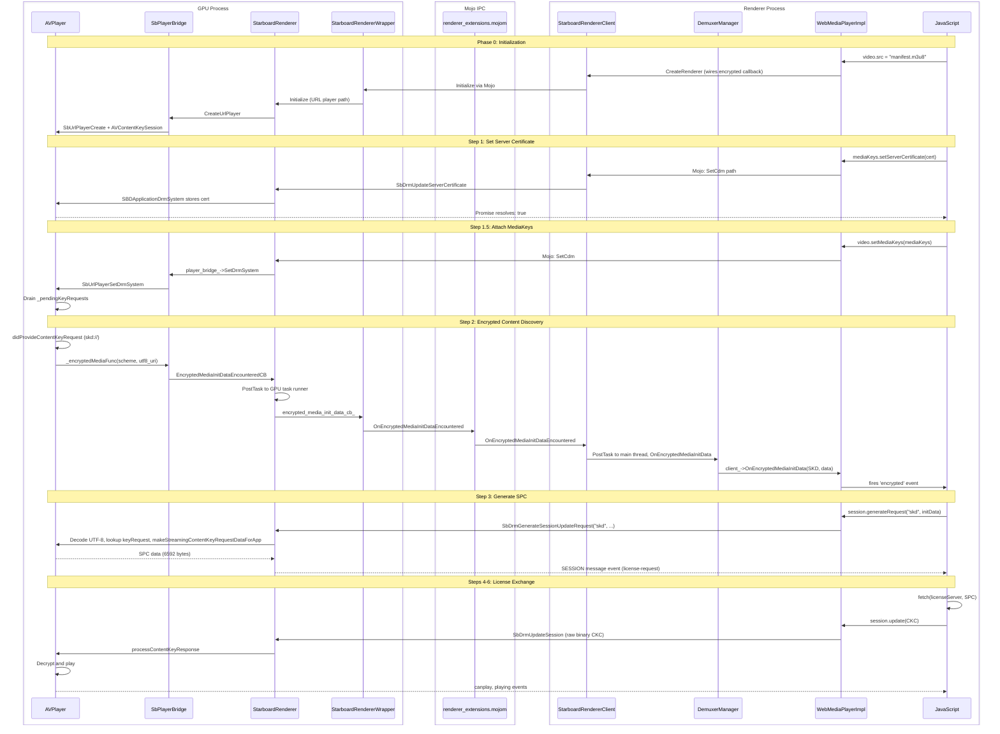

# **Design Doc: FairPlay DRM & EME Integration on Chrobalt (Phase 2)**

*Authors: [abhijeet@igalia.com](mailto:abhijeet@igalia.com)*
*May 2026*

# **One-page overview**

### **Summary**
This document describes how we propose to integrate Apple FairPlay Streaming (FPS) DRM into Chrobalt's multi-process architecture, enabling encrypted HLS playback via the URL Player established in Phase 1.

Phase 1 solved the process boundary problem for *clear* HLS playback: routing the URL from the Renderer to AVPlayer in the GPU process. Phase 2 adds DRM, which introduces a second, harder boundary problem: encrypted media events originate from AVPlayer (GPU process) but must reach JavaScript (Renderer process) to complete the EME key exchange. C25 avoided this entirely because it was single-process.

We divide this work into three areas:
- **EME capability registration:** Teaching Chromium's key system machinery about FairPlay
- **Encrypted event forwarding:** Bridging the AVPlayer-to-JavaScript gap across process boundaries
- **DRM handshake plumbing:** Wiring certificate storage, SPC generation, and license application through a multi-process pipeline that was designed for single-process callbacks

### **Platforms**
tvOS

### **Team**
Cobalt Media Team

### **Code affected**
`media/base`, `media/starboard`, `media/filters`, `media/mojo`, `starboard/tvos/shared/media`, `third_party/blink/renderer/platform/media`, `third_party/blink/renderer/modules/encryptedmedia`, `components/cdm/renderer`, `cobalt/renderer`

---

# **Design**

## **Problem Statement**

Phase 1 established that AVPlayer lives in the GPU process while the web page lives in the Renderer process, connected by Mojo IPC. For clear HLS, this works: the URL flows down, metadata flows back up. For encrypted HLS, the same boundary must carry a bidirectional DRM conversation:

1. **AVPlayer discovers encryption** and fires a FairPlay key request with a `skd://` URI.
2. **JavaScript must receive this event**, fetch a license from a server, and pass it back.
3. **AVPlayer applies the license** and begins decryption.

In C25, this conversation happened through direct function-pointer callbacks within a single process. In Chrobalt, every signal must cross the GPU-Renderer boundary via Mojo, land on the correct thread, and speak the correct data format. The existing Starboard DRM layer was built exclusively for YouTube's custom FairPlay flow, which differs from standard EME in init data format, certificate delivery, and response encoding.

## **Analysis of C25 Legacy Assumptions**

C25's FairPlay implementation was purpose-built for YouTube. Several design choices that worked well in a single-process environment become obstacles in a multi-process browser.

### **1. Non-standard init data type and format**

C25 hardcoded the string `"fairplay"` as the init data type and packed three fields into a single blob:

```
[4 bytes: skd URL length][skd URL as UTF-16LE]
[4 bytes: content ID length][content ID]
[4 bytes: certificate length][FairPlay certificate]
```

Standard FairPlay (as implemented by WebKit/Safari) sends the init data type as `"skd"` (the URI scheme extracted from the HLS manifest's `EXT-X-KEY` tag) and the init data as a raw UTF-8 `skd://` URI. The certificate is delivered separately via `setServerCertificate()`, not packed into the init data.

**Consequence:** The Starboard layer's `SbDrmGenerateSessionUpdateRequest` calls `unpackData()` unconditionally. When it receives a standard 75-byte UTF-8 URI instead of a 154-byte packed blob, the first four bytes are interpreted as a nonsensical length value, unpacking fails silently, the callback never fires, and Mojo times out after 20 seconds.

### **2. Implicit certificate delivery bypassing setServerCertificate()**

C25 deliberately returned `false` from `SbDrmIsServerCertificateUpdatable` for FairPlay:

```objc
// drm_is_server_certificate_updatable.mm
if ([drmManager isApplicationDrmSystem:drm_system]) {
    return false;  // Certificate packed into generateRequest() instead
}
```

This caused `StarboardCdm::SetServerCertificate` to reject the promise immediately. The certificate never reached the platform layer. YouTube's JavaScript compensated by packing the certificate into the `generateRequest()` init data.

**Consequence in Chrobalt:** Standard EME web applications call `setServerCertificate()` before `generateRequest()`. Without storing the certificate, the platform has no certificate available when it needs to call Apple's `makeStreamingContentKeyRequestDataForApp:`. The SPC cannot be generated, the `message` event never fires, and the license exchange never begins.

### **3. UTF-16LE identifier encoding**

`SBDApplicationDrmSystem::generateSessionUpdateRequestWithCertificationData:` decodes the init data identifier using `NSUTF16LittleEndianStringEncoding`. Standard FairPlay init data is UTF-8. When the identifier is decoded with the wrong encoding, the resulting string is garbled and cannot match the pending `AVContentKeyRequest` stored in `_keyRequestsPendingUpdateRequest`.

### **4. Base64 assumption for license responses**

`SbDrmUpdateSession` decodes the license response (CKC) as a Base64 string before passing it to `AVContentKeyResponse`. Standard FairPlay license servers return raw binary CKC data. Attempting to decode raw binary as UTF-8 returns `nil`, which crashes on `initWithBase64EncodedString:nil` with `NSInvalidArgumentException`.

### **5. Absence of thread-safety for encrypted media callbacks**

`SbPlayerBridge::EncryptedMediaInitDataEncounteredCB` is a static C callback invoked from the AVFoundation dispatch queue. Unlike other callbacks in the same file (e.g., `PlayerStatusCB`, `DeallocateSampleCB`), it did not post to the task runner. In a multi-process environment, calling the wrapper callback directly from the wrong thread triggers a `DCHECK` failure on `thread_checker_`.

### **6. State machine does not account for late DRM attachment**

`StarboardRenderer::Initialize` takes the URL player path and transitions directly to `STATE_PLAYING` without waiting for CDM. When `SetCdm` arrives later (from `video.setMediaKeys()`), it checks `state_ == STATE_INIT_PENDING_CDM`, finds `STATE_PLAYING` instead, and skips forwarding the DRM system to the player bridge. The `SbUrlPlayerSetDrmSystem` call never happens, pending key requests in `_pendingKeyRequests` are never drained, and the encrypted event never reaches JavaScript.

## **The Chrobalt Challenge: Technical Gaps**

### **1. Process boundary mismatch for encrypted events**

In Chromium, encrypted media events originate from the **Demuxer** in the Renderer process. The existing interface `DemuxerManager::Client::OnEncryptedMediaInitData` carries them to `WebMediaPlayerImpl`. The `RendererClient` interface (GPU-to-Renderer callbacks for playback control) deliberately omits encrypted media events because Chromium treats encryption as a stream-discovery concern, not a rendering concern.

In our port, encrypted events originate from **AVPlayer** in the GPU process. There is no demuxer to fire them. The signal must cross the GPU-Renderer boundary via Mojo, but neither `RendererClient` nor `Pipeline::Client` has a method for it.

**Failure mode:** The encrypted event reaches `StarboardRenderer::OnEncryptedMediaInitDataEncountered` in the GPU process but has no path to `WebMediaPlayerImpl`. JavaScript never receives the `encrypted` event. AVPlayer eventually times out waiting for a decryption key (`CoreMediaErrorDomain -19152`).

### **2. Missing init data type support in Chromium's EME stack**

Chromium's `EmeInitDataType` enum defines four values: `UNKNOWN`, `WEBM`, `CENC`, `KEYIDS`. FairPlay uses `skd` and `sinf` (standard, from WebKit) and `fairplay` (C25/YouTube legacy). All three map to `UNKNOWN` in Chromium's `ConvertToInitDataType`, which triggers a `DCHECK(init_data_type != EmeInitDataType::UNKNOWN)` in `WebMediaPlayerImpl::OnEncryptedMediaInitData`.

**Failure mode:** The encrypted event arrives at `WebMediaPlayerImpl` but crashes on the DCHECK because the init data type was downgraded to `UNKNOWN` during string-to-enum conversion.

### **3. Encryption scheme default breaks FairPlay**

`KeySystemConfigSelector::GetEncryptionSchemeConfigRule` treats `kNotSpecified` as `kCenc` for backward compatibility (documented in the W3C EME spec implementation notes). FairPlay only supports `kCbcs`. When JavaScript omits `encryptionScheme` in the `requestMediaKeySystemAccess` configuration, the selector defaults to `kCenc`, `FairplayKeySystemInfo` returns `UnsupportedRule`, and the capability query is silently rejected.

**Failure mode:** `requestMediaKeySystemAccess` rejects despite the key system being registered. No error message indicates the encryption scheme was the cause.

### **4. Thread hop requirements**

The encrypted event signal traverses four threads before reaching JavaScript:

```
AVFoundation dispatch queue  -->  GPU task runner  -->  Mojo IO thread  -->  Media thread  -->  Main thread
```

Each hop requires explicit `PostTask` or `BindPostTaskToCurrentDefault`. Missing any hop causes a `DCHECK` failure on the receiving end's `SequenceChecker`.

## **Proposed Architecture**

### **1. EME enum extension**

We propose adding `SINF`, `SKD`, and `FAIRPLAY` to `EmeInitDataType` in `media/base/eme_constants.h`, guarded by `BUILDFLAG(IS_IOS_TVOS) && BUILDFLAG(USE_STARBOARD_MEDIA)`:

| Value | Origin | Purpose |
|-------|--------|---------|
| `SINF` | WebKit `CDMFairPlayStreaming.cpp` | sinf box init data (key IDs in sinf atoms) |
| `SKD` | WebKit `CDMFairPlayStreaming.cpp` | skd:// URI init data (FairPlay key request) |
| `FAIRPLAY` | Cobalt C25 `application_player.mm` | Legacy init data from AVPlayer |

String mappings would be added to `encrypted_media_utils.cc` and switch statements updated across affected files. This satisfies the DCHECK in `WebMediaPlayerImpl` and enables proper type discrimination throughout the pipeline.

### **2. The "Matchmaker" bridge: Option E**

Rather than modifying `RendererClient` or `Pipeline::Client` (which would diverge from upstream Chromium), we propose using `DemuxerManager::OnEncryptedMediaInitData` as a bridge. This method already forwards encrypted events from demuxers to `WebMediaPlayerImpl` in the standard Chromium path.

In `WebMediaPlayerImpl::CreateRenderer()`, after the factory produces a `StarboardRendererClient`, we would wire a callback:

```cpp
starboard_client->SetEncryptedMediaInitDataCB(
    base::BindPostTaskToCurrentDefault(
        base::BindRepeating(&DemuxerManager::OnEncryptedMediaInitData,
                            base::Unretained(demuxer_manager_.get()))));
```

`BindPostTaskToCurrentDefault` ensures the callback is posted to the main thread (where `CreateRenderer` runs), even though `StarboardRendererClient` fires it from the media thread.

The full forwarding chain:

```
StarboardRenderer (AVFoundation thread)
  -> PostTask to GPU task runner
    -> StarboardRendererWrapper (Mojo send)
      -> StarboardRendererClient (Mojo receive, media thread)
        -> PostTask to main thread (BindPostTaskToCurrentDefault)
          -> DemuxerManager::OnEncryptedMediaInitData
            -> WebMediaPlayerImpl::OnEncryptedMediaInitData
              -> HTMLMediaElement fires 'encrypted' event
```

This reuses the exact Chromium path that `FFmpegDemuxer` and `ChunkDemuxer` use, without modifying any upstream interfaces.

### **3. Branching DRM logic by init data type**

We propose a branching strategy in `SbDrmGenerateSessionUpdateRequest` based on the `type` parameter:

**`"skd"` path (standard EME, matching WebKit/Safari):**
1. Decode init data as UTF-8 to get the `skd://` identifier
2. Look up the pending `AVContentKeyRequest` in `_keyRequestsPendingUpdateRequest` by identifier
3. Retrieve the stored server certificate from `_serverCertificate` (set via `setServerCertificate()`)
4. Call `makeStreamingContentKeyRequestDataForApp:` to generate the SPC
5. Fire `_sessionUpdateRequestFunc` callback with the SPC

**`"fairplay"` path (C25/YouTube backward compatibility):**
- Existing `unpackData()` logic unchanged
- Certificate extracted from the third field of the packed data
- Identifier decoded as UTF-16LE

Both paths converge to the same `makeKeyRequestData:` method, which calls Apple's `makeStreamingContentKeyRequestDataForApp:` API. Similarly, `SbDrmUpdateSession` would try raw binary CKC first, falling back to Base64 decode for YouTube compatibility.

### **4. Certificate persistence and handshake synchronization**

We propose threading `SbDrmServerCertificateUpdatedFunc` through the DRM creation chain (`SbDrmCreateSystem` -> `DrmManager` -> `SBDApplicationDrmSystem`), following the same pattern as `SbDrmSessionUpdateRequestFunc` and `SbDrmSessionUpdatedFunc`. This enables:

1. `SbDrmIsServerCertificateUpdatable` returns `true` for FairPlay (was `false`)
2. `SbDrmUpdateServerCertificate` forwards the certificate to `SBDApplicationDrmSystem`
3. `updateServerCertificate:ticket:` stores the certificate with `@synchronized` for thread-safe access
4. The callback fires to resolve the JavaScript `setServerCertificate()` promise

For the SetCdm timing race, we propose forwarding the DRM system to the URL player bridge in `StarboardRenderer::SetCdm` regardless of the state machine position:

```cpp
#if SB_HAS(PLAYER_WITH_URL)
if (player_bridge_ && !source_url_.empty() && SbDrmSystemIsValid(drm_system_)) {
    player_bridge_->SetDrmSystem(drm_system_);
}
#endif
```

This mirrors C25's `SbPlayerPipeline::SetDrmSystem`, which unconditionally forwarded regardless of pipeline state.

## **Sequence Diagram**



## **Platform Guard Strategy**

The same guards from Phase 1 apply. FairPlay-specific additions:

| Where | Guard | Why |
|-------|-------|-----|
| `EmeInitDataType` enum values | `BUILDFLAG(IS_IOS_TVOS) && BUILDFLAG(USE_STARBOARD_MEDIA)` | Enum only has FairPlay values on tvOS |
| `FairplayKeySystemInfo` registration | Same as above | Only register FairPlay key system on tvOS |
| DRM branching in Starboard layer | `SB_HAS(PLAYER_WITH_URL)` | Starboard-level: only compile URL player DRM path on tvOS |
| Encrypted event forwarding in WMPI | `BUILDFLAG(USE_STARBOARD_MEDIA) && SB_HAS(PLAYER_WITH_URL)` | Only wire callback for URL player renderer |

---

# **Testing plan**

For validation of Phase 2, we propose using a [test page](https://people.igalia.com/akandalkar/fairplay/fairplay-urlplayer-test.html) that loads a FairPlay-encrypted HLS stream (Axinom CBCS test vector: `protected_1080p_h264_cbcs`) and performs the full EME key exchange:

1. `requestMediaKeySystemAccess("com.youtube.fairplay")` with `encryptionScheme: "cbcs"`
2. `createMediaKeys()` and `setServerCertificate()` with embedded Axinom certificate
3. Wait for `encrypted` event, call `generateRequest("skd", initData)`
4. Fetch license from Axinom FairPlay license server
5. `session.update()` with CKC response

**Success criteria:**
- `setServerCertificate()` returns `true`
- `encrypted` event fires with `initDataType: "skd"` and valid `skd://` URI
- `generateRequest()` promise resolves, `message` event fires with SPC
- License server returns valid CKC
- `session.update()` succeeds, `canplay` event fires
- Standard MP4/WebM playback (non-HLS) and Widevine DRM remain unaffected
- YouTube's C25-style `"fairplay"` packed format continues to work (backward compatibility)

We are happy to adapt our test setup to any test pages or encrypted streams the team recommends.
