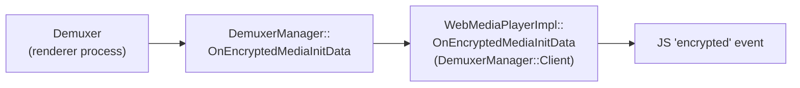
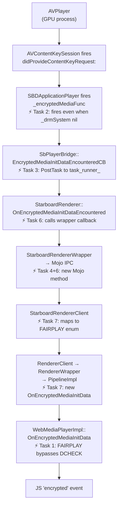
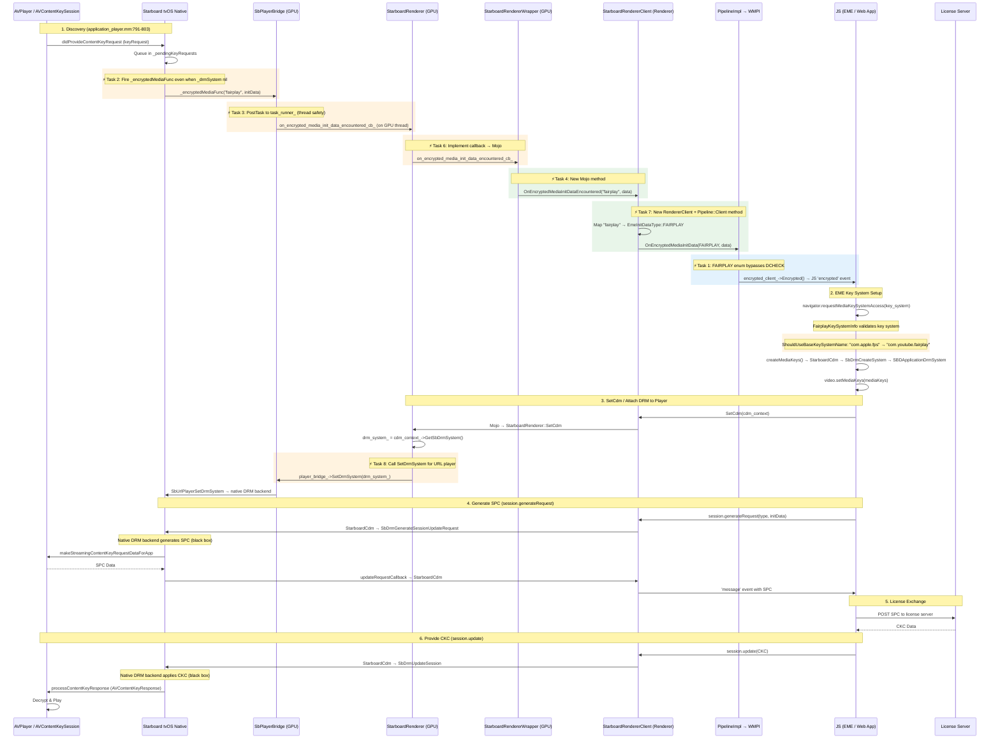
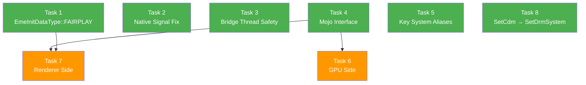

# FairPlay DRM Integration for tvOS Cobalt - Research Report

## 1. Architecture Overview

### Two FairPlay Paths in tvOS Cobalt (Bug: 512045535)

| | **Path-1: AVPlayer/URLPlayer + HLS** | **Path-2: AVSampleBufferDisplayLayer + EME** |
|---|---|---|
| **Key system** | `"com.youtube.fairplay"` | `"com.youtube.fairplay.sbdl"` |
| **Content delivery** | HLS (`application/x-mpegURL`) | DASH/CMAF via MSE |
| **Player** | `AVPlayer` (SbUrlPlayerCreate) | `SbPlayer` → `AVSampleBufferDisplayLayer` |
| **DRM handling** | AVPlayer handles FairPlay **natively** — discovers encryption, manages `AVContentKeySession`, decrypts segments | Full EME protocol — `DrmSystemFairplay` manages its own `AVContentKeySession`, decrypts via `AVContentKey` |
| **DRM backend** | `SBDApplicationDrmSystem` (player-driven) | `DrmSystemFairplay` (CDM-driven) |
| **Rendering** | AVPlayer renders directly (video hole punch-out) | App controls rendering via `AVSampleBufferDisplayLayer` |
| **Entitlements** | Standard | May need private entitlements (TBC) |
| **Our focus** | **YES — this is what we're implementing** | No — already working for non-HLS content |

**Path-1 is "less DRM-ish"** because AVPlayer handles FairPlay **crypto** natively (discovers encryption, generates SPC, applies CKC, decrypts segments). However, **JS handshaking via EME is still required** because:

- AVPlayer does NOT know the **license server URL** (only the `skd://` content ID is in the HLS manifest)
- AVPlayer does NOT know the **authentication tokens** (JWT, cookies, etc.)
- AVPlayer does NOT have the **FairPlay server certificate**
- The **web app** (e.g. YouTube TV JS) owns all of this and provides it via EME

So the round-trip is: AVPlayer says "I found encrypted content" → JS provides certificate + brokers license exchange → CKC fed back to AVPlayer. AVPlayer handles the crypto, JS handles the license acquisition.

### Implementation Strategy: POC-First → Full EME

| | **POC (Quick Validation)** | **Full EME (Production)** |
|---|---|---|
| **Approach** | Hardcode license URL + certificate in native C++ | Full Mojo plumbing: encrypted event → JS → license → session.update |
| **Effort** | Minimal — modify `SBDApplicationDrmSystem` only | Tasks 1-8 (cross-process Mojo, RendererClient, Pipeline::Client) |
| **Validates** | AVPlayer ↔ `AVContentKeySession` ↔ `SBDApplicationDrmSystem` key exchange works end-to-end | Full EME contract with web app in control |
| **Limitation** | Breaks when web app changes DRM config; only works with Axinom test stream | Production-ready, any license server |
| **When** | **Phase 1 — do this first** | Phase 2 — after POC proves native DRM path works |

**POC approach:** In `SBDApplicationDrmSystem`, when `processKeyRequest:` is called, fetch the certificate and license directly using hardcoded Axinom test URLs. This skips the entire Mojo/EME pipeline and proves the native FairPlay key exchange works with AVPlayer. If the POC plays encrypted video, we know the native DRM path is correct, and the remaining work is purely Mojo plumbing.

**Path-2's `DrmSystemFairplay` code** (`cobalt/internal/starboard/shared/tvos/drm_system_fairplay.mm`) is **not relevant to our URL Player work**. It was built for the `AVSampleBufferDisplayLayer` pipeline where Cobalt has full control over decryption.

---

### Normal Chromium Encrypted Media Flow (not URL player)



The demuxer discovers encryption and calls `EncryptedMediaInitDataCB` directly. This never goes through `RendererClient` or `Pipeline::Client`.

### URL Player Flow (post-implementation, all 8 tasks applied)



### DRM Backend Routing (`drm_create_system.mm:28-79`)
```
SbDrmCreateSystem(key_system, ...)
  ├── strstr(key_system, "widevine") → DrmSystemWidevine (line 47-57)
  ├── DrmSystemPlatform::IsKeySystemSupported(key_system) → DrmSystemPlatform::Create()
  │     Internal build: DrmSystemFairplay::IsKeySystemSupported matches
  │     ONLY "com.youtube.fairplay.sbdl" (drm_system_fairplay.mm:467-473)
  ├── !strstr(key_system, DrmSystemPlatform::GetName()) → kSbDrmSystemInvalid
  │     GetName() returns "fairplay" in internal build (drm_system_fairplay.mm:586)
  │     So "com.apple.fps" does NOT contain "fairplay" → REJECTED as invalid
  └── fallthrough → SBDApplicationDrmSystem via SBDDrmManager (line 71-78)
        Only reached if key_system contains "fairplay" but is not "com.youtube.fairplay.sbdl"
        e.g. "com.youtube.fairplay" → SBDApplicationDrmSystem
```

### Key System → Backend Summary

> **Our focus is Path-1 only.** AVPlayer handles FairPlay natively. The `SBDApplicationDrmSystem` + `SBDApplicationPlayer` code manages the `AVContentKeySession` ↔ AVPlayer connection. Our job is the **Mojo/Chromium plumbing** to bridge EME signals between GPU and renderer processes.

<details>
<summary><b>DrmSystemFairplay — Path-2 Only</b> (NOT used by AVPlayer/URLPlayer, reference only)</summary>

**File:** `cobalt/internal/starboard/shared/tvos/drm_system_fairplay.mm`

Built for Path-2 (`AVSampleBufferDisplayLayer` + DASH/CMAF via MSE). NOT relevant to our URL Player work.

- **Key system:** Only matches `"com.youtube.fairplay.sbdl"` (`IsKeySystemSupported` line 467-473)
- **Own `AVContentKeySession`:** Creates its own (line 113-114), independent from `SBDApplicationPlayer`
- **CDM-driven flow:** JS drives key requests via `generateRequest()` → `processContentKeyRequestWithIdentifier:`
- **No connection to AVPlayer:** Does not use `SbUrlPlayerSetDrmSystem`
</details>

### Key System → Backend → Path Summary
| Key System | Backend | Path | Status |
|---|---|---|---|
| `"com.youtube.fairplay"` | `SBDApplicationDrmSystem` | **Path-1 (AVPlayer/HLS)** | ✅ Our target |
| `"com.youtube.fairplay.sbdl"` | `DrmSystemFairplay` | Path-2 (SBDL/DASH) | Not our focus |
| `"com.apple.fps"` | **REJECTED** | — | Needs Task 5 (alias) |
| `"com.apple.fps.1_0"` | **REJECTED** | — | Needs Task 5 (alias) |

---

## 2. Sequence Diagram: FairPlay Key Exchange Round-Trip



### Key File:Line References (Verified)
| Step | File | Line | Function |
|------|------|------|----------|
| Discovery | `starboard/tvos/shared/media/application_player.mm` | 791-803 | `contentKeySession:didProvideContentKeyRequest:` |
| Process key | `starboard/tvos/shared/media/application_player.mm` | 729-749 | `processKeyRequest:` |
| Signal Cobalt | `starboard/tvos/shared/media/application_player.mm` | 744 | `_encryptedMediaFunc(...)` |
| Bridge callback | `media/starboard/sbplayer_bridge.cc` | 593 | `EncryptedMediaInitDataEncounteredCB` |
| GPU entry | `media/starboard/starboard_renderer.cc` | 548 | `OnEncryptedMediaInitDataEncountered` (TODO) |
| Player created | `media/starboard/starboard_renderer.cc` | 650-668 | `CreatePlayerBridge` (URL path) |
| SetCdm | `media/starboard/starboard_renderer.cc` | 298-322 | `SetCdm` |
| SetDrmSystem | `media/starboard/sbplayer_bridge.cc` | 520-525 | `SetDrmSystem` → `SbUrlPlayerSetDrmSystem` |
| DRM create | `starboard/tvos/shared/media/drm_create_system.mm` | 28-79 | `SbDrmCreateSystem` |
| SPC generation | `starboard/tvos/shared/media/drm_generate_session_update_request.mm` | 57-102 | `SbDrmGenerateSessionUpdateRequest` |
| SPC data | `starboard/tvos/shared/media/application_drm_system.mm` | 126-148 | `makeKeyRequestData:` |
| CKC update | `starboard/tvos/shared/media/drm_update_session.mm` | 26-63 | `SbDrmUpdateSession` |
| CKC applied | `starboard/tvos/shared/media/application_drm_system.mm` | 104-123 | `updateSessionWithKey:` |
| Set DRM on player | `starboard/tvos/shared/media/url_player_set_drm_system.mm` | 23-42 | `SbUrlPlayerSetDrmSystem` |
| Pending keys | `starboard/tvos/shared/media/application_player.mm` | 752-765 | `setDrmSystem:` |
| FairPlay EME | `components/cdm/renderer/fairplay_key_system_info.cc` | 29-141 | Key system registration |
| Mojo interface | `media/mojo/mojom/renderer_extensions.mojom` | 73-86 | `StarboardRendererClientExtension` |
| Client ext | `media/mojo/clients/starboard/starboard_renderer_client.cc` | 83-98 | `Initialize`, `client_` set |
| Wrapper | `media/mojo/services/starboard/starboard_renderer_wrapper.cc` | 151 | `SetCdm` forwarding |
| RendererClient | `media/base/renderer_client.h` | 23-69 | No `OnEncryptedMediaInitData` |
| Pipeline::Client | `media/base/pipeline.h` | 30-80 | No `OnEncryptedMediaInitData` |
| WMPI handler | `third_party/blink/renderer/platform/media/web_media_player_impl.cc` | 1694-1718 | `OnEncryptedMediaInitData` |

---

## 3. Gap Analysis

### G1: `OnEncryptedMediaInitDataEncountered` is a TODO
**File:** `media/starboard/starboard_renderer.cc:554`
```cpp
// TODO: Forward encrypted media init data to the EME/DRM layer.
```
The function receives `init_data_type` ("fairplay") and `init_data` (packed skd:// URI) from `SbPlayerBridge` but does nothing with them.

### G2: No Mojo Method for Encrypted Media Events
**File:** `media/mojo/mojom/renderer_extensions.mojom:73-86`
`StarboardRendererClientExtension` has `PaintVideoHoleFrame`, `UpdateStarboardRenderingMode`, `GetSbWindowHandle` — but no method to signal encrypted media init data from GPU → Renderer process.

### G3: `RendererClient` and `Pipeline::Client` Lack Encrypted Media Callback
**Files:** `media/base/renderer_client.h`, `media/base/pipeline.h`

In normal Chromium, encrypted media init data goes `Demuxer → DemuxerManager::Client → WebMediaPlayerImpl` (all in renderer process, no Mojo). For URL player, the renderer (GPU process) discovers encryption, so the data must travel:
```
StarboardRendererClient (renderer process, implements RendererClient)
  → PipelineImpl::RendererWrapper (implements RendererClient)
  → PipelineImpl (main thread)
  → WebMediaPlayerImpl (implements Pipeline::Client)
```
Neither `RendererClient` nor `Pipeline::Client` has `OnEncryptedMediaInitData`. Must be added following the same pattern as `OnWaiting` (which uses the exact same forwarding chain).

### G4: `WebMediaPlayerImpl` DCHECK on `EmeInitDataType::UNKNOWN`
**File:** `third_party/blink/renderer/platform/media/web_media_player_impl.cc:1697`
```cpp
DCHECK(init_data_type != media::EmeInitDataType::UNKNOWN);
```
In standard Chromium, `EmeInitDataType::UNKNOWN` is used as a fallback but is forbidden during the `OnEncryptedMediaInitData` flow. Our FairPlay implementation (and `FairplayKeySystemInfo`) currently relies on `UNKNOWN`. We must introduce `EmeInitDataType::FAIRPLAY` to bypass this check.

### G5: `SetCdm` Does Not Call `SetDrmSystem` on URL Player
**File:** `media/starboard/starboard_renderer.cc:298-322`
`SetCdm` stores `drm_system_` (line 311) and transitions state, but never calls `player_bridge_->SetDrmSystem(drm_system_)`. Without this, `SbUrlPlayerSetDrmSystem` is never called, so `SBDApplicationPlayer.drmSystem` is never set, `_keySession` is never connected to the DRM system, and pending key requests are never processed (line 752-765).

For Path-1, `SbUrlPlayerSetDrmSystem` works correctly: `SbDrmCreateSystem("com.youtube.fairplay")` creates an `SBDApplicationDrmSystem`, so `[drmManager isApplicationDrmSystem:]` returns true → `applicationPlayer.drmSystem = applicationDrmSystem` succeeds.

### G6: Native Signal Suppressed When DRM is Nil
**File:** `starboard/tvos/shared/media/application_player.mm:791-803`
`contentKeySession:didProvideContentKeyRequest:` only fires `_encryptedMediaFunc` if `_drmSystem` is already set. For URL players, `_drmSystem` is nil at startup, so the signal is queued but never sent to Cobalt, preventing EME from starting.

### G7: Thread Safety in Bridge Callback
**File:** `media/starboard/sbplayer_bridge.cc:593`
`EncryptedMediaInitDataEncounteredCB` is invoked from an AVFoundation dispatch queue. Unlike other callbacks in `SbPlayerBridge` (e.g., `PlayerStatusCB`), it currently calls the Cobalt callback directly instead of using `PostTask`, which is unsafe.

<details>
<summary><b>G8: SbUrlPlayerSetDrmSystem is a no-op for DrmSystemFairplay</b> (Path-2 only, not relevant to our work)</summary>

**File:** `starboard/tvos/shared/media/url_player_set_drm_system.mm:23-42`
`[drmManager isApplicationDrmSystem:drm_system]` (line 33) returns false for `DrmSystemFairplay`. Not an issue for Path-1 — `SBDApplicationDrmSystem` is correctly handled.
</details>

<details>
<summary><b>G9: "com.apple.fps" key system rejected at Starboard level</b> (may be auto-resolved by FairplayKeySystemInfo)</summary>

**File:** `starboard/tvos/shared/media/drm_create_system.mm:66-69`
`strstr("com.apple.fps", "fairplay")` returns NULL → `kSbDrmSystemInvalid`.

**However**, `FairplayKeySystemInfo::ShouldUseBaseKeySystemName()` returns `true` (line 62-63) and `GetBaseKeySystemName()` returns `base_key_system_`. If `FairplayKeySystemInfo` is constructed with `base_key_system_ = "com.youtube.fairplay"`, then Chromium automatically substitutes the key system before passing it to `SbDrmCreateSystem` (`key_system_config_selector.cc:1113-1116`). JS requests `"com.apple.fps"` → CDM receives `"com.youtube.fairplay"` → Starboard accepts it.

**Task 5 (Starboard aliases) may not be needed** if this substitution is already in place. Verify by checking the `FairplayKeySystemInfo` construction in the registration code.
</details>

---

## 4. Implementation Plan

### Phase 1: POC — Prove Native DRM Path Works

#### Step 0a: Validate AVPlayer Fires Encryption Events
**Goal:** Confirm AVPlayer detects encryption in the protected HLS stream and fires `didProvideContentKeyRequest:`.

**Approach:** Change the hardcoded URL in `starboard_renderer.cc:653` from the unprotected Mux stream to the encrypted Axinom stream:
```cpp
source_url_ = "https://media.axprod.net/TestVectors/Cmaf/protected_1080p_h264_cbcs/manifest.m3u8";
```

Add `NSLog` in `application_player.mm` `didProvideContentKeyRequest:` (line 791) and `_encryptedMediaFunc` callback (line 744) to confirm the events fire.

**Files:** 
- `media/starboard/starboard_renderer.cc:653` — Change URL
- `starboard/tvos/shared/media/application_player.mm` — Add NSLog (may already have logging)

**Expected result:** Logs show `didProvideContentKeyRequest:` fires with a `skd://` identifier. `_encryptedMediaFunc` may or may not fire depending on `_drmSystem` state. `OnEncryptedMediaInitDataEncountered` logs in `starboard_renderer.cc:552` should appear (the TODO function already logs).

**If `didProvideContentKeyRequest:` does NOT fire:** The `AVContentKeySession` or `addContentKeyRecipient:` setup is wrong — debug there first.

**Dependencies:** None. Just a URL change + deploy.

---

#### Step 0b: Hardcoded FairPlay License Exchange POC
**Goal:** Validate that `SBDApplicationDrmSystem` + `AVContentKeySession` can complete the full FairPlay key exchange end-to-end.

**Approach:** In `application_player.mm` `contentKeySession:didProvideContentKeyRequest:`, bypass the EME pipeline entirely:
1. Hardcode the Axinom FairPlay certificate (base64 from `fairplay-urlplayer-test.html`)
2. Call `[keyRequest makeStreamingContentKeyRequestDataForApp:cert contentIdentifier:keyId ...]` to generate SPC
3. POST SPC to hardcoded Axinom license URL (`https://drm-fairplay-licensing.axprod.net/AcquireLicense?AxDrmMessage=<JWT>`)
4. Feed CKC response back via `[keyRequest processContentKeyResponse:]`

**Files:**
- `starboard/tvos/shared/media/application_player.mm` — Add hardcoded license logic in `didProvideContentKeyRequest:`

**No Mojo, no Chromium changes, no JS involvement.** Pure native ObjC.

**Success criteria:** Encrypted Axinom HLS stream plays on Apple TV.
**If it fails:** Native DRM path has issues — debug before investing in Mojo plumbing.
**If it succeeds:** Native path proven. Move to Phase 2 (Tasks 1-8) for proper EME wiring.

**Dependencies:** Step 0a (confirm events fire first).

---

### Phase 2: Full EME Integration (8 Surgical Tasks)

### Task 1: Add `EmeInitDataType::FAIRPLAY`
**Goal:** Satisfy Chromium's type safety and bypass `WebMediaPlayerImpl` DCHECKs.

**Files (11 total — all switch statements on `EmeInitDataType`):**
- `media/base/eme_constants.h` — Add `FAIRPLAY` to enum, update `kMaxValue = FAIRPLAY`.
- `media/cdm/cdm_type_conversion.cc` — Update `ToCdmInitDataType` and `ToEmeInitDataType`.
- `media/base/android/media_drm_bridge.cc` — Update `ConvertInitDataType`.
- `media/cdm/fuchsia/fuchsia_cdm.cc` — Update `GetInitDataTypeName`.
- `media/cdm/win/media_foundation_cdm_session.cc` — Update `InitDataTypeToString`.
- `media/starboard/starboard_cdm.cc` — Update `GetInitDataTypeName`.
- `media/cdm/aes_decryptor.cc` — Update `CreateSessionAndGenerateRequest` switch.
- `components/cdm/renderer/android_key_system_info.cc` — Update `IsSupportedInitDataType`.
- `components/cdm/renderer/fairplay_key_system_info.cc` — Update `IsSupportedInitDataType` to accept `FAIRPLAY`.
- `third_party/blink/renderer/platform/media/key_system_config_selector_unittest.cc` — Update mock `IsSupportedInitDataType`.
- `third_party/blink/renderer/modules/encryptedmedia/encrypted_media_utils.cc` — Map both `"fairplay"` and `"sinf"` to `FAIRPLAY` in `ConvertToInitDataType`, and `FAIRPLAY` → `"fairplay"` in `ConvertFromInitDataType`.

**Dependencies:** None.

---

### Task 2: Native Signal Discovery Fix
**File:** `starboard/tvos/shared/media/application_player.mm`
In `contentKeySession:didProvideContentKeyRequest:` (line 797), fire `_encryptedMediaFunc` even when `_drmSystem` is nil (the `else` branch). This requires duplicating the init data construction and callback logic from `processKeyRequest:` (lines 736-746). This ensures the web app is notified of the "fairplay" discovery immediately so it can initiate EME.

**Dependencies:** None.

---

### Task 3: Bridge Thread Safety
**File:** `media/starboard/sbplayer_bridge.cc`
In `EncryptedMediaInitDataEncounteredCB`, post the callback to `task_runner_` using `base::BindOnce` to ensure it runs on the correct thread.

**Dependencies:** None.

---

### Task 4: Mojo Interface — Add Encrypted Media IPC Method
**File:** `media/mojo/mojom/renderer_extensions.mojom`
Add `OnEncryptedMediaInitDataEncountered(string type, array<uint8> data)` to `StarboardRendererClientExtension`.

**Dependencies:** None.

---

### Task 5: Starboard Key System Aliases (may not be needed)
**Files:**
- `starboard/tvos/shared/media/drm_create_system.mm`
- `starboard/tvos/shared/media_is_key_system_supported.mm`
- `starboard/tvos/shared/media_can_play_mime_and_key_system.mm`

Add support for `"com.apple.fps"` by routing it to the same path as `"com.youtube.fairplay"`.

**Important:** `FairplayKeySystemInfo::ShouldUseBaseKeySystemName()` returns `true`, so Chromium may already substitute `"com.apple.fps"` → `"com.youtube.fairplay"` before reaching Starboard (see `key_system_config_selector.cc:1113-1116`). If `base_key_system_` in the `FairplayKeySystemInfo` registration is `"com.youtube.fairplay"`, then **this task is unnecessary**. Verify by checking the registration code. If the alias works at the Chromium level, skip this task entirely.

**Dependencies:** None.

---

### Task 6: GPU Side — Signal Discovery
**Files:**
- `media/starboard/starboard_renderer.h/.cc` — Implement `OnEncryptedMediaInitDataEncountered` to run the wrapper callback.
- `media/mojo/services/starboard/starboard_renderer_wrapper.h/.cc` — Forward the signal via Mojo.

**Dependencies:** Task 4.

---

### Task 7: Renderer Side — Pipe to WebMediaPlayerImpl
**Files:**
- `media/base/renderer_client.h` — Add `OnEncryptedMediaInitData`.
- `media/base/pipeline.h` — Add to `Pipeline::Client`.
- `media/base/pipeline_impl.cc` — Add forwarding logic.
- `media/mojo/clients/starboard/starboard_renderer_client.h/.cc` — Implement Mojo handler and map incoming signal to `EmeInitDataType::FAIRPLAY`.

**Dependencies:** Task 1, Task 4.

---

### Task 8: SetCdm → SetDrmSystem
**File:** `media/starboard/starboard_renderer.cc`
In `SetCdm`, if `player_bridge_` exists and is a URL player, call `player_bridge_->SetDrmSystem(drm_system_)`.

For Path-1, this calls `SbUrlPlayerSetDrmSystem` which sets `applicationPlayer.drmSystem = applicationDrmSystem`, connecting the `AVContentKeySession` and triggering processing of any pending key requests queued since `didProvideContentKeyRequest:` fired.

**Dependencies:** None.

---

## 5. Task Dependency Graph



- 🟢 Green = independent, start immediately in parallel (Tasks 1, 2, 3, 4, 5, 8)
- 🟠 Orange = has dependencies (Task 6 needs Task 4; Task 7 needs Tasks 1 + 4)

## 6. Test Page & Verification Plan

### Test Page
**File:** `fairplay-urlplayer-test.html` (local) / [hosted version](https://people.igalia.com/akandalkar/fairplay/fairplay-urlplayer-test.html)

The test page exercises the full FairPlay EME round-trip:
- **Stream:** Axinom CBCS-encrypted 1080p H.264 HLS (`manifest.m3u8`)
- **License server:** `https://drm-fairplay-licensing.axprod.net/AcquireLicense` (JWT token embedded)
- **Certificate:** Axinom FairPlay certificate (base64 embedded)
- **Key systems tried:** `['com.apple.fps', 'com.apple.fps.1_0', 'com.apple.fps.2_0']`
- **EME flow:** Listens for `encrypted` event → `setupEME()` → `requestMediaKeySystemAccess` → `createMediaKeys` → `setServerCertificate` → `setMediaKeys` → `generateRequest` → license fetch → `session.update`
- **Fallback:** Also triggers EME setup on `waitingforkey` event and via 3-second timeout

**Current behavior (before our changes):** `waitingforkey` fires repeatedly, `encrypted` event never fires, eventually `MEDIA_ERR_DECODE` (CoreMediaErrorDomain -19152) — AVPlayer times out waiting for decryption key.

**Expected behavior (after all 8 tasks):** `encrypted` event fires → EME setup succeeds → license acquired → video plays.

### Verification Steps

1. Build for tvOS (internal build)
2. Deploy to Apple TV
3. Load `fairplay-urlplayer-test.html`
4. **Path-1 flow** (AVPlayer + HLS + `SBDApplicationDrmSystem`):
   - AVPlayer fires `didProvideContentKeyRequest:`
   - Task 2: `_encryptedMediaFunc` fires (even with `_drmSystem` nil)
   - Tasks 3→6→7: Signal reaches JS as `encrypted` event
   - JS calls `requestMediaKeySystemAccess("com.apple.fps")`
   - `FairplayKeySystemInfo` accepts it, `ShouldUseBaseKeySystemName` → CDM gets `"com.youtube.fairplay"`
   - JS calls `createMediaKeys` → `setServerCertificate` → `setMediaKeys`
   - Task 8: `SetCdm` → `SetDrmSystem` → `applicationPlayer.drmSystem` set → pending keys processed
   - `generateRequest` → license → `session.update` → CKC applied
   - Video plays
5. Expected log sequence:
   ```
   OnEncryptedMediaInitDataEncountered: type=fairplay
   [DRM] IsSupportedKeySystem('com.apple.fps') = YES
   CDM set successfully.
   SbUrlPlayerSetDrmSystem called
   SPC generated → license acquired → CKC applied
   Video plays
   ```

## 7. Threading Note
`SbPlayerBridge::EncryptedMediaInitDataEncounteredCB` (sbplayer_bridge.cc:593) is a static C callback invoked from the Starboard/AVFoundation thread. Unlike other callbacks in the same file (e.g., `PlayerStatusCB`), it currently lacks thread safety. Task 3 explicitly adds `PostTask` logic to ensure this signal is safely delivered to the GPU task runner, matching the robust pattern used by other player events.

## 8. Out of Scope (follow-ups)

- Error handling / retry for DRM failures
- Suspend/resume behavior with active DRM sessions
- Path-2 (`DrmSystemFairplay` + `AVSampleBufferDisplayLayer` + DASH/CMAF) — separate pipeline, not related to URL Player
- Path-2 private entitlements investigation for `AVSampleBufferDisplayLayer`

## 9. Implementation Status (2026-05-18)

**Branch:** `AVPlayer-URL-Loading-New-based-on-AVPlater-Encrypted`
**Result:** FairPlay DRM key exchange working end-to-end with Axinom test server.
`canplay` event fires, AVPlayer has decryption key.

### Task Status

| Task | Status | Commit | Notes |
|------|--------|--------|-------|
| Task 1 (EmeInitDataType) | **DONE** | `6a9c464` | Expanded: added SINF, SKD, FAIRPLAY (not just FAIRPLAY). SINF/SKD from WebKit CDMFairPlayStreaming.cpp. All guarded with `IS_IOS_TVOS && USE_STARBOARD_MEDIA`. |
| Task 2 (Native Signal Fix) | **NOT NEEDED** | -- | Task 8 solved this: SetCdm forwards DRM to player, drains `_pendingKeyRequests`, `processKeyRequest:` fires normally. No code duplication needed. |
| Task 3 (Bridge Thread Safety) | **DONE** | `a79221d` | PostTask in `StarboardRenderer::OnEncryptedMediaInitDataEncountered` (not in `sbplayer_bridge.cc` as originally planned). Copies data, posts to GPU task runner. |
| Task 4 (Mojo Interface) | **DONE** | pre-existing | `renderer_extensions.mojom` already had `OnEncryptedMediaInitDataEncountered` from a prior commit. |
| Task 5 (Key System Aliases) | **NOT NEEDED** | -- | JS uses `"com.youtube.fairplay"` directly. `"com.apple.fps"` not reachable via `GetKeySystemInfo` prefix match. Not blocking. |
| Task 6 (GPU Side) | **DONE** | `a79221d` | StarboardRenderer -> wrapper callback -> Mojo. Wrapper sets callback during Initialize. |
| Task 7 (Renderer Side) | **DONE** | `a79221d` | **Different approach than planned.** Used Option E: `DemuxerManager::OnEncryptedMediaInitData` as bridge (made public). Wired from `StarboardRendererClient` via `BindPostTaskToCurrentDefault` in `WebMediaPlayerImpl::CreateRenderer()`. Did NOT add to `RendererClient` or `PipelineImpl`. |
| Task 8 (SetCdm -> SetDrmSystem) | **DONE** | `711d7b9` | In `SetCdm`, forward DRM to URL player bridge when `player_bridge_` exists and `source_url_` is non-empty. |

### Additional Work (Discovered During Implementation)

| Task | Description | Commit | Why Needed |
|------|-------------|--------|-----------|
| Task A | FairPlay key system registration (`FairplayKeySystemInfo`) | `ff203b8` | Chromium needs `KeySystemInfo` to accept `com.youtube.fairplay` in `requestMediaKeySystemAccess`. Pattern matches `WidevineKeySystemInfo`. |
| Task B | Send `"skd"` init data type from AVPlayer | `125bea0` | C25 hardcoded `"fairplay"`. Standard FairPlay uses `"skd"` (from URI scheme). Matches WebKit's `initTypeForRequest()`. Falls back to `"fairplay"` for non-skd URIs. |
| Task C | Gap #1: Enable `setServerCertificate()` for FairPlay | `be90623` | C25 returned `false` from `IsServerCertificateUpdatable` (YouTube packs cert in init data). Standard EME requires `true`. Threaded `serverCertificateUpdatedFunc` callback through DRM creation chain (7 files). |
| Task D | Gap #2+3: `"skd"` path in `generateRequest` | `8278552` | Branch on init data type: `"skd"` decodes UTF-8 + uses stored cert, `"fairplay"` uses existing `unpackData()` + UTF-16LE. Reuses `makeKeyRequestData:` for SPC generation. |
| Task E | Raw binary CKC in `session.update()` | `71dbe3d` | C25 assumed base64-encoded CKC (YouTube). Standard FairPlay servers return raw binary. Try raw first, base64 fallback. Matches WebKit which passes CKC directly. |

### Key Design Decisions

1. **Option E for encrypted event forwarding (Task 7):** Used `DemuxerManager::OnEncryptedMediaInitData` instead of adding to `RendererClient`. Reuses existing Chromium path, avoids modifying upstream interfaces.

2. **Two certificate delivery paths (Task C):** `"skd"` uses `setServerCertificate()` (standard EME), `"fairplay"` packs cert in init data (YouTube). Both deliver to same Apple API.

3. **Init data type from URI scheme (Task B):** Not hardcoded. Extracted via `[urlString hasPrefix:@"skd://"]` matching WebKit's `initTypeForRequest()`.

4. **Out of scope item resolved:** "JS-side init data packing" from Section 8 is no longer needed. The `"skd"` path sends raw UTF-8 URI, no packing required.

