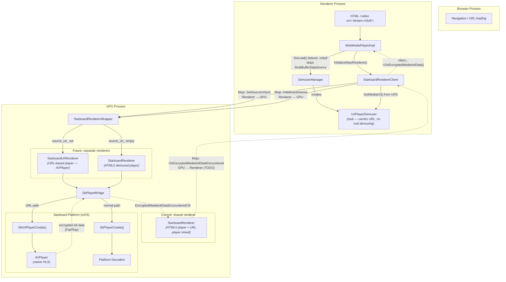
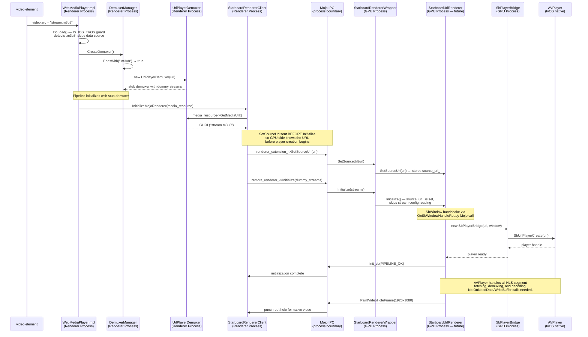
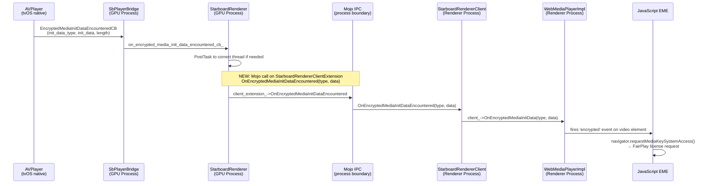
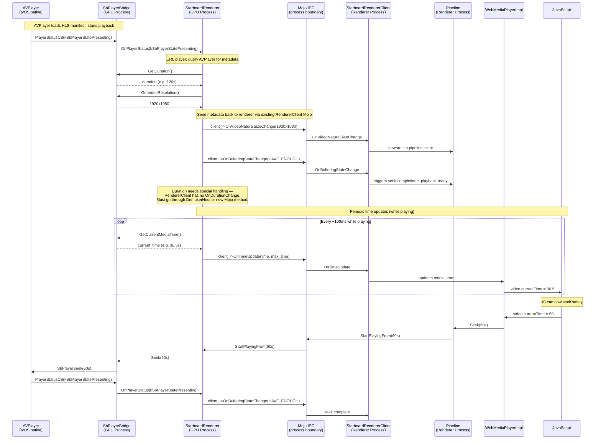

# HLS URL Routing: Multi-Process Architecture

## Process Boundary Diagram



## Why Mojo IPC Is Needed

Chromium's media pipeline splits across process boundaries for security and stability:

- **Renderer process** — untrusted, runs web content. Knows the media URL from the `<video>` element
  but cannot access GPU resources or native platform APIs directly.
- **GPU process** — trusted, manages hardware access. Hosts `SbPlayerBridge` and the native
  AVPlayer, but has no visibility into web page URLs or the DOM.

The HLS URL must cross this process boundary because:

1. **The URL originates in the renderer** — `<video src="stream.m3u8">` is parsed by Blink in the
   renderer process. The `UrlPlayerDemuxer` holds this URL, but it cannot call `SbUrlPlayerCreate()`
   directly (wrong process, no Starboard access).

2. **The player lives in the GPU process** — `SbUrlPlayerCreate()` and AVPlayer run in the GPU
   process where they have access to the platform's media hardware and compositing surfaces.

3. **Mojo bridges the gap** — `SetSourceUrl(string)` on the `StarboardRendererExtension` interface
   serializes the URL string, sends it over the Mojo pipe, and deserializes it in the GPU process
   where `StarboardRenderer` (or future `StarboardUrlRenderer`) stores it for player creation.

### Mojo Messages in the URL Player Flow

| Mojo Message | Interface | Direction | Purpose |
|-------------|-----------|-----------|---------|
| `SetSourceUrl(url)` | `StarboardRendererExtension` | Renderer → GPU | Passes the HLS URL so the GPU-side renderer knows to use `SbUrlPlayerCreate` instead of `SbPlayerCreate`. Sent **before** `Initialize` to ensure the URL is available when player creation begins. |
| `Initialize(client, streams)` | `mojom::Renderer` (`media/mojo/mojom/renderer.mojom:25`) | Renderer → GPU | **Existing Chromium call** (not added by us). Both normal and URL player paths use this. It sends Mojo remotes for DemuxerStreams and a client callback. For URL player, these are dummy stream proxies from `UrlPlayerDemuxer` — the GPU side detects `source_url_` is set and ignores the streams, skipping codec config reading entirely. |
| `OnSbWindowHandleReady(handle)` | `StarboardRendererExtension` | Renderer → GPU | Passes the native window handle needed by `SbUrlPlayerCreate` for punch-out video rendering. Already existed before URL player work. |
| `PaintVideoHoleFrame(size)` | `StarboardRendererClientExtension` | GPU → Renderer | Tells the renderer to paint a transparent "hole" in the web page so the native AVPlayer video surface shows through (punch-out compositing). |

### Message Ordering

`SetSourceUrl` and `Initialize` travel on **separate Mojo pipes** (`renderer_extension_` vs `remote_renderer_`).
Mojo does not guarantee ordering across different pipes. However, both messages are sent synchronously
within the same function (`InitializeMojoRenderer`) on the same task runner, and both are received on
the same GPU thread. In practice, they arrive in order because Mojo dispatches pending messages in
FIFO order per task runner.

## Sequence Diagram



## Component Locations

| Component | Process | Directory | Purpose |
|-----------|---------|-----------|---------|
| `UrlPlayerDemuxer` | Renderer | `media/starboard/` | Stub demuxer — carries HLS URL via `GetMediaUrl()`, provides dummy streams for pipeline validation |
| `StarboardRendererClient` | Renderer | `media/mojo/clients/starboard/` | Extracts URL from `MediaResource`, sends `SetSourceUrl` via Mojo before `Initialize` |
| `StarboardRendererWrapper` | GPU | `media/mojo/services/starboard/` | Receives Mojo calls, delegates to appropriate renderer based on `source_url_` |
| `StarboardRenderer` | GPU | `media/starboard/` | HTML5 demuxed player — reads from DemuxerStreams, writes to SbPlayer |
| `StarboardUrlRenderer` (future) | GPU | `media/starboard/` | URL-based player — delegates entirely to AVPlayer via `SbUrlPlayerCreate` |
| `SbPlayerBridge` | GPU | `media/starboard/` | Starboard abstraction — wraps `SbPlayerCreate` / `SbUrlPlayerCreate` |

## Why a Separate `StarboardUrlRenderer`

`StarboardRenderer` is designed for the HTML5 demuxed player — it manages DemuxerStreams,
decoder configs, CDM/DRM key exchange, audio/video buffer writing, write duration tracking,
and codec-level details. The URL player (AVPlayer) needs **none of this** because AVPlayer
handles demuxing, decoding, buffering, and rendering internally.

### What `StarboardRenderer` Does That URL Player Doesn't Need

| Feature | StarboardRenderer | URL Player (AVPlayer) |
|---|---|---|
| DemuxerStream reading | Reads audio/video buffers from demuxer streams | Not needed — AVPlayer fetches HLS segments itself |
| Decoder config (codec, sample rate, etc.) | Extracts from streams, passes to `SbPlayerCreate` | Not needed — AVPlayer detects codecs from manifest |
| CDM / DRM key exchange | Manages `CdmContext`, `SbDrmSystem`, waits for keys | Not needed — FairPlay is handled natively by AVPlayer + Starboard platform layer |
| Buffer writing (`OnNeedData` → `WriteBuffer`) | Core loop: reads from demuxer, writes to SbPlayer | Not needed — AVPlayer manages its own buffer pipeline |
| Audio write duration tracking | Tracks local/remote audio output for preroll | Not needed — AVPlayer manages audio buffering |
| EOS (end-of-stream) handling | Sends EOS buffers per stream | Not needed — AVPlayer detects end internally |
| Bitstream converter (AAC/H264) | Converts to ADTS/Annex B format | Not needed — AVPlayer handles raw HLS segments |
| Config change handling | Responds to `DemuxerStream::kConfigChanged` | Not needed — AVPlayer handles adaptive bitrate internally |

### What `StarboardUrlRenderer` Actually Needs

A much simpler class:

1. **Player creation** — `SbUrlPlayerCreate(url, window)` with encrypted media callback
2. **Player status handling** — `OnPlayerStatus` for state transitions (Presenting, EndOfStream, Error)
3. **Duration reporting** — query `SbPlayerBridge::GetDuration()` at Presenting, send via Mojo
4. **Video size reporting** — query `GetVideoResolution()` at Presenting, send via `OnVideoNaturalSizeChange`
5. **Time update polling** — periodic `GetCurrentMediaTime()` → `OnTimeUpdate` via Mojo
6. **Seek** — `SbPlayerBridge::Seek(time)`
7. **Playback rate / volume** — forward to `SbPlayerBridge`
8. **Encrypted media callback** — forward init data to renderer process via Mojo

This is roughly **~200 lines** vs StarboardRenderer's **~1400 lines**. Mixing both paths
in one class with `#if SB_HAS(PLAYER_WITH_URL)` guards makes the code fragile and hard to
reason about — every method needs "if URL player, skip this" logic.

## Mojo Signals: GPU → Renderer (What JS Needs)

All metadata from AVPlayer lives in the GPU process. JavaScript in the renderer process
needs these signals to function correctly. Here's what exists vs what's missing:

| Signal | JS API | Mojo Interface | Exists? | Notes |
|---|---|---|---|---|
| Video size | `video.videoWidth/Height` | `RendererClient::OnVideoNaturalSizeChange(size)` | **Yes** (`renderer.mojom:85`) | Call from `OnPlayerStatus(Presenting)` |
| Time updates | `video.currentTime` | `RendererClient::OnTimeUpdate(time, max_time, capture_time)` | **Yes** (`renderer.mojom:63`) | Need periodic polling loop (~100ms) in StarboardRenderer |
| Buffering state | `canplay/canplaythrough` events | `RendererClient::OnBufferingStateChange(state, reason)` | **Yes** (`renderer.mojom:68`) | Signals playback readiness + seek completion |
| End of stream | `ended` event | `RendererClient::OnEnded()` | **Yes** (`renderer.mojom:72`) | Call from `OnPlayerStatus(EndOfStream)` |
| Errors | `error` event | `RendererClient::OnError(status)` | **Yes** (`renderer.mojom:77`) | Call from `OnPlayerError` |
| Duration | `video.duration` | `RendererClient` has **no** `OnDurationChange` | **No** | Need new method on `StarboardRendererClientExtension` |
| Encrypted init data | `encrypted` event | `StarboardRendererClientExtension` has **no** `OnEncryptedMediaInitDataEncountered` | **No** | Need new method (see TODO section above) |

### Duration Gap

`mojom::RendererClient` (`renderer.mojom`) has callbacks for time, buffering, size, ended, error —
but **no `OnDurationChange`**. In the normal path, duration comes from the demuxer side
(`DemuxerHost::SetDuration()`) which runs in the renderer process, so it never needed a Mojo call.

For URL player, AVPlayer discovers duration after loading the HLS manifest in the GPU process.
This requires a **new Mojo method** on `StarboardRendererClientExtension`:

```
// renderer_extensions.mojom — StarboardRendererClientExtension
OnDurationChange(mojo_base.mojom.TimeDelta duration);
```

### Call Flow: Duration (GPU → Renderer → JS)

```
AVPlayer loads HLS manifest (GPU process)
  → SbPlayerBridge status: kSbPlayerStatePresenting
  → StarboardRenderer::OnPlayerStatus(kSbPlayerStatePresenting)
  → player_bridge_->GetDuration() → e.g. 120 seconds
  → Mojo: client_extension_->OnDurationChange(120s)
  → StarboardRendererClient::OnDurationChange(120s)  (Renderer process)
  → pipeline client updates duration
  → JS: video.duration = 120
  → JS can now safely seek: video.currentTime = 60 (clamped to [0, 120])
```

### Call Flow: Time Updates (GPU → Renderer → JS)

```
StarboardRenderer starts periodic timer after kSbPlayerStatePresenting
  loop every ~100ms:
    → player_bridge_->GetCurrentMediaTime() → e.g. 30.5s
    → Mojo: client_->OnTimeUpdate(30.5s, 30.5s, now)  (existing RendererClient method)
    → StarboardRendererClient receives OnTimeUpdate  (Renderer process)
    → pipeline updates media time
    → JS: video.currentTime = 30.5
```

### Call Flow: Seek (Renderer → GPU → AVPlayer)

```
JS: video.currentTime = 60
  → WebMediaPlayerImpl::Seek(60s)
  → Pipeline::Seek()
  → UrlPlayerDemuxer::Seek(60s) → posts PIPELINE_OK immediately (no-op stub)
  → StarboardRenderer::Flush() → StarboardRenderer::StartPlayingFrom(60s)
  → player_bridge_->Seek(60s)
  → SbPlayerSeek(60s) → AVPlayer seekToTime:60
  → AVPlayer seeks, buffers, reaches presenting state
  → SbPlayerBridge status: kSbPlayerStatePresenting
  → StarboardRenderer::OnPlayerStatus(kSbPlayerStatePresenting)
  → client_->OnBufferingStateChange(HAVE_ENOUGH)  (Mojo → Renderer)
  → pipeline: seek complete
  → JS: seeked event fires
```

## Guard Strategy

| Layer | Guard | Rationale |
|-------|-------|-----------|
| Outer (Renderer process) | `BUILDFLAG(IS_IOS_TVOS) && BUILDFLAG(USE_STARBOARD_MEDIA)` | Prevents non-tvOS Starboard platforms from entering URL player path |
| Inner (GPU process, `media/starboard/`) | `#if SB_HAS(PLAYER_WITH_URL)` | Platform capability check — only tvOS defines this |
| Mojom interface | Always present (`SetSourceUrl` in `.mojom`) | Can't `EnableIf` for tvOS; harmless if never called |
| Wrapper forwarding | `#if SB_HAS(PLAYER_WITH_URL)` in body | No-op on non-tvOS — method exists (mojom override) but body is empty |

## Data Flow

```
HTML video.src = "https://...stream.m3u8"
  → DoLoad() detects .m3u8 (IS_IOS_TVOS guard), skips data source
  → DemuxerManager creates UrlPlayerDemuxer(url)
  → Pipeline initializes with stub demuxer (dummy streams)
  → StarboardRendererClient.InitializeMojoRenderer()
  → GetMediaUrl() from MediaResource → Mojo SetSourceUrl(url)
  → StarboardRendererWrapper forwards to StarboardUrlRenderer
  → StarboardUrlRenderer stores source_url_, skips stream config
  → SbWindow handshake → CreatePlayerBridge() with URL constructor
  → SbUrlPlayerCreate() → AVPlayer → native HLS playback
```

## Mojo Renderer Interface: Who Implements What

The core renderer Mojo interface is defined in `media/mojo/mojom/renderer.mojom`.
It has two sides: `mojom::Renderer` (receives commands) and `mojom::RendererClient` (receives events).

### `mojom::Renderer` — the service side (receives commands)

| Implementor | Process | File | Role |
|---|---|---|---|
| `MojoRendererService` | **GPU** | `media/mojo/services/mojo_renderer_service.h:41` | Receives `Initialize`, `Flush`, `StartPlayingFrom`, `SetPlaybackRate`, `SetVolume`, `SetCdm` over Mojo. Wraps a `media::Renderer` instance (e.g. `StarboardRendererWrapper`) and delegates all calls to it. |

### `mojom::RendererClient` — the client callback side (receives events)

| Implementor | Process | File | Role |
|---|---|---|---|
| `MojoRenderer` | **Renderer** | `media/mojo/clients/mojo_renderer.h:43` | Receives callbacks from GPU process: `OnTimeUpdate`, `OnBufferingStateChange`, `OnEnded`, `OnError`, `OnVideoNaturalSizeChange`, `OnVideoOpacityChange`, `OnStatisticsUpdate`, `OnWaiting`. Forwards them to `media::RendererClient` (the pipeline). |

### How They Connect

```
Renderer Process                              GPU Process
────────────────                              ───────────

MojoRenderer                                  MojoRendererService
  implements mojom::RendererClient              implements mojom::Renderer
  (receives events ←)                           (receives commands →)
      │                                              │
      │  holds Remote<mojom::Renderer>               │  holds Remote<mojom::RendererClient>
      │         │                                    │         │
      │         └──── Initialize(client, streams) ──►│         │
      │         └──── StartPlayingFrom(time) ───────►│         │
      │         └──── Flush() ──────────────────────►│         │
      │                                              │         │
      │◄─────── OnTimeUpdate(time, max_time) ────────┘         │
      │◄─────── OnBufferingStateChange(state) ─────────────────┘
      │◄─────── OnVideoNaturalSizeChange(size) ────────────────┘
      │◄─────── OnEnded() ─────────────────────────────────────┘
      │◄─────── OnError(status) ───────────────────────────────┘
      │                                              │
      ▼                                              ▼
StarboardRendererClient                       MojoRendererService
  (extends MojoRenderer with                    wraps media::Renderer
   StarboardRendererExtension)                       │
                                              ┌──────┴───────┐
                                              ▼              ▼
                                    StarboardRenderer  StarboardUrlRenderer
                                    (demuxed player)   (URL player — future)
                                              │              │
                                              ▼              ▼
                                         SbPlayerBridge  SbPlayerBridge
                                              │              │
                                              ▼              ▼
                                       SbPlayerCreate  SbUrlPlayerCreate
```

### Starboard Extension Interfaces

In addition to the standard `mojom::Renderer` / `mojom::RendererClient`, Cobalt adds
Starboard-specific extension interfaces defined in `media/mojo/mojom/renderer_extensions.mojom`:

| Interface | Direction | Implementor (receiver) | Process | Purpose |
|---|---|---|---|---|
| `StarboardRendererExtension` | Renderer → GPU | `StarboardRendererWrapper` | GPU | Starboard-specific commands: `OnGpuChannelTokenReady`, `GetCurrentVideoFrame`, `OnSbWindowHandleReady`, `SetSourceUrl` |
| `StarboardRendererClientExtension` | GPU → Renderer | `StarboardRendererClient` | Renderer | Starboard-specific events: `PaintVideoHoleFrame`, `UpdateStarboardRenderingMode`, `GetSbWindowHandle` |

These extensions travel on **separate Mojo pipes** from the standard `mojom::Renderer` pipe.
`StarboardRendererClient` holds both `Remote<mojom::Renderer>` (inherited from `MojoRenderer`)
and `Remote<StarboardRendererExtension>` for the extension calls.

## TODO: Encrypted Media Init Data (FairPlay DRM — GPU → Renderer)

**Status:** Not yet implemented. Currently dead-ends at `StarboardRenderer::OnEncryptedMediaInitDataEncountered`
with a `// TODO: Forward encrypted media init data to the EME/DRM layer.`

### Why This Is URL-Player-Specific

In the **normal HTML5 player** path, encrypted media init data is discovered by the demuxer
in the **renderer process** — it never needs to cross to GPU and back. The renderer process
fires the `'encrypted'` event directly.

In the **URL player** path, AVPlayer (running in the GPU process via Starboard) discovers
encrypted content when it encounters FairPlay-protected HLS segments. This init data must
travel **back** to the renderer process to trigger the JavaScript EME key exchange.

### Current Path (incomplete)

```
AVPlayer encounters FairPlay-encrypted segment (tvOS native, GPU process)
  → Starboard calls SbPlayerBridge::EncryptedMediaInitDataEncounteredCB (static)
  → on_encrypted_media_init_data_encountered_cb_.Run(type, data, length)
  → StarboardRenderer::OnEncryptedMediaInitDataEncountered  [GPU Process]
  → LOG + TODO  ← DEAD END — init data is dropped
```

### Required Path (future implementation)



### Implementation Checklist

1. **Mojom** — Add `OnEncryptedMediaInitDataEncountered(string init_data_type, array<uint8> init_data)` to `StarboardRendererClientExtension` in `renderer_extensions.mojom`
2. **StarboardRenderer** — In `OnEncryptedMediaInitDataEncountered()`, call client extension remote instead of just logging
3. **StarboardRendererWrapper** — Hold/forward the client extension remote to `StarboardRenderer`
4. **StarboardRendererClient** — Implement `OnEncryptedMediaInitDataEncountered()`, forward to `client_->OnEncryptedMediaInitData()`

### Key Files

| File | Change |
|---|---|
| `media/mojo/mojom/renderer_extensions.mojom` | Add `OnEncryptedMediaInitDataEncountered` to `StarboardRendererClientExtension` |
| `media/starboard/starboard_renderer.cc:554` | Replace TODO with Mojo call to client extension |
| `media/mojo/clients/starboard/starboard_renderer_client.cc` | Implement callback, forward to pipeline |
| `media/starboard/sbplayer_bridge.cc:593` | Already wired — no changes needed |

## TODO: Duration, Time Updates, and Seek for URL Player

**Status:** Not yet implemented. Currently `video.duration` returns NaN/0 and `video.currentTime`
does not advance for URL player.

### The Problem

In the normal HTML5 player path, the **demuxer** (renderer process) reports duration and the
**renderer** reports time updates from decoded frames. For URL player, AVPlayer handles everything
in the GPU process — the pipeline has no frames flowing through it, so these signals are missing.

| Signal | Normal Path | URL Player Gap |
|---|---|---|
| `video.duration` | Demuxer parses media → `DemuxerHost::SetDuration()` → Pipeline → JS | `UrlPlayerDemuxer` has no duration. AVPlayer knows it (after manifest load) but it's in GPU process. |
| `video.currentTime` | Renderer reports via `OnTimeUpdate()` from decoded frames | No frames flow through pipeline. `SbPlayerBridge::GetCurrentMediaTime()` works but nothing polls it. |
| Seek validation | Browser clamps `video.currentTime = X` to `[0, duration]` | If `duration` is NaN, no clamping — seek to invalid position possible. |

### How C25 Solves This (single-process)

In C25's `SbPlayerPipeline::OnPlayerStatus(kSbPlayerStatePresenting)` (`sbplayer_pipeline.cc:1288`):

```cpp
#if SB_HAS(PLAYER_WITH_URL)
if (is_url_based_) {
    duration_ = player_bridge_->GetDuration();        // ← from SbPlayerGetInfo
    start_date_ = player_bridge_->GetStartDate();
    player_bridge_->GetVideoResolution(&w, &h);       // ← video size
    natural_size_ = gfx::Size(w, h);
    content_size_change_cb_.Run();
}
#endif
buffering_state_cb_.Run(kPrerollCompleted);
if (!seek_cb_.is_null()) {
    CallSeekCB(PIPELINE_OK, "");                       // ← seek complete
}
```

C25 can do this directly because it's single-process — `SbPlayerPipeline` holds `SbPlayerBridge` directly.

### Required Call Flow (multi-process — Mojo needed)

Since AVPlayer is in the GPU process and JS is in the renderer process, **all three signals
need Mojo IPC** to cross the process boundary:



### What Exists vs What's Missing

| Signal | Mojo Interface | Exists? | Notes |
|---|---|---|---|
| Video size | `mojom::RendererClient::OnVideoNaturalSizeChange(size)` | **Yes** (renderer.mojom:85) | Can use directly — call from `OnPlayerStatus(Presenting)` |
| Time updates | `mojom::RendererClient::OnTimeUpdate(time, max_time, capture_time)` | **Yes** (renderer.mojom:63) | Can use directly — need periodic polling loop in `StarboardRenderer` |
| Buffering state | `mojom::RendererClient::OnBufferingStateChange(state, reason)` | **Yes** (renderer.mojom:68) | Can use directly — signals playback readiness and seek completion |
| Duration | `mojom::RendererClient` has **no** `OnDurationChange` | **No** | Gap! Pipeline gets duration from `DemuxerHost::SetDuration()` which is renderer-side. Options below. |
| Seek | `mojom::Renderer::StartPlayingFrom(time)` → `SbPlayerSeek` | **Yes** | Works already — `UrlPlayerDemuxer::Seek()` is a no-op, `SbPlayerBridge::Seek()` calls AVPlayer |

### Duration Gap: Options

The `mojom::RendererClient` interface (renderer.mojom) has `OnTimeUpdate`, `OnBufferingStateChange`,
`OnVideoNaturalSizeChange`, `OnEnded`, `OnError` — but **no `OnDurationChange`**. Duration normally
comes from the demuxer side, not the renderer side.

**Option A: New Mojo method on `StarboardRendererClientExtension`**
- Add `OnDurationChange(TimeDelta duration)` to `StarboardRendererClientExtension` in `renderer_extensions.mojom`
- `StarboardRenderer` calls it at `kSbPlayerStatePresenting`
- `StarboardRendererClient` receives it and calls `client_->OnDurationChange()` or sets duration on pipeline
- Pros: Clean, URL-player-specific
- Cons: New Mojo plumbing

**Option B: Report via `UrlPlayerDemuxer` after the fact**
- Not feasible — `UrlPlayerDemuxer` is in renderer process and has no visibility into AVPlayer's metadata

**Option C: Hardcode/estimate duration from HLS manifest**
- Not feasible — we skip manifest parsing (AVPlayer handles it)

**Recommendation: Option A** — add `OnDurationChange` to `StarboardRendererClientExtension`.

### Implementation Checklist

1. **Duration reporting**
   - Add `OnDurationChange(mojo_base.mojom.TimeDelta duration)` to `StarboardRendererClientExtension` in `renderer_extensions.mojom`
   - In `StarboardRenderer::OnPlayerStatus(kSbPlayerStatePresenting)`: call `player_bridge_->GetDuration()` and send via client extension
   - In `StarboardRendererClient`: implement callback, call `client_->OnDurationChange()`

2. **Video size reporting**
   - In `StarboardRenderer::OnPlayerStatus(kSbPlayerStatePresenting)`: call `player_bridge_->GetVideoResolution()` and `client_->OnVideoNaturalSizeChange()`
   - Already exists in `mojom::RendererClient` — no new Mojo needed

3. **Time update polling**
   - In `StarboardRenderer`: start a periodic timer (~100ms) after `kSbPlayerStatePresenting`
   - Poll `player_bridge_->GetCurrentMediaTime()` and call `client_->OnTimeUpdate()`
   - Stop timer on seek/flush/destroy

4. **Buffering state**
   - At `kSbPlayerStatePresenting`: call `client_->OnBufferingStateChange(BUFFERING_HAVE_ENOUGH)`
   - This triggers seek completion in the pipeline

### Key Files

| File | Change |
|---|---|
| `media/mojo/mojom/renderer_extensions.mojom` | Add `OnDurationChange` to `StarboardRendererClientExtension` |
| `media/starboard/starboard_renderer.cc` | In `OnPlayerStatus(Presenting)`: report duration, size, buffering; add time update timer |
| `media/mojo/clients/starboard/starboard_renderer_client.cc` | Implement `OnDurationChange`, forward to pipeline |
| `media/starboard/sbplayer_bridge.cc` | `GetDuration()` already exists — no changes needed |
