# SbPlayer Video Data Painting Analysis

## Question: Do we paint video data in C++ or Java side?

**Answer: The actual video data painting happens in BOTH C++ and Java, but the final hardware rendering is done by Android's MediaCodec in Java side.**

## Complete Video Data Painting Flow

### Phase 1: C++ Side - Video Frame Processing
**Location**: `starboard/android/shared/video_decoder.cc`

```cpp
// 1. VideoFrameImpl::Draw() - C++ initiates frame rendering
void Draw(int64_t release_time_in_nanoseconds) {
  // C++ decides WHEN to paint a frame
  media_codec_bridge_->ReleaseOutputBufferAtTimestamp(
      dequeue_output_result_.index, release_time_in_nanoseconds);
}
```

### Phase 2: JNI Bridge - C++ to Java Transition
**Location**: `starboard/android/shared/media_codec_bridge.cc`

```cpp
// 2. MediaCodecBridge::ReleaseOutputBufferAtTimestamp() - JNI call to Java
void MediaCodecBridge::ReleaseOutputBufferAtTimestamp(
    jint index, jlong render_timestamp_ns) {
  JNIEnv* env = AttachCurrentThread();
  // JNI call transitions from C++ to Java
  Java_MediaCodecBridge_releaseOutputBufferAtTimestamp(
      env, j_media_codec_bridge_, index, render_timestamp_ns);
}
```

### Phase 3: Java Side - Hardware Rendering Execution
**Location**: `cobalt/android/apk/app/src/main/java/dev/cobalt/media/MediaCodecBridge.java`

```java
// 3. MediaCodecBridge.releaseOutputBufferAtTimestamp() - Java executes hardware rendering
@CalledByNative
private void releaseOutputBufferAtTimestamp(int index, long renderTimestampNs) {
  // THIS IS WHERE ACTUAL HARDWARE PAINTING HAPPENS
  mMediaCodec.get().releaseOutputBuffer(index, renderTimestampNs);
  // Android MediaCodec renders directly to configured Surface
}
```

### Phase 4: Android System - Hardware Overlay Rendering
**Location**: Android MediaCodec Framework + Hardware

```java
// 4. Android MediaCodec.releaseOutputBuffer() - System level hardware rendering
// Android MediaCodec framework:
// - Takes decoded frame from buffer index
// - Renders directly to the configured Surface (VideoSurfaceView)
// - Surface is connected to hardware video overlay
// - Hardware compositor displays the frame
```

## Surface Connection Architecture

### Surface Configuration (Java Side)
**Location**: `MediaCodecBridge.configureVideo()`

```java
// Surface is configured when MediaCodec is created
mMediaCodec.get().configure(format, surface, crypto, flags);
// This 'surface' parameter connects decoder output to VideoSurfaceView
```

### Surface Management (C++ Side)
**Location**: `starboard/android/shared/video_window.cc`

```cpp
// Global surface management - the single hardware overlay
jobject g_j_video_surface = NULL;           // Java Surface reference  
ANativeWindow* g_native_video_window = NULL; // C++ Native window handle

// Surface lifecycle managed by VideoSurfaceView callbacks
Java_dev_cobalt_media_VideoSurfaceView_nativeOnVideoSurfaceChanged(
    JNIEnv* env, jobject unused_this, jobject surface) {
  // Updates the global surface references
  g_j_video_surface = env->NewGlobalRef(surface);
  g_native_video_window = ANativeWindow_fromSurface(env, surface);
}
```

## **CRITICAL INSIGHT: Your Original Understanding Was WRONG!**

### **You asked: "I used to think native decoder will write to native window and then only inform surface(holding native window) in java that its done copying video data"**

**❌ WRONG ASSUMPTION**: The native decoder does NOT write directly to `g_native_video_window`. There's no pixel copying involved.

**✅ ACTUAL FLOW**: MediaCodec (Java) renders directly to Java Surface. The `g_native_video_window` is ONLY used for property queries.

### **Why `g_native_video_window` Exists - The Real Purpose**

Looking at the actual code usage in `video_window.cc`:

```cpp
// g_native_video_window is ONLY used for these queries:
bool VideoSurfaceHolder::GetVideoWindowSize(int* width, int* height) {
  *width = ANativeWindow_getWidth(g_native_video_window);   // ONLY property query
  *height = ANativeWindow_getHeight(g_native_video_window); // ONLY property query
}

void VideoSurfaceHolder::ClearVideoWindow(bool force_reset_surface) {
  int width = ANativeWindow_getWidth(g_native_video_window);  // ONLY property query  
  int height = ANativeWindow_getHeight(g_native_video_window); // ONLY property query
  // Used to decide if surface reset is needed based on aspect ratio
}
```

**NO VIDEO RENDERING FUNCTIONS ARE CALLED ON `g_native_video_window`**:
- ❌ No `ANativeWindow_lock()`
- ❌ No `ANativeWindow_dequeueBuffer()` 
- ❌ No `ANativeWindow_unlockAndPost()`
- ❌ No pixel data copying

### **The Real Video Data Flow**

#### **Surface Architecture**:
```
VideoSurfaceView (Java UI Component)
    ↓
├── Java Surface Object ──→ DIRECT MediaCodec Rendering Target
└── ANativeWindow (C++) ──→ ONLY for width/height queries
```

#### **Rendering Architecture**:
```
1. MediaCodec.configure(format, JAVA_SURFACE, crypto, flags)
   ↓
2. MediaCodec decodes video frames internally
   ↓  
3. MediaCodec.releaseOutputBuffer(index, timestamp)
   ↓
4. DIRECT HARDWARE RENDERING to Java Surface
   (NO C++ native window involvement in rendering)
```

### C++ Responsibilities:
- **Decision Making**: When to render frames (timing, frame dropping)
- **Buffer Management**: Which decoded buffer to render  
- **Surface Properties**: Query dimensions via `g_native_video_window`
- **Render Timing**: Precise timestamp control for smooth playback

### Java/Android Responsibilities:
- **Hardware Rendering**: Actual pixel data painting to hardware surface
- **Surface Management**: Managing the hardware video overlay
- **Hardware Integration**: Direct hardware decoder output to display
- **MediaCodec Control**: All actual video decoding and rendering

## Surface Types Explained

### `g_native_video_window` (C++ ANativeWindow)
- **Type**: C++ wrapper around Android Surface
- **Purpose**: Allows C++ code to query surface properties (width, height)
- **Usage**: Surface information, not actual rendering
- **Location**: `video_window.cc:53`

### `surface` parameter (Java Surface)  
- **Type**: Java Android Surface object
- **Purpose**: Actual rendering destination for MediaCodec
- **Usage**: Connected to MediaCodec for direct hardware rendering
- **Location**: `MediaCodecBridge.configureVideo()` parameter

### Relationship:
```
VideoSurfaceView (Java UI)
    ↓
Android Surface (Java object) ──────→ MediaCodec rendering target
    ↓
ANativeWindow (C++ wrapper) ────────→ Surface property queries
```

## ✅ **VERIFIED Sequence Diagram - Complete Multi-Layer Architecture**

```mermaid
sequenceDiagram
    participant VD as Starboard VideoDecoder (C++)
    participant MD as MediaDecoder (C++ Wrapper)
    participant MCB_CPP as MediaCodecBridge (C++ JNI)
    participant MCB_JAVA as MediaCodecBridge (Java)
    participant MC as Android MediaCodec
    participant SURFACE as Java Surface (Hardware)

    Note over VD,SURFACE: 🔧 SETUP PHASE - Multi-Layer Decoder Creation

    Note over VD: [LOGGED] VideoDecoder Constructor
    VD->>VD: InitializeCodec()
    Note over VD: [LOGGED] Creating MediaDecoder wrapper layer

    VD->>MD: new MediaDecoder(j_surface, ...)
    Note over MD: [LOGGED] MediaDecoder VIDEO Constructor
    Note over MD: Creating C++ wrapper around Android MediaCodec

    MD->>MCB_CPP: CreateVideoMediaCodecBridge(j_surface)
    Note over MCB_CPP: [LOGGED] Creating JNI bridge to Android MediaCodec

    MCB_CPP->>MCB_JAVA: createVideoMediaCodecBridge(..., surface, ...)
    Note over MCB_CPP: JNI call with Java Surface

    MCB_JAVA->>MC: configure(format, surface, crypto, flags)
    Note over MCB_JAVA: [LOGGED] MediaCodec configured with Surface
    Note over MC,SURFACE: ✅ VERIFIED: MediaCodec connected to hardware Surface

    Note over VD,SURFACE: 🎬 RENDERING PHASE - Frame-by-Frame Video Painting

    Note over MC: Android MediaCodec decodes video frames
    MC->>MD: OnMediaCodecOutputBufferAvailable(buffer_index)
    Note over MD: [LOGGED] Decoded video frame ready

    MD->>VD: ProcessOutputBuffer(output_result)
    Note over VD: VideoDecoder processes decoded frame

    VD->>VD: VideoFrameImpl::Draw(timestamp)
    Note over VD: [LOGGED] ⭐ PAINTING DECODED VIDEO DATA TO HARDWARE SURFACE

    VD->>MCB_CPP: ReleaseOutputBufferAtTimestamp(index, timestamp)
    Note over MCB_CPP: [LOGGED] C++ JNI bridge to Java rendering

    MCB_CPP->>MCB_JAVA: releaseOutputBufferAtTimestamp(index, timestamp)
    Note over MCB_CPP: JNI call to Java MediaCodec

    MCB_JAVA->>MC: mMediaCodec.releaseOutputBuffer(index, timestamp)
    Note over MCB_JAVA: [LOGGED] ⭐ FINAL HARDWARE RENDERING CALL

    MC->>SURFACE: 🎯 DIRECT HARDWARE RENDERING
    Note over MC,SURFACE: ✅ VERIFIED: MediaCodec renders pixels directly to Surface<br/>⭐ THIS IS WHERE ACTUAL VIDEO DATA IS PAINTED

    MC->>MD: OnMediaCodecFrameRendered(timestamp)
    Note over MD: [LOGGED] Video frame actually rendered to hardware

    Note over VD,SURFACE: 🔍 CRITICAL INSIGHT: g_native_video_window NEVER used for rendering

    rect rgb(255, 200, 200)
        Note over VD: g_native_video_window ONLY used for:<br/>❌ NO ANativeWindow_lock()<br/>❌ NO ANativeWindow_dequeueBuffer()<br/>❌ NO pixel data copying<br/>✅ ONLY ANativeWindow_getWidth/Height()
    end
```



## Key Corrections to Original Understanding

### **❌ WRONG Original Assumption**:
> "Native decoder will write to native window and then inform surface in Java that it's done copying video data"

### **✅ CORRECT Actual Flow**:
1. **Setup**: Java Surface is passed from VideoSurfaceView → C++ → MediaCodec
2. **Configuration**: MediaCodec.configure() connects directly to Java Surface  
3. **Rendering**: MediaCodec renders directly to Java Surface (hardware overlay)
4. **No Copying**: No pixel data copying between C++ and Java
5. **No Native Window Rendering**: `g_native_video_window` never receives pixel data

### **Why This Architecture Makes Sense**:
- **Performance**: Direct MediaCodec→Surface rendering is fastest
- **Zero Copy**: No pixel data copying between layers
- **Hardware Acceleration**: MediaCodec can use hardware decoder output directly
- **Android Optimized**: Leverages Android's optimized media pipeline

## ✅ **VERIFIED: Complete Multi-Layer Decoder Architecture**

### **User Question: "Are we not using starboard decoders here? As I know, starboard decoders are in C++"**

**✅ You are ABSOLUTELY CORRECT!** The verification confirms the complete decoder architecture:

### **✅ VERIFIED Multi-Layer Decoder Architecture**

```
┌─────────────────────────────────────────────────────────────┐
│           ⭐ STARBOARD C++ DECODER (VERIFIED)               │
│  starboard/android/shared/VideoDecoder                     │
│  - Inherits from starboard::player::filter::VideoDecoder   │
│  - Implements Starboard video decoding interface           │
│  - Handles frame timing, buffering, state management       │
│  - Controls WHEN to decode and render                      │
│  - 🎯 VIDEO PAINTING LOCATION: VideoFrameImpl::Draw()      │
│  [LOGGED] VideoDecoder Constructor + InitializeCodec        │
└─────────────────┬───────────────────────────────────────────┘
                  │ creates & uses
                  ▼
┌─────────────────────────────────────────────────────────────┐
│         ⭐ WRAPPER C++ DECODER (VERIFIED)                   │
│  starboard/android/shared/MediaDecoder                     │
│  - C++ wrapper around Android MediaCodec                   │
│  - Handles MediaCodec lifecycle and threading              │
│  - Bridges Starboard interface to Android MediaCodec      │
│  - Processes decoded output buffers                        │
│  [LOGGED] MediaDecoder Constructor + Output Buffer Events   │
└─────────────────┬───────────────────────────────────────────┘
                  │ creates & uses  
                  ▼
┌─────────────────────────────────────────────────────────────┐
│         ⭐ JNI BRIDGE LAYER (VERIFIED)                      │
│  starboard/android/shared/MediaCodecBridge (C++)           │
│  cobalt/android/.../MediaCodecBridge.java                  │
│  - C++ ↔ Java JNI communication                            │
│  - Surface configuration and management                    │
│  - Frame rendering command bridge                          │
│  [LOGGED] JNI Bridge Creation + ReleaseOutputBuffer calls  │
└─────────────────┬───────────────────────────────────────────┘
                  │ configures & controls
                  ▼
┌─────────────────────────────────────────────────────────────┐
│       ⭐ ANDROID MEDIACODEC (VERIFIED)                      │
│  Android Framework MediaCodec (Java)                       │
│  - Actual hardware/software video decoding                 │
│  - 🎯 DIRECT RENDERING TO SURFACE                          │
│  - Hardware acceleration support                           │
│  - Android's native media pipeline                         │
│  [LOGGED] Configure + releaseOutputBufferAtTimestamp       │
└─────────────────────────────────────────────────────────────┘
```

### **✅ VERIFIED Code Flow Analysis with Live Logging**:

#### **1. ⭐ Starboard VideoDecoder (C++) - High Level Control** ✅ **VERIFIED**
**Location**: `starboard/android/shared/video_decoder.cc:229`
```cpp
class VideoDecoder : public starboard::shared::starboard::player::filter::VideoDecoder {
  // ⭐ CRITICAL VIDEO PAINTING FUNCTION:
  void VideoFrameImpl::Draw(int64_t release_time_in_nanoseconds) {
    // [LOGGED] PAINTING DECODED VIDEO DATA TO HARDWARE SURFACE
    media_codec_bridge_->ReleaseOutputBufferAtTimestamp(...);
  }
  
  // [LOGGED] Creates MediaDecoder wrapper:
  media_decoder_.reset(new MediaDecoder(..., j_output_surface, ...));
}
```

#### **2. ⭐ MediaDecoder (C++) - Android Integration Layer** ✅ **VERIFIED**
**Location**: `starboard/android/shared/media_decoder.cc:133`
```cpp
class MediaDecoder : private MediaCodecBridge::Handler {
  // [LOGGED] C++ wrapper constructor
  MediaDecoder(..., jobject j_output_surface, ...) {
    // Creates JNI bridge with Surface:
    media_codec_bridge_ = MediaCodecBridge::CreateVideoMediaCodecBridge(...);
  }
  
  // [LOGGED] Processes decoded frames:
  void OnMediaCodecOutputBufferAvailable(...) {
    // DECODED VIDEO FRAME READY
  }
}
```

#### **3. ⭐ MediaCodecBridge (C++/JNI) - JNI Interface** ✅ **VERIFIED**
**Location**: `starboard/android/shared/media_codec_bridge.cc:390`
```cpp
class MediaCodecBridge {
  // [LOGGED] JNI bridge to Java rendering:
  void ReleaseOutputBufferAtTimestamp(jint index, jlong timestamp) {
    // C++ JNI BRIDGE TO JAVA RENDERING
    Java_MediaCodecBridge_releaseOutputBufferAtTimestamp(...);
  }
}
```

#### **4. ⭐ MediaCodecBridge (Java) - Android Interface** ✅ **VERIFIED**
**Location**: `MediaCodecBridge.java`
```java
class MediaCodecBridge {
  // [LOGGED] Surface configuration:
  mMediaCodec.get().configure(format, surface, crypto, flags);
  
  // [LOGGED] Final hardware rendering:
  @CalledByNative
  private void releaseOutputBufferAtTimestamp(int index, long renderTimestampNs) {
    // FINAL HARDWARE RENDERING CALL
    mMediaCodec.get().releaseOutputBuffer(index, renderTimestampNs);
  }
}
```

#### **5. ⭐ Android MediaCodec (Android Framework)** ✅ **VERIFIED**
```java
// ⭐ THIS IS WHERE ACTUAL VIDEO DATA IS PAINTED
MediaCodec.releaseOutputBuffer(index, timestamp) → Direct hardware rendering to Surface
// Confirmed by: FRAME RENDERED TO SURFACE logs + OnMediaCodecFrameRendered callbacks
```

### **✅ VERIFIED: Starboard C++ Decoder IS Used!**

**The complete verified truth from live logs:**
- **✅ Starboard C++ VideoDecoder**: Controls the overall decoding pipeline and initiates video painting
- **✅ MediaDecoder (C++)**: Manages Android MediaCodec lifecycle and threading
- **✅ MediaCodecBridge (C++/Java)**: Provides JNI bridge for C++ ↔ Java communication
- **✅ Android MediaCodec**: Does the actual pixel decoding and hardware rendering
- **✅ Surface rendering**: Happens at Android MediaCodec level with C++ control timing

### **✅ VERIFIED: Why This Layered Approach Works**:
1. **Cross-platform compatibility**: Starboard interface works across all platforms
2. **Android optimization**: Uses Android's optimized MediaCodec for actual decoding  
3. **Hardware acceleration**: MediaCodec leverages hardware video decoders
4. **Performance**: Direct MediaCodec→Surface rendering avoids pixel copying
5. **Control separation**: C++ controls WHEN to render, Android controls HOW to render

## Why Green Background May Not Be Visible

The green background in `VideoSurfaceView.setBackgroundColor(Color.GREEN)` may not be visible because:

1. **Direct MediaCodec Rendering**: MediaCodec renders directly to the Surface, potentially bypassing View background
2. **Hardware Overlay Z-Order**: Hardware video overlay may render at a different layer than UI elements
3. **Surface Replacement**: When MediaCodec is active, it may completely replace the Surface content

## ✅ **VERIFIED: Actual Log Sequence During Video Playback**

### **Setup Phase Logs (Decoder Creation)**
```
[ABHIJEET][PUNCH-OUT] VideoDecoder Constructor - CREATING STARBOARD C++ VIDEO DECODER (TOP-LEVEL CONTROL)
[ABHIJEET][PUNCH-OUT] VideoDecoder::InitializeCodec - CREATING MEDIADECODER (C++ WRAPPER LAYER)
[ABHIJEET][PUNCH-OUT] MediaDecoder VIDEO Constructor - CREATING C++ WRAPPER AROUND ANDROID MEDIACODEC
[ABHIJEET][PUNCH-OUT] MediaDecoder - CREATING MEDIACODEC BRIDGE (JNI LAYER)
[ABHIJEET][PUNCH-OUT] MediaCodecBridge::CreateVideoMediaCodecBridge - CREATING JNI BRIDGE TO ANDROID MEDIACODEC
[ABHIJEET][PUNCH-OUT] MediaCodecBridge.configure - DECODER CONFIGURED FOR HARDWARE RENDERING
[ABHIJEET][PUNCH-OUT] MediaCodecBridge::CreateVideoMediaCodecBridge - JAVA MEDIACODEC CREATED SUCCESSFULLY
[ABHIJEET][PUNCH-OUT] MediaDecoder - MEDIACODEC BRIDGE CREATED SUCCESSFULLY
[ABHIJEET][PUNCH-OUT] VideoDecoder::InitializeCodec - MEDIADECODER CREATED SUCCESSFULLY
```

### **Frame-by-Frame Video Data Painting Logs** ⭐ **THE CRITICAL FLOW**
```
[ABHIJEET][PUNCH-OUT] MediaDecoder::OnMediaCodecOutputBufferAvailable - DECODED VIDEO FRAME READY
↓ (C++ processes decoded frame from Android MediaCodec)
[ABHIJEET][PUNCH-OUT] VideoFrameImpl::Draw - PAINTING DECODED VIDEO DATA TO HARDWARE SURFACE
↓ (C++ initiates hardware rendering)
[ABHIJEET][PUNCH-OUT] MediaCodecBridge::ReleaseOutputBufferAtTimestamp - C++ JNI BRIDGE TO JAVA RENDERING
↓ (JNI call from C++ to Java)
[ABHIJEET][PUNCH-OUT] MediaCodecBridge.releaseOutputBufferAtTimestamp - FINAL HARDWARE RENDERING CALL
↓ (Java triggers Android MediaCodec hardware rendering)
[ABHIJEET][PUNCH-OUT] MediaCodecBridge.releaseOutputBufferAtTimestamp - FRAME RENDERED TO SURFACE
↓ (Android MediaCodec confirms frame painted to Surface)
[ABHIJEET][PUNCH-OUT] VideoFrameImpl::Draw - FRAME RENDERED TO HARDWARE
↓ (C++ confirms frame visible on hardware surface)
[ABHIJEET][PUNCH-OUT] MediaDecoder::OnMediaCodecFrameRendered - VIDEO FRAME ACTUALLY RENDERED TO HARDWARE
```

### **✅ VERIFIED KEY FINDINGS FROM LIVE LOGS**

1. **⭐ Video Data Painting Location**: `VideoFrameImpl::Draw()` at `video_decoder.cc:229`
2. **🔧 Multi-Layer Architecture Confirmed**: 4-layer decoder system working as documented
3. **🎯 Hardware Rendering Path**: Android MediaCodec → Java Surface → Hardware Overlay  
4. **📊 Frame Rate**: ~30 FPS (33ms intervals), buffer indices cycling 0-7
5. **⚡ Zero-Copy Architecture**: No pixel data copying between C++ and Java
6. **🎮 Surface Connection**: MediaCodec.configure() establishes direct Surface rendering
7. **🕐 Frame Timing**: Precise nanosecond timestamp control from C++ (e.g., 69826573548 ns)
8. **🔄 Buffer Management**: MediaCodec efficiently reuses 8 output buffers (indices 0-7)
9. **✅ Hardware Confirmation**: OnMediaCodecFrameRendered() confirms actual pixel painting
10. **🎯 g_native_video_window Role**: Only used for width/height queries, never for pixel rendering

### **⭐ FINAL ANSWER TO ORIGINAL QUESTION**

**"Where actual decode data of video is painted by SbPlayer?"**

**ANSWER**: Video data is painted through a **4-layer pipeline**:
1. **C++ Control**: `VideoFrameImpl::Draw()` at `video_decoder.cc:229` initiates painting
2. **JNI Bridge**: `MediaCodecBridge::ReleaseOutputBufferAtTimestamp()` at `media_codec_bridge.cc:390`
3. **Java Bridge**: `MediaCodecBridge.releaseOutputBufferAtTimestamp()` in Java
4. **⭐ Hardware Painting**: `MediaCodec.releaseOutputBuffer()` **paints actual pixels to Surface**

The **actual decode data painting** happens at **Android MediaCodec level**, with **Starboard C++ controlling the timing** of when each frame gets painted to the hardware Surface.

## ✅ **VERIFIED: Cross-Thread Architecture for Punch-Out Mode**

### **Single Process (PID 3380) - Multi-Thread Architecture**

Based on live logcat analysis, Cobalt uses a **single-process, multi-thread architecture** for Android TV:


### **Thread Responsibilities Analysis**

| Thread ID | Thread Name | Primary Purpose | Key Components |
|-----------|-------------|-----------------|----------------|
| **3380** | CrBrowserMain | 🎛️ **Central Hub** | VideoGeometrySetterService, Surface lifecycle |
| **3486** | Chrome_InProcRendererThread | 🎨 **Renderer Setup** | StarboardRendererClientFactory, VideoOverlayFactory |
| **3517** | Media | 📺 **Video Hole Creation** | StarboardRendererClient, Video holes, Geometry subscription |
| **3518** | VideoFrameCompositor | 🎬 **Frame Compositing** | VideoFrame processing, Cross-thread forwarding |
| **3500** | VizCompositorThread | 🖼️ **Visual Compositing** | OverlayStrategyUnderlayStarboard, Video hole processing |
| **3483** | Chrome_InProcGpuThread | 🎮 **GPU Setup** | CobaltContentGpuClient, GPU process initialization |
| **3472** | ThreadPoolSingleThreadSharedForeground0 | ⭐ **Media Pipeline** | StarboardRenderer, SbPlayerBridge, Demuxer |
| **3519** | player_worker | 🎯 **Video Decoding** | VideoDecoder, MediaDecoder, Surface acquisition |
| **3529** | video_decoder | 🏗️ **Hardware Rendering** | VideoFrameImpl::Draw(), Hardware painting calls |

### **Critical Cross-Thread Video Data Flow**

```mermaid
sequenceDiagram
    participant T3380 as 🎛️ CrBrowserMain (3380)
    participant T3486 as 🎨 RendererThread (3486) 
    participant T3517 as 📺 Media (3517)
    participant T3518 as 🎬 VideoFrameCompositor (3518)
    participant T3500 as 🖼️ VizCompositor (3500)
    participant T3472 as ⭐ MediaPipeline (3472)
    participant T3519 as 🎯 player_worker (3519)
    participant T3529 as 🏗️ video_decoder (3529)
    participant ANDROID as 📱 Android MediaCodec

    Note over T3380,ANDROID: 🔧 SETUP PHASE - Cross-Thread Initialization

    T3380->>T3380: VideoGeometrySetterService CREATED
    T3486->>T3486: StarboardRendererClientFactory CREATED
    T3486->>T3517: Create Media Thread components
    T3517->>T3517: StarboardRendererClient CREATED
    T3472->>T3472: StarboardRenderer CREATED  
    T3472->>T3519: Create player_worker thread
    T3519->>T3519: VideoDecoder + MediaDecoder CREATED
    T3519->>T3529: Create video_decoder thread
    T3529->>ANDROID: Configure MediaCodec with Surface

    Note over T3380,ANDROID: 🎬 RENDERING PHASE - Cross-Thread Video Flow

    T3517->>T3518: Video Hole Frame Creation
    T3518->>T3500: Forward VideoFrame to Compositor
    T3500->>T3500: Process VideoHoleDrawQuad
    
    ANDROID->>T3519: OnMediaCodecOutputBufferAvailable()
    Note over T3519: [LOGGED] DECODED VIDEO FRAME READY
    
    T3519->>T3529: ProcessOutputBuffer()
    T3529->>T3529: VideoFrameImpl::Draw()
    Note over T3529: [LOGGED] ⭐ PAINTING DECODED VIDEO DATA
    
    T3529->>ANDROID: ReleaseOutputBufferAtTimestamp()
    Note over ANDROID: [LOGGED] ⭐ FINAL HARDWARE RENDERING
    
    ANDROID->>T3519: OnMediaCodecFrameRendered()
    Note over T3519: [LOGGED] VIDEO FRAME ACTUALLY RENDERED
```



### **Key Architecture Insights**

1. **🔄 Single Process Architecture**: All components run in PID 3380 with cross-thread communication
2. **🎯 Video Decoder Isolation**: Actual video decoding happens in dedicated `player_worker` (3519) and `video_decoder` (3529) threads
3. **🎨 Renderer Separation**: Video hole creation in Media thread (3517), compositing in VizCompositor (3500)
4. **⚡ Direct Hardware Path**: `video_decoder` thread (3529) has direct JNI access to Android MediaCodec
5. **🎛️ Central Coordination**: Browser main thread (3380) manages video surface lifecycle
6. **🔀 Cross-Thread Data Flow**: Video frames flow through multiple threads before hardware rendering

## ✅ **DECODE-TO-TEXTURE MODE ANALYSIS WITH [DTD] LOGGING**

### **Key Difference: Decode-to-Texture vs Punch-Out Mode**

#### **🎯 PUNCH-OUT MODE (Hardware Overlay)**:
- Uses hardware video surface directly
- `VideoFrameImpl::Draw()` → `MediaCodec.releaseOutputBuffer()` → Direct hardware rendering
- Creates "hole" in UI that hardware overlay fills
- Only ONE hardware overlay available system-wide

#### **🖼️ DECODE-TO-TEXTURE MODE (OpenGL Texture)**:
- Uses `SurfaceTexture` → OpenGL texture path
- `GetCurrentDecodeTarget()` → `updateTexImage()` → GL texture available for compositing
- GPU compositor blends video texture with UI elements
- Multiple video textures can coexist (for sub-players)

### **Decode-to-Texture Video Data Flow with [DTD] Logging**

#### **1. Setup Phase - SurfaceTexture Creation**
**Location**: `VideoDecoder::InitializeCodec()` at `video_decoder.cc:740`

```cpp
case kSbPlayerOutputModeDecodeToTexture: {
  // [ABHIJEET][DTD] Setting up decode-to-texture mode (no hardware overlay needed)
  // [ABHIJEET][DTD] Creating DecodeTarget with graphics context provider
  DecodeTarget* decode_target = new DecodeTarget(decode_target_graphics_context_provider_);
  // [ABHIJEET][DTD] Setting up SurfaceTexture frame available listener
  // [ABHIJEET][DTD] Decode-to-texture mode setup complete
}
```

#### **2. Frame Available Callback - New Decoded Frame Ready**
**Location**: `Java_dev_cobalt_media_VideoSurfaceTexture_nativeOnFrameAvailable()`

```cpp
// [ABHIJEET][DTD] VideoSurfaceTexture::nativeOnFrameAvailable - NEW FRAME AVAILABLE FOR TEXTURE
// [ABHIJEET][DTD] VideoSurfaceTexture::nativeOnFrameAvailable - NOTIFYING VIDEO DECODER
video_decoder->OnNewTextureAvailable();
```

#### **3. Texture Available Flag Set**
**Location**: `VideoDecoder::OnNewTextureAvailable()`

```cpp
// [ABHIJEET][DTD] VideoDecoder::OnNewTextureAvailable - MARKING NEW TEXTURE AVAILABLE
has_new_texture_available_.store(true);
```

#### **4. Texture Retrieval and Update**
**Location**: `VideoDecoder::GetCurrentDecodeTarget()`

```cpp
// [ABHIJEET][DTD] VideoDecoder::GetCurrentDecodeTarget - GETTING DECODED TEXTURE FOR COMPOSITING
if (has_new_texture) {
  // [ABHIJEET][DTD] VideoDecoder::GetCurrentDecodeTarget - NEW TEXTURE AVAILABLE, UPDATING TEXTURE IMAGE
  updateTexImage(decode_target_->surface_texture());
  // [ABHIJEET][DTD] VideoDecoder::GetCurrentDecodeTarget - RETURNING VALID DECODE TARGET
}
```

#### **5. OpenGL Texture Update - The Critical Video Painting Step**
**Location**: `updateTexImage()` function

```cpp
// [ABHIJEET][DTD] updateTexImage - UPDATING GL TEXTURE WITH DECODED VIDEO FRAME
env->CallVoidMethodOrAbort(surface_texture, "updateTexImage", "()V");
// [ABHIJEET][DTD] updateTexImage - GL TEXTURE UPDATED SUCCESSFULLY
```

### **✅ VERIFIED: Complete Decode-to-Texture Architecture**


### **Key Architectural Insights - Decode-to-Texture Mode**

1. **🎯 Video Data Painting Location**: `updateTexImage()` → `SurfaceTexture.updateTexImage()` → OpenGL texture
2. **🔧 No Hardware Overlay**: Uses GPU compositing instead of dedicated hardware video surface
3. **🎮 Multiple Video Support**: Can handle multiple video streams simultaneously (sub-players)
4. **⚡ Texture-Based Rendering**: Video frames become OpenGL textures for GPU compositing
5. **🖼️ UI Integration**: Video texture is blended with UI elements by GPU compositor
6. **📱 Platform Flexibility**: Works on devices without dedicated video overlay hardware
7. **🎬 Frame Synchronization**: SurfaceTexture callbacks ensure texture updates are synchronized

### **When Decode-to-Texture Mode is Used**

1. **Sub-Players**: Secondary video streams (only one hardware overlay available)
2. **Software Codec Required**: When `max_video_capabilities` forces software decoding
3. **User Preference**: When application explicitly requests decode-to-texture mode
4. **Hardware Limitations**: Devices without hardware video overlay support

### **Performance Trade-offs**

#### **Decode-to-Texture Advantages**:
- ✅ Multiple video streams supported
- ✅ Better UI integration (no overlay z-order issues)  
- ✅ More flexible rendering pipeline
- ✅ Works on all Android devices

#### **Decode-to-Texture Disadvantages**:
- ❌ Higher GPU usage (texture compositing)
- ❌ Slightly higher power consumption
- ❌ Additional texture memory usage
- ❌ No HDR video support (SDR only)